<!-- Generated by SVGConformanceMarkdownReport. Do not edit. -->

# animate

78 tests · generated 2026-08-20 · [coverage index](README.md)

| Status | Count |
| --- | ---: |
| `passed` | 8 |
| `partialBaseline` | 60 |
| `skipped` | 10 |

> `partialBaseline` means the render is tracked but **not** visually verified. Do not treat a matching partial snapshot as a pass.

## Renders

| Test | Status | SVGeeKit | W3C reference |
| --- | --- | --- | --- |
| [`animate-dom-01-f`](../../Tests/SVGConformanceTests/Resources/W3C-SVG-1.1/svg/animate-dom-01-f.svg) | `skipped` DOM/script/interaction — out of SMIL scope | — |  |
| [`animate-dom-02-f`](../../Tests/SVGConformanceTests/Resources/W3C-SVG-1.1/svg/animate-dom-02-f.svg) | `skipped` DOM/script/interaction — out of SMIL scope | — |  |
| [`animate-elem-02-t`](../../Tests/SVGConformanceTests/Resources/W3C-SVG-1.1/svg/animate-elem-02-t.svg) | `passed` | 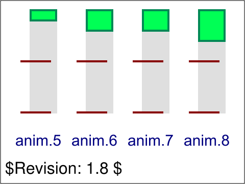 |  |
| [`animate-elem-03-t`](../../Tests/SVGConformanceTests/Resources/W3C-SVG-1.1/svg/animate-elem-03-t.svg) | `passed` | 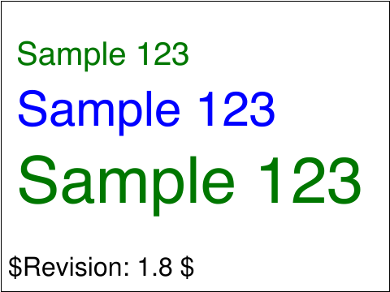 | 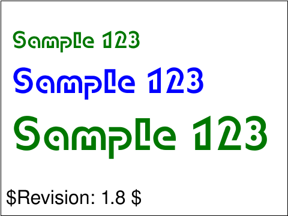 |
| [`animate-elem-04-t`](../../Tests/SVGConformanceTests/Resources/W3C-SVG-1.1/svg/animate-elem-04-t.svg) | `partialBaseline` | 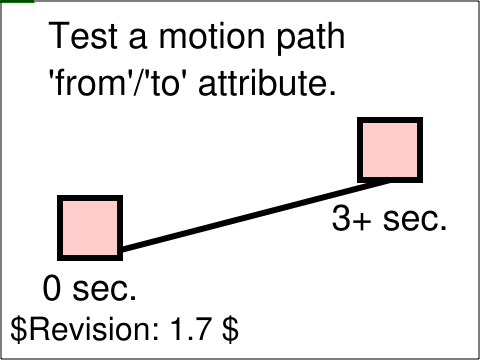 | 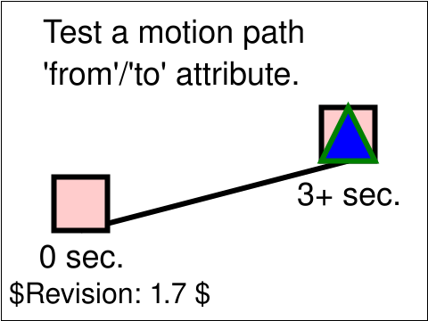 |
| [`animate-elem-05-t`](../../Tests/SVGConformanceTests/Resources/W3C-SVG-1.1/svg/animate-elem-05-t.svg) | `partialBaseline` | 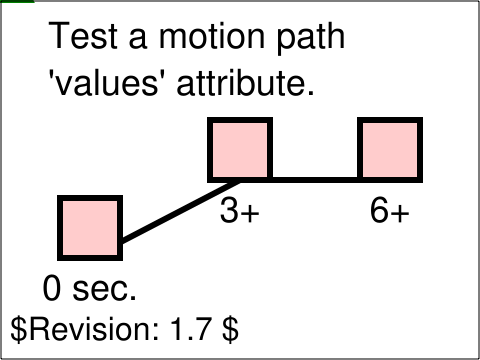 | 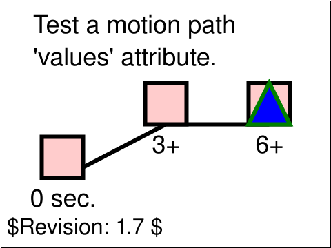 |
| [`animate-elem-06-t`](../../Tests/SVGConformanceTests/Resources/W3C-SVG-1.1/svg/animate-elem-06-t.svg) | `partialBaseline` |  |  |
| [`animate-elem-07-t`](../../Tests/SVGConformanceTests/Resources/W3C-SVG-1.1/svg/animate-elem-07-t.svg) | `partialBaseline` | 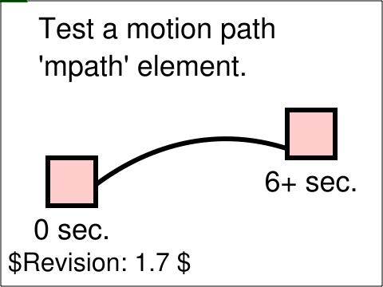 | 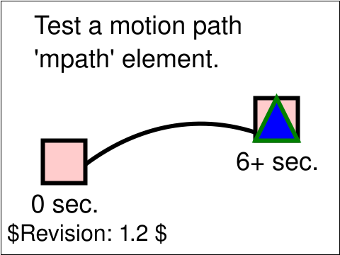 |
| [`animate-elem-08-t`](../../Tests/SVGConformanceTests/Resources/W3C-SVG-1.1/svg/animate-elem-08-t.svg) | `partialBaseline` | 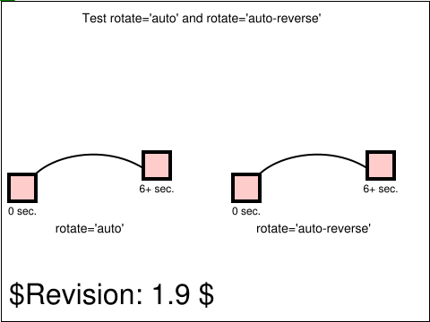 | 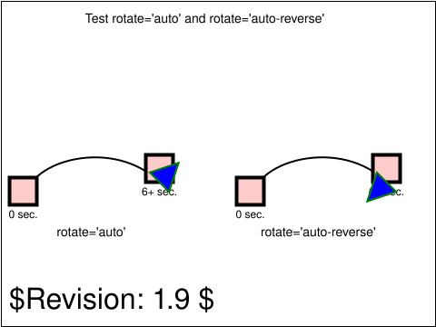 |
| [`animate-elem-09-t`](../../Tests/SVGConformanceTests/Resources/W3C-SVG-1.1/svg/animate-elem-09-t.svg) | `partialBaseline` | 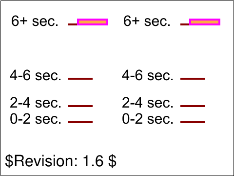 | 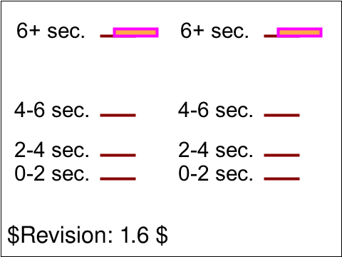 |
| [`animate-elem-10-t`](../../Tests/SVGConformanceTests/Resources/W3C-SVG-1.1/svg/animate-elem-10-t.svg) | `partialBaseline` |  | 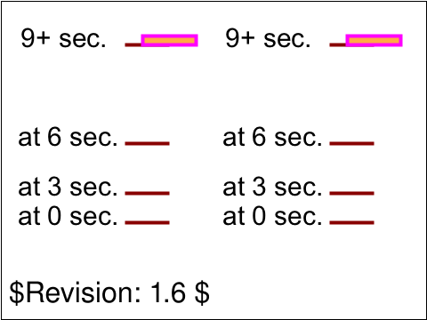 |
| [`animate-elem-11-t`](../../Tests/SVGConformanceTests/Resources/W3C-SVG-1.1/svg/animate-elem-11-t.svg) | `partialBaseline` | 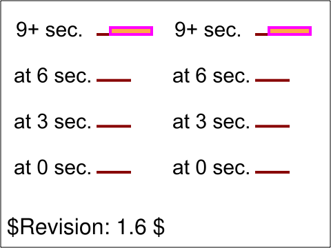 | 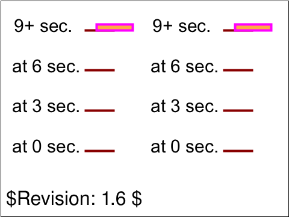 |
| [`animate-elem-12-t`](../../Tests/SVGConformanceTests/Resources/W3C-SVG-1.1/svg/animate-elem-12-t.svg) | `partialBaseline` | 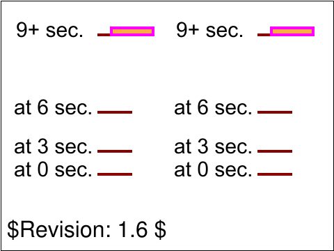 |  |
| [`animate-elem-13-t`](../../Tests/SVGConformanceTests/Resources/W3C-SVG-1.1/svg/animate-elem-13-t.svg) | `partialBaseline` | 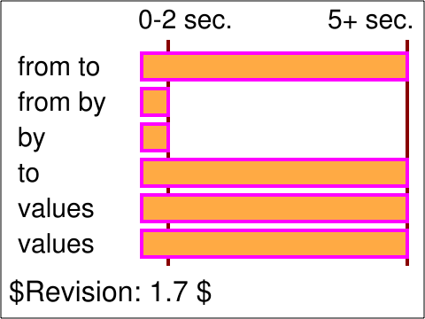 | 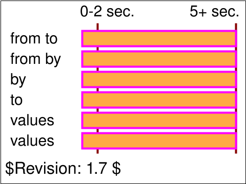 |
| [`animate-elem-14-t`](../../Tests/SVGConformanceTests/Resources/W3C-SVG-1.1/svg/animate-elem-14-t.svg) | `partialBaseline` |  | 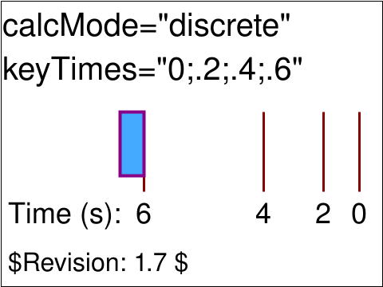 |
| [`animate-elem-15-t`](../../Tests/SVGConformanceTests/Resources/W3C-SVG-1.1/svg/animate-elem-15-t.svg) | `partialBaseline` | 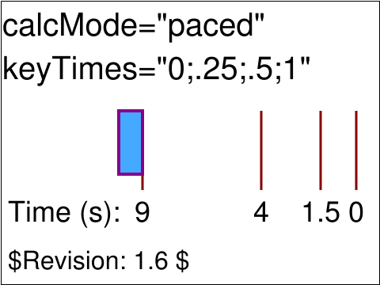 | 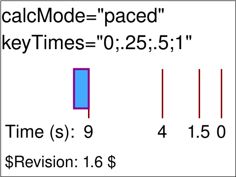 |
| [`animate-elem-17-t`](../../Tests/SVGConformanceTests/Resources/W3C-SVG-1.1/svg/animate-elem-17-t.svg) | `partialBaseline` |  | 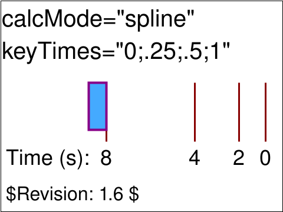 |
| [`animate-elem-19-t`](../../Tests/SVGConformanceTests/Resources/W3C-SVG-1.1/svg/animate-elem-19-t.svg) | `partialBaseline` |  | 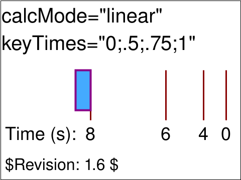 |
| [`animate-elem-20-t`](../../Tests/SVGConformanceTests/Resources/W3C-SVG-1.1/svg/animate-elem-20-t.svg) | `partialBaseline` | 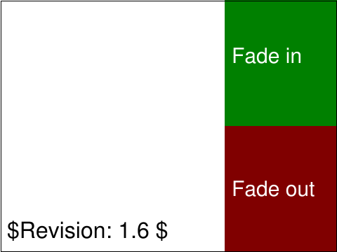 | 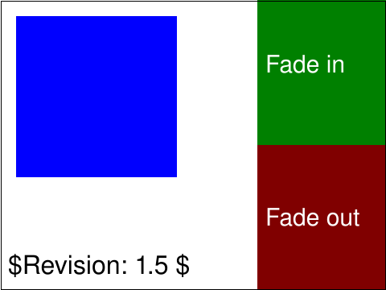 |
| [`animate-elem-21-t`](../../Tests/SVGConformanceTests/Resources/W3C-SVG-1.1/svg/animate-elem-21-t.svg) | `partialBaseline` | 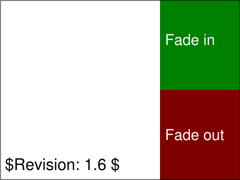 | 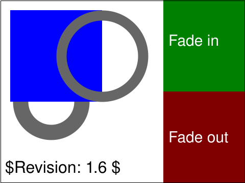 |
| [`animate-elem-22-b`](../../Tests/SVGConformanceTests/Resources/W3C-SVG-1.1/svg/animate-elem-22-b.svg) | `passed` |  | 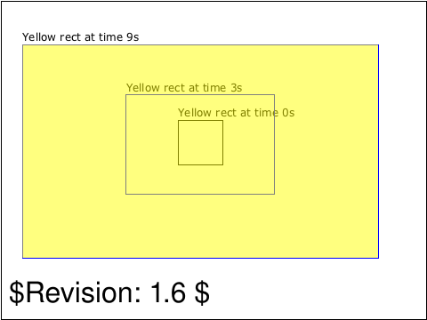 |
| [`animate-elem-23-t`](../../Tests/SVGConformanceTests/Resources/W3C-SVG-1.1/svg/animate-elem-23-t.svg) | `partialBaseline` |  | 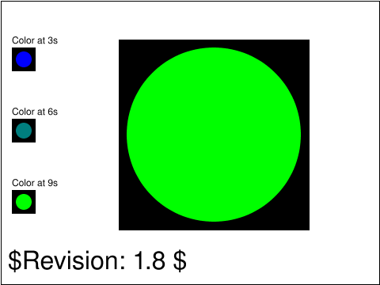 |
| [`animate-elem-24-t`](../../Tests/SVGConformanceTests/Resources/W3C-SVG-1.1/svg/animate-elem-24-t.svg) | `partialBaseline` |  |  |
| [`animate-elem-25-t`](../../Tests/SVGConformanceTests/Resources/W3C-SVG-1.1/svg/animate-elem-25-t.svg) | `passed` | 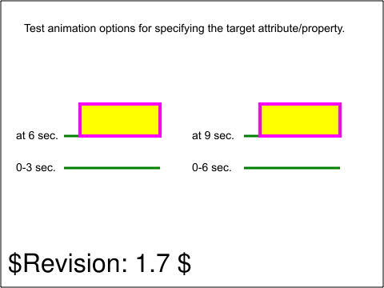 | 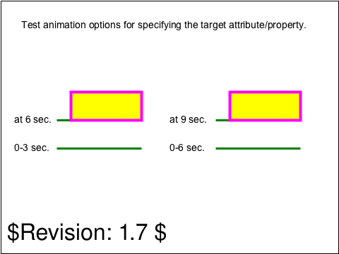 |
| [`animate-elem-26-t`](../../Tests/SVGConformanceTests/Resources/W3C-SVG-1.1/svg/animate-elem-26-t.svg) | `passed` | 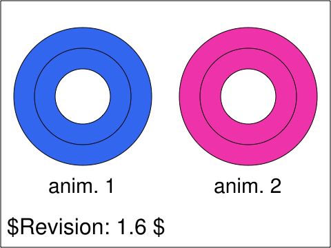 | 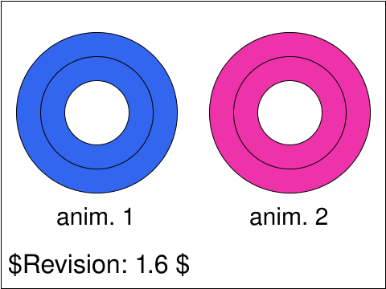 |
| [`animate-elem-27-t`](../../Tests/SVGConformanceTests/Resources/W3C-SVG-1.1/svg/animate-elem-27-t.svg) | `passed` | 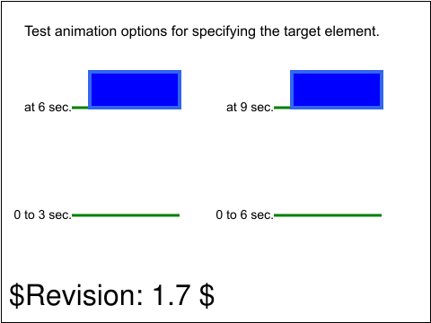 |  |
| [`animate-elem-28-t`](../../Tests/SVGConformanceTests/Resources/W3C-SVG-1.1/svg/animate-elem-28-t.svg) | `passed` |  |  |
| [`animate-elem-29-b`](../../Tests/SVGConformanceTests/Resources/W3C-SVG-1.1/svg/animate-elem-29-b.svg) | `partialBaseline` | 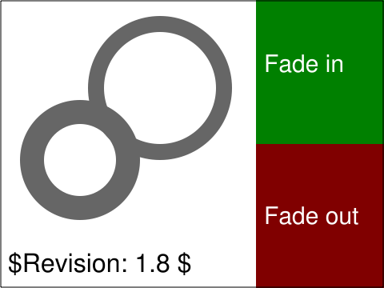 | 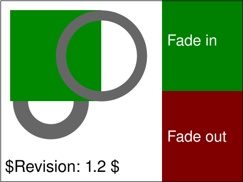 |
| [`animate-elem-30-t`](../../Tests/SVGConformanceTests/Resources/W3C-SVG-1.1/svg/animate-elem-30-t.svg) | `partialBaseline` | 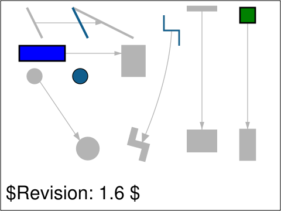 | 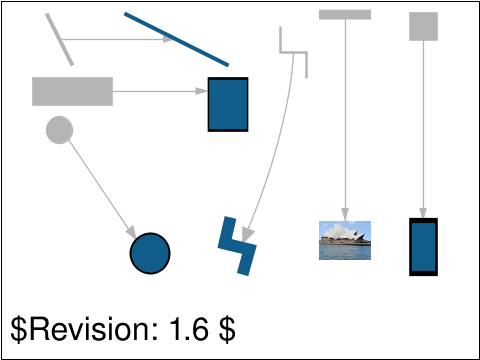 |
| [`animate-elem-31-t`](../../Tests/SVGConformanceTests/Resources/W3C-SVG-1.1/svg/animate-elem-31-t.svg) | `partialBaseline` | 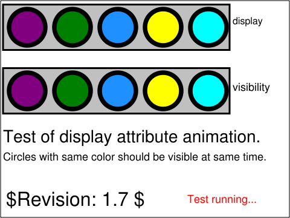 | 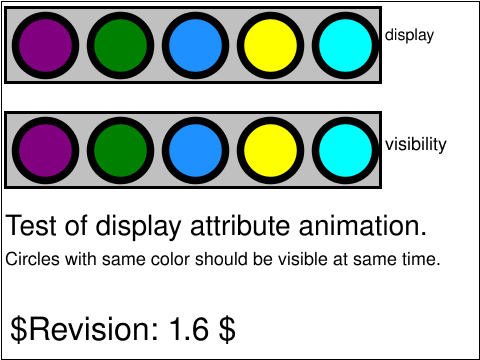 |
| [`animate-elem-32-t`](../../Tests/SVGConformanceTests/Resources/W3C-SVG-1.1/svg/animate-elem-32-t.svg) | `partialBaseline` |  |  |
| [`animate-elem-33-t`](../../Tests/SVGConformanceTests/Resources/W3C-SVG-1.1/svg/animate-elem-33-t.svg) | `partialBaseline` | 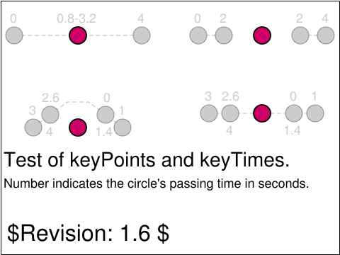 | 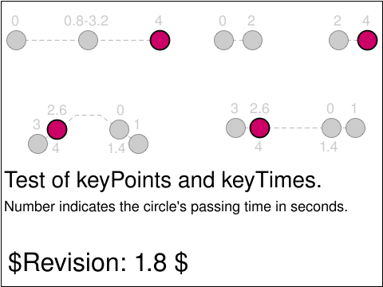 |
| [`animate-elem-34-t`](../../Tests/SVGConformanceTests/Resources/W3C-SVG-1.1/svg/animate-elem-34-t.svg) | `partialBaseline` | 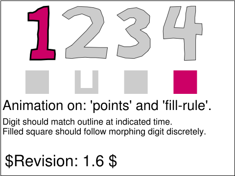 |  |
| [`animate-elem-35-t`](../../Tests/SVGConformanceTests/Resources/W3C-SVG-1.1/svg/animate-elem-35-t.svg) | `partialBaseline` | 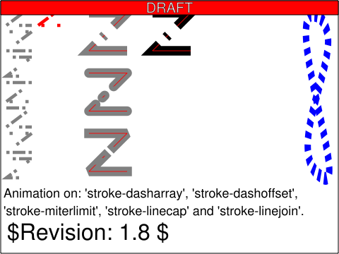 | 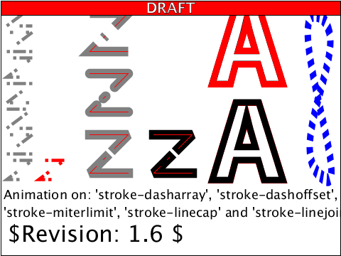 |
| [`animate-elem-36-t`](../../Tests/SVGConformanceTests/Resources/W3C-SVG-1.1/svg/animate-elem-36-t.svg) | `partialBaseline` | 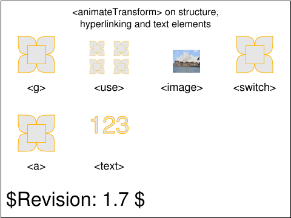 | 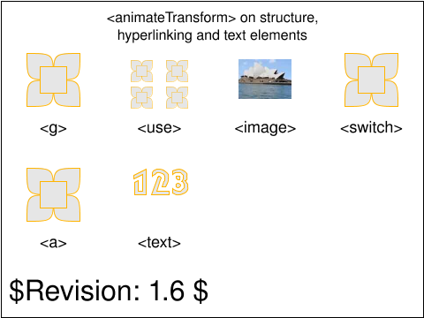 |
| [`animate-elem-37-t`](../../Tests/SVGConformanceTests/Resources/W3C-SVG-1.1/svg/animate-elem-37-t.svg) | `partialBaseline` | 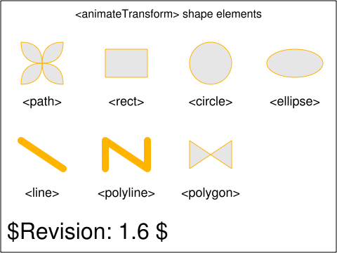 | 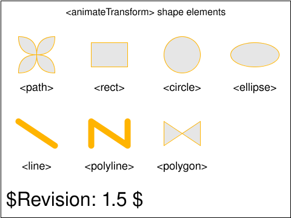 |
| [`animate-elem-38-t`](../../Tests/SVGConformanceTests/Resources/W3C-SVG-1.1/svg/animate-elem-38-t.svg) | `partialBaseline` |  |  |
| [`animate-elem-39-t`](../../Tests/SVGConformanceTests/Resources/W3C-SVG-1.1/svg/animate-elem-39-t.svg) | `partialBaseline` |  |  |
| [`animate-elem-40-t`](../../Tests/SVGConformanceTests/Resources/W3C-SVG-1.1/svg/animate-elem-40-t.svg) | `partialBaseline` |  |  |
| [`animate-elem-41-t`](../../Tests/SVGConformanceTests/Resources/W3C-SVG-1.1/svg/animate-elem-41-t.svg) | `partialBaseline` |  |  |
| [`animate-elem-44-t`](../../Tests/SVGConformanceTests/Resources/W3C-SVG-1.1/svg/animate-elem-44-t.svg) | `partialBaseline` |  |  |
| [`animate-elem-46-t`](../../Tests/SVGConformanceTests/Resources/W3C-SVG-1.1/svg/animate-elem-46-t.svg) | `partialBaseline` |  |  |
| [`animate-elem-52-t`](../../Tests/SVGConformanceTests/Resources/W3C-SVG-1.1/svg/animate-elem-52-t.svg) | `partialBaseline` |  |  |
| [`animate-elem-53-t`](../../Tests/SVGConformanceTests/Resources/W3C-SVG-1.1/svg/animate-elem-53-t.svg) | `partialBaseline` |  |  |
| [`animate-elem-60-t`](../../Tests/SVGConformanceTests/Resources/W3C-SVG-1.1/svg/animate-elem-60-t.svg) | `partialBaseline` |  |  |
| [`animate-elem-61-t`](../../Tests/SVGConformanceTests/Resources/W3C-SVG-1.1/svg/animate-elem-61-t.svg) | `partialBaseline` |  |  |
| [`animate-elem-62-t`](../../Tests/SVGConformanceTests/Resources/W3C-SVG-1.1/svg/animate-elem-62-t.svg) | `partialBaseline` |  |  |
| [`animate-elem-63-t`](../../Tests/SVGConformanceTests/Resources/W3C-SVG-1.1/svg/animate-elem-63-t.svg) | `partialBaseline` |  |  |
| [`animate-elem-64-t`](../../Tests/SVGConformanceTests/Resources/W3C-SVG-1.1/svg/animate-elem-64-t.svg) | `partialBaseline` |  |  |
| [`animate-elem-65-t`](../../Tests/SVGConformanceTests/Resources/W3C-SVG-1.1/svg/animate-elem-65-t.svg) | `partialBaseline` |  |  |
| [`animate-elem-66-t`](../../Tests/SVGConformanceTests/Resources/W3C-SVG-1.1/svg/animate-elem-66-t.svg) | `partialBaseline` |  |  |
| [`animate-elem-67-t`](../../Tests/SVGConformanceTests/Resources/W3C-SVG-1.1/svg/animate-elem-67-t.svg) | `partialBaseline` |  |  |
| [`animate-elem-68-t`](../../Tests/SVGConformanceTests/Resources/W3C-SVG-1.1/svg/animate-elem-68-t.svg) | `partialBaseline` |  |  |
| [`animate-elem-69-t`](../../Tests/SVGConformanceTests/Resources/W3C-SVG-1.1/svg/animate-elem-69-t.svg) | `partialBaseline` |  |  |
| [`animate-elem-70-t`](../../Tests/SVGConformanceTests/Resources/W3C-SVG-1.1/svg/animate-elem-70-t.svg) | `partialBaseline` |  |  |
| [`animate-elem-77-t`](../../Tests/SVGConformanceTests/Resources/W3C-SVG-1.1/svg/animate-elem-77-t.svg) | `partialBaseline` |  |  |
| [`animate-elem-78-t`](../../Tests/SVGConformanceTests/Resources/W3C-SVG-1.1/svg/animate-elem-78-t.svg) | `partialBaseline` |  |  |
| [`animate-elem-80-t`](../../Tests/SVGConformanceTests/Resources/W3C-SVG-1.1/svg/animate-elem-80-t.svg) | `partialBaseline` |  |  |
| [`animate-elem-81-t`](../../Tests/SVGConformanceTests/Resources/W3C-SVG-1.1/svg/animate-elem-81-t.svg) | `partialBaseline` |  |  |
| [`animate-elem-82-t`](../../Tests/SVGConformanceTests/Resources/W3C-SVG-1.1/svg/animate-elem-82-t.svg) | `partialBaseline` |  |  |
| [`animate-elem-83-t`](../../Tests/SVGConformanceTests/Resources/W3C-SVG-1.1/svg/animate-elem-83-t.svg) | `partialBaseline` |  |  |
| [`animate-elem-84-t`](../../Tests/SVGConformanceTests/Resources/W3C-SVG-1.1/svg/animate-elem-84-t.svg) | `partialBaseline` |  |  |
| [`animate-elem-85-t`](../../Tests/SVGConformanceTests/Resources/W3C-SVG-1.1/svg/animate-elem-85-t.svg) | `partialBaseline` |  |  |
| [`animate-elem-86-t`](../../Tests/SVGConformanceTests/Resources/W3C-SVG-1.1/svg/animate-elem-86-t.svg) | `partialBaseline` |  |  |
| [`animate-elem-87-t`](../../Tests/SVGConformanceTests/Resources/W3C-SVG-1.1/svg/animate-elem-87-t.svg) | `partialBaseline` |  |  |
| [`animate-elem-88-t`](../../Tests/SVGConformanceTests/Resources/W3C-SVG-1.1/svg/animate-elem-88-t.svg) | `passed` |  |  |
| [`animate-elem-89-t`](../../Tests/SVGConformanceTests/Resources/W3C-SVG-1.1/svg/animate-elem-89-t.svg) | `partialBaseline` |  |  |
| [`animate-elem-90-b`](../../Tests/SVGConformanceTests/Resources/W3C-SVG-1.1/svg/animate-elem-90-b.svg) | `partialBaseline` |  |  |
| [`animate-elem-91-t`](../../Tests/SVGConformanceTests/Resources/W3C-SVG-1.1/svg/animate-elem-91-t.svg) | `partialBaseline` |  |  |
| [`animate-elem-92-t`](../../Tests/SVGConformanceTests/Resources/W3C-SVG-1.1/svg/animate-elem-92-t.svg) | `partialBaseline` |  |  |
| [`animate-interact-events-01-t`](../../Tests/SVGConformanceTests/Resources/W3C-SVG-1.1/svg/animate-interact-events-01-t.svg) | `skipped` DOM/script/interaction — out of SMIL scope | — |  |
| [`animate-interact-pevents-01-t`](../../Tests/SVGConformanceTests/Resources/W3C-SVG-1.1/svg/animate-interact-pevents-01-t.svg) | `skipped` DOM/script/interaction — out of SMIL scope | — |  |
| [`animate-interact-pevents-02-t`](../../Tests/SVGConformanceTests/Resources/W3C-SVG-1.1/svg/animate-interact-pevents-02-t.svg) | `skipped` DOM/script/interaction — out of SMIL scope | — |  |
| [`animate-interact-pevents-03-t`](../../Tests/SVGConformanceTests/Resources/W3C-SVG-1.1/svg/animate-interact-pevents-03-t.svg) | `skipped` DOM/script/interaction — out of SMIL scope | — |  |
| [`animate-interact-pevents-04-t`](../../Tests/SVGConformanceTests/Resources/W3C-SVG-1.1/svg/animate-interact-pevents-04-t.svg) | `skipped` DOM/script/interaction — out of SMIL scope | — |  |
| [`animate-pservers-grad-01-b`](../../Tests/SVGConformanceTests/Resources/W3C-SVG-1.1/svg/animate-pservers-grad-01-b.svg) | `skipped` gradient animation deferred — see animate-rollout.md | — |  |
| [`animate-script-elem-01-b`](../../Tests/SVGConformanceTests/Resources/W3C-SVG-1.1/svg/animate-script-elem-01-b.svg) | `skipped` DOM/script/interaction — out of SMIL scope | — |  |
| [`animate-struct-dom-01-b`](../../Tests/SVGConformanceTests/Resources/W3C-SVG-1.1/svg/animate-struct-dom-01-b.svg) | `skipped` DOM/script/interaction — out of SMIL scope | — |  |

