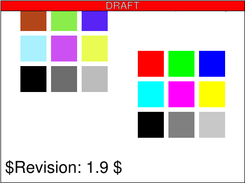
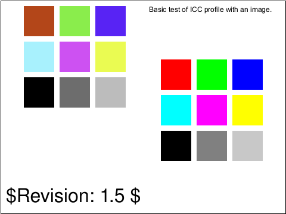
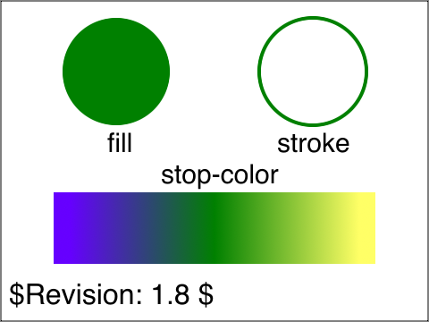
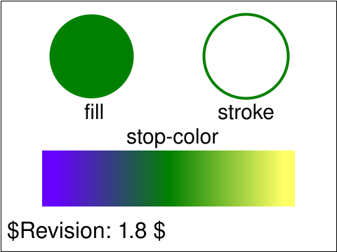
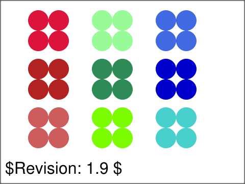
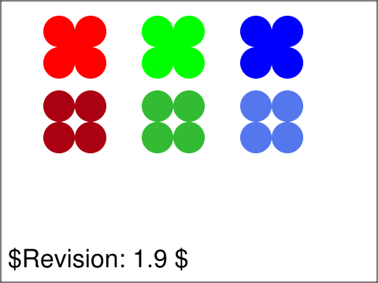
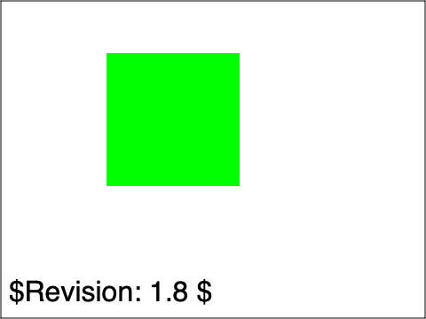

<!-- Generated by SVGConformanceMarkdownReport. Do not edit. -->

# color

6 tests · generated 2026-08-20 · [coverage index](README.md)

| Status | Count |
| --- | ---: |
| `passed` | 6 |
| `partialBaseline` | 0 |
| `skipped` | 0 |

## Renders

| Test | Status | SVGeeKit | W3C reference |
| --- | --- | --- | --- |
| [`color-prof-01-f`](../../Tests/SVGConformanceTests/Resources/W3C-SVG-1.1/svg/color-prof-01-f.svg) | `passed` |  |  |
| [`color-prop-01-b`](../../Tests/SVGConformanceTests/Resources/W3C-SVG-1.1/svg/color-prop-01-b.svg) | `passed` |  |  |
| [`color-prop-02-f`](../../Tests/SVGConformanceTests/Resources/W3C-SVG-1.1/svg/color-prop-02-f.svg) | `passed` |  |  |
| [`color-prop-03-t`](../../Tests/SVGConformanceTests/Resources/W3C-SVG-1.1/svg/color-prop-03-t.svg) | `passed` |  |  |
| [`color-prop-04-t`](../../Tests/SVGConformanceTests/Resources/W3C-SVG-1.1/svg/color-prop-04-t.svg) | `passed` |  |  |
| [`color-prop-05-t`](../../Tests/SVGConformanceTests/Resources/W3C-SVG-1.1/svg/color-prop-05-t.svg) | `passed` |  |  |

