<!-- Generated by SVGConformanceMarkdownReport. Do not edit. -->

# coords

32 tests · generated 2026-08-20 · [coverage index](README.md)

| Status | Count |
| --- | ---: |
| `passed` | 28 |
| `partialBaseline` | 0 |
| `skipped` | 4 |

## Renders

| Test | Status | SVGeeKit | W3C reference |
| --- | --- | --- | --- |
| [`coords-coord-01-t`](../../Tests/SVGConformanceTests/Resources/W3C-SVG-1.1/svg/coords-coord-01-t.svg) | `passed` |  |  |
| [`coords-coord-02-t`](../../Tests/SVGConformanceTests/Resources/W3C-SVG-1.1/svg/coords-coord-02-t.svg) | `passed` |  |  |
| [`coords-dom-01-f`](../../Tests/SVGConformanceTests/Resources/W3C-SVG-1.1/svg/coords-dom-01-f.svg) | `skipped` script-driven DOM mutation; out of scope | — | 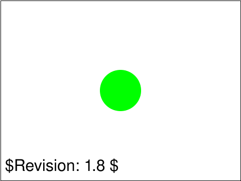 |
| [`coords-dom-02-f`](../../Tests/SVGConformanceTests/Resources/W3C-SVG-1.1/svg/coords-dom-02-f.svg) | `skipped` script-driven DOM mutation; out of scope | — | 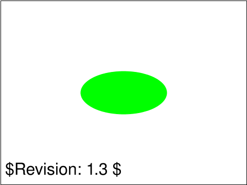 |
| [`coords-dom-03-f`](../../Tests/SVGConformanceTests/Resources/W3C-SVG-1.1/svg/coords-dom-03-f.svg) | `skipped` script-driven DOM mutation; out of scope | — |  |
| [`coords-dom-04-f`](../../Tests/SVGConformanceTests/Resources/W3C-SVG-1.1/svg/coords-dom-04-f.svg) | `skipped` script-driven DOM mutation; out of scope | — |  |
| [`coords-trans-01-b`](../../Tests/SVGConformanceTests/Resources/W3C-SVG-1.1/svg/coords-trans-01-b.svg) | `passed` | 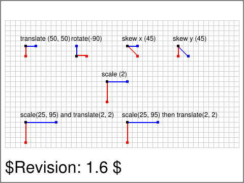 | 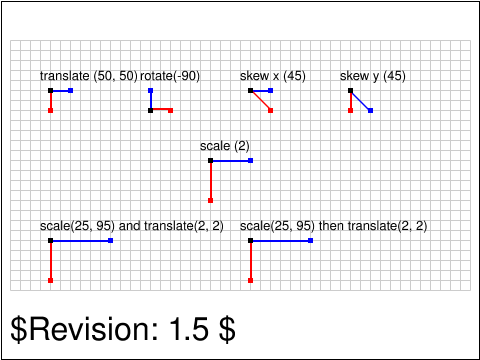 |
| [`coords-trans-02-t`](../../Tests/SVGConformanceTests/Resources/W3C-SVG-1.1/svg/coords-trans-02-t.svg) | `passed` | 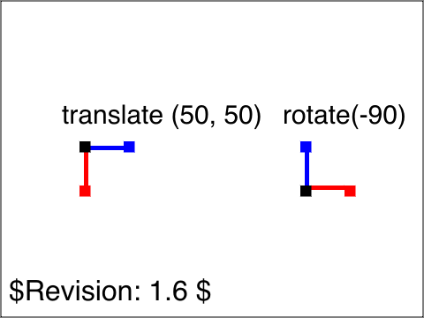 | 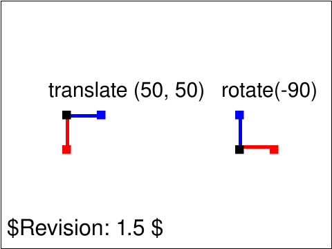 |
| [`coords-trans-03-t`](../../Tests/SVGConformanceTests/Resources/W3C-SVG-1.1/svg/coords-trans-03-t.svg) | `passed` | 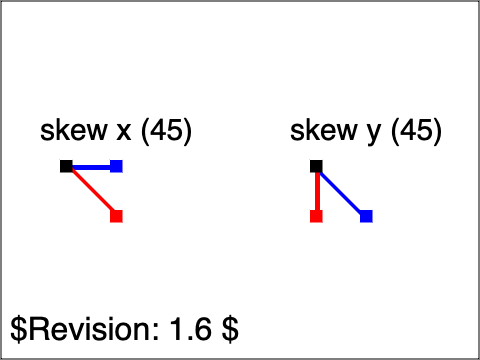 |  |
| [`coords-trans-04-t`](../../Tests/SVGConformanceTests/Resources/W3C-SVG-1.1/svg/coords-trans-04-t.svg) | `passed` |  | 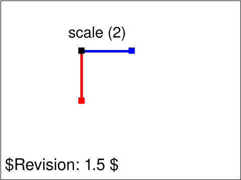 |
| [`coords-trans-05-t`](../../Tests/SVGConformanceTests/Resources/W3C-SVG-1.1/svg/coords-trans-05-t.svg) | `passed` | 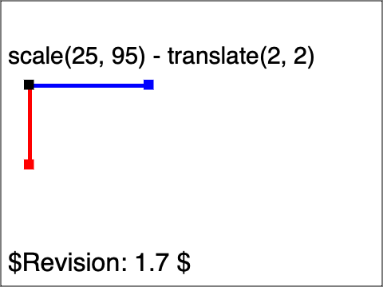 | 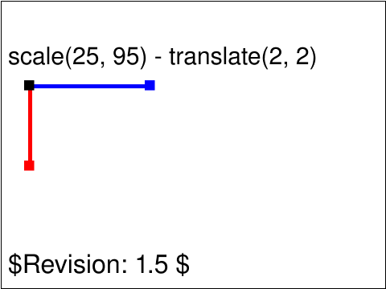 |
| [`coords-trans-06-t`](../../Tests/SVGConformanceTests/Resources/W3C-SVG-1.1/svg/coords-trans-06-t.svg) | `passed` | 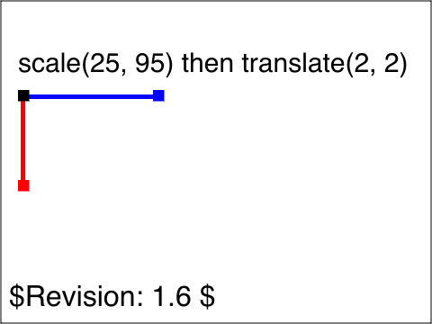 | 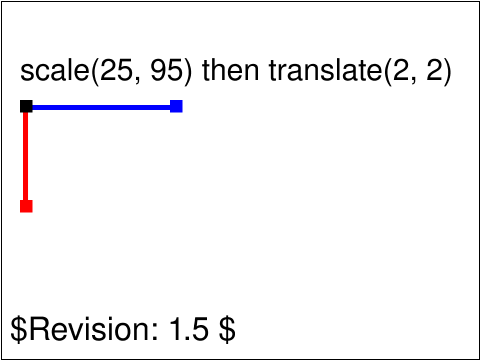 |
| [`coords-trans-07-t`](../../Tests/SVGConformanceTests/Resources/W3C-SVG-1.1/svg/coords-trans-07-t.svg) | `passed` | 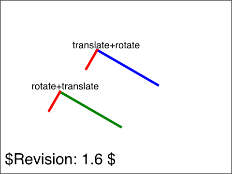 |  |
| [`coords-trans-08-t`](../../Tests/SVGConformanceTests/Resources/W3C-SVG-1.1/svg/coords-trans-08-t.svg) | `passed` |  | 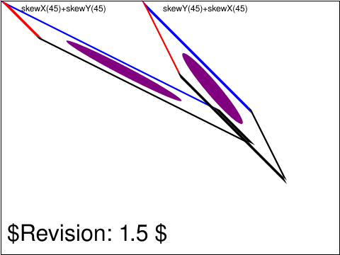 |
| [`coords-trans-09-t`](../../Tests/SVGConformanceTests/Resources/W3C-SVG-1.1/svg/coords-trans-09-t.svg) | `passed` | 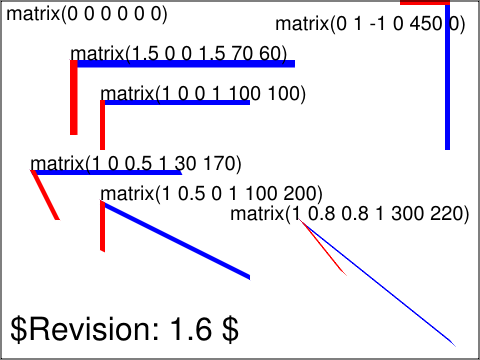 | 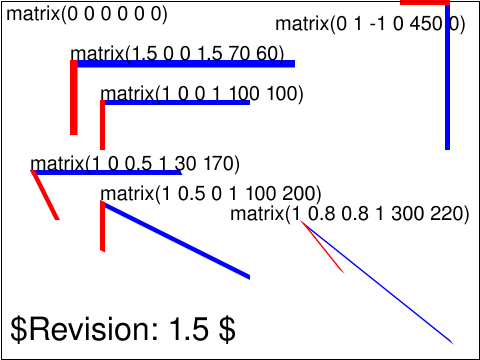 |
| [`coords-trans-10-f`](../../Tests/SVGConformanceTests/Resources/W3C-SVG-1.1/svg/coords-trans-10-f.svg) | `passed` |  | 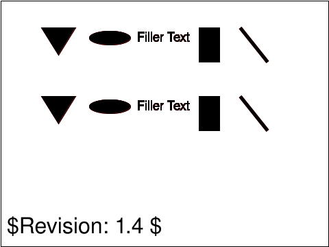 |
| [`coords-trans-11-f`](../../Tests/SVGConformanceTests/Resources/W3C-SVG-1.1/svg/coords-trans-11-f.svg) | `passed` |  |  |
| [`coords-trans-12-f`](../../Tests/SVGConformanceTests/Resources/W3C-SVG-1.1/svg/coords-trans-12-f.svg) | `passed` |  | 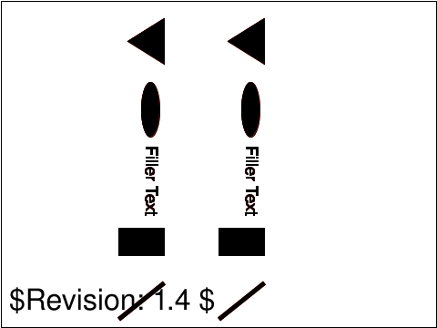 |
| [`coords-trans-13-f`](../../Tests/SVGConformanceTests/Resources/W3C-SVG-1.1/svg/coords-trans-13-f.svg) | `passed` |  |  |
| [`coords-trans-14-f`](../../Tests/SVGConformanceTests/Resources/W3C-SVG-1.1/svg/coords-trans-14-f.svg) | `passed` |  | 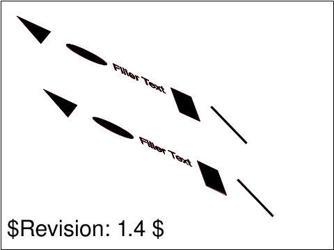 |
| [`coords-transformattr-01-f`](../../Tests/SVGConformanceTests/Resources/W3C-SVG-1.1/svg/coords-transformattr-01-f.svg) | `passed` |  | 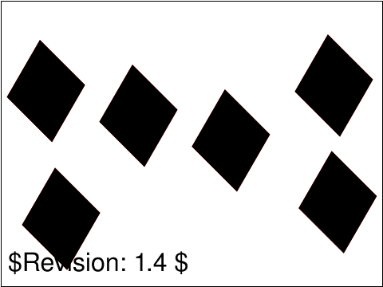 |
| [`coords-transformattr-02-f`](../../Tests/SVGConformanceTests/Resources/W3C-SVG-1.1/svg/coords-transformattr-02-f.svg) | `passed` | 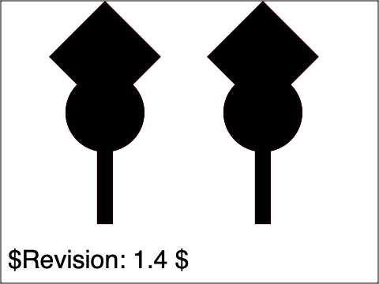 | 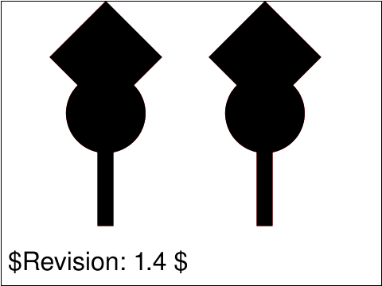 |
| [`coords-transformattr-03-f`](../../Tests/SVGConformanceTests/Resources/W3C-SVG-1.1/svg/coords-transformattr-03-f.svg) | `passed` |  |  |
| [`coords-transformattr-04-f`](../../Tests/SVGConformanceTests/Resources/W3C-SVG-1.1/svg/coords-transformattr-04-f.svg) | `passed` |  |  |
| [`coords-transformattr-05-f`](../../Tests/SVGConformanceTests/Resources/W3C-SVG-1.1/svg/coords-transformattr-05-f.svg) | `passed` |  |  |
| [`coords-units-01-b`](../../Tests/SVGConformanceTests/Resources/W3C-SVG-1.1/svg/coords-units-01-b.svg) | `passed` | 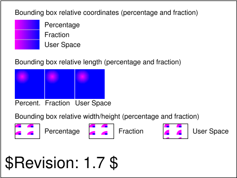 | 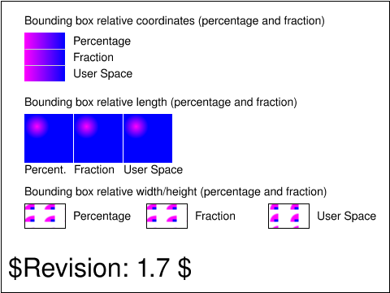 |
| [`coords-units-02-b`](../../Tests/SVGConformanceTests/Resources/W3C-SVG-1.1/svg/coords-units-02-b.svg) | `passed` | 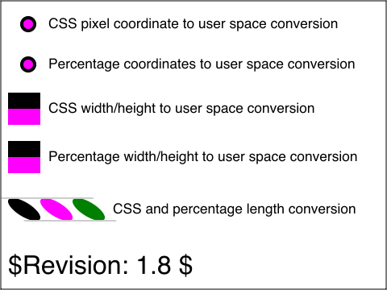 | 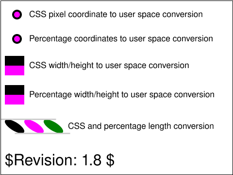 |
| [`coords-units-03-b`](../../Tests/SVGConformanceTests/Resources/W3C-SVG-1.1/svg/coords-units-03-b.svg) | `passed` | 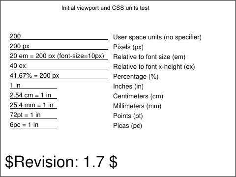 | 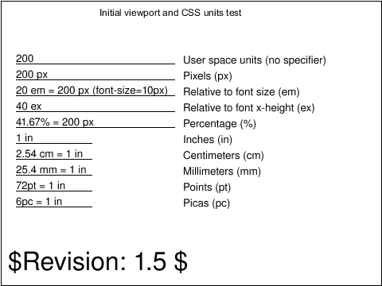 |
| [`coords-viewattr-01-b`](../../Tests/SVGConformanceTests/Resources/W3C-SVG-1.1/svg/coords-viewattr-01-b.svg) | `passed` | 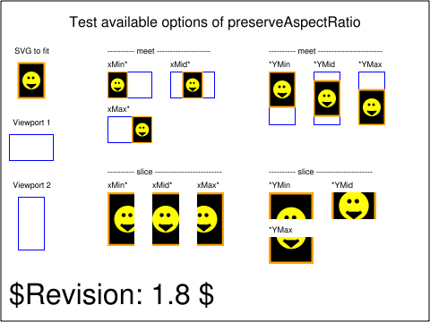 | 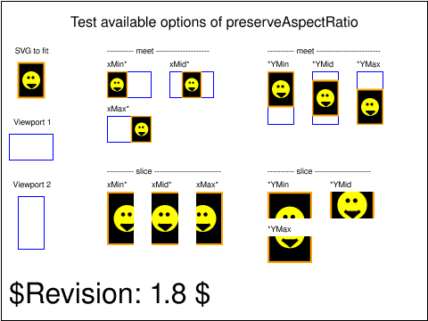 |
| [`coords-viewattr-02-b`](../../Tests/SVGConformanceTests/Resources/W3C-SVG-1.1/svg/coords-viewattr-02-b.svg) | `passed` | 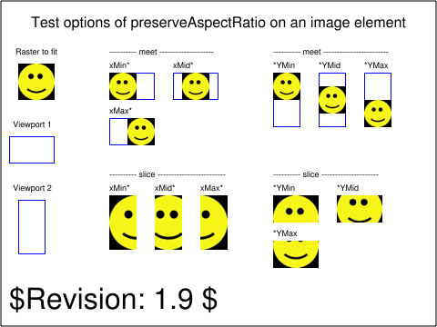 |  |
| [`coords-viewattr-03-b`](../../Tests/SVGConformanceTests/Resources/W3C-SVG-1.1/svg/coords-viewattr-03-b.svg) | `passed` | 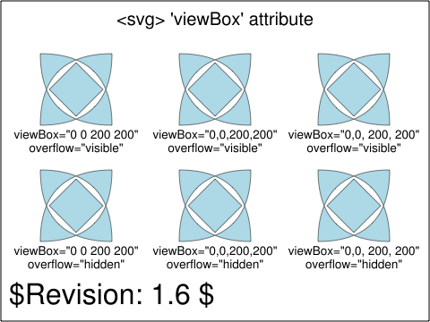 | 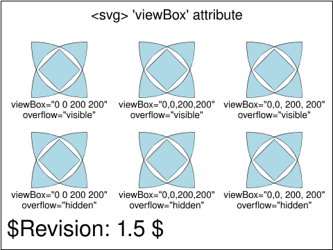 |
| [`coords-viewattr-04-f`](../../Tests/SVGConformanceTests/Resources/W3C-SVG-1.1/svg/coords-viewattr-04-f.svg) | `passed` | 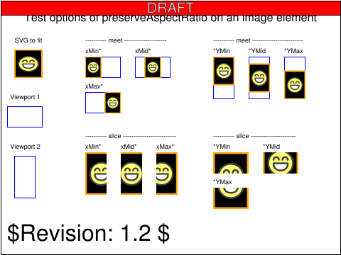 | 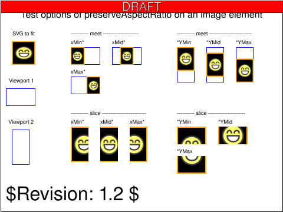 |

