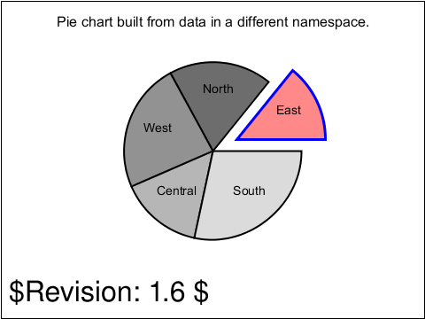

<!-- Generated by SVGConformanceMarkdownReport. Do not edit. -->

# extend

1 tests · generated 2026-08-20 · [coverage index](README.md)

| Status | Count |
| --- | ---: |
| `passed` | 0 |
| `partialBaseline` | 0 |
| `skipped` | 1 |

## Renders

| Test | Status | SVGeeKit | W3C reference |
| --- | --- | --- | --- |
| [`extend-namespace-01-f`](../../Tests/SVGConformanceTests/Resources/W3C-SVG-1.1/svg/extend-namespace-01-f.svg) | `skipped` feature family not yet supported by SVGeeKit | — |  |

