<!-- Generated by SVGConformanceMarkdownReport. Do not edit. -->

# filters

43 tests · generated 2026-08-20 · [coverage index](README.md)

| Status | Count |
| --- | ---: |
| `passed` | 0 |
| `partialBaseline` | 0 |
| `skipped` | 43 |

## Renders

| Test | Status | SVGeeKit | W3C reference |
| --- | --- | --- | --- |
| [`filters-background-01-f`](../../Tests/SVGConformanceTests/Resources/W3C-SVG-1.1/svg/filters-background-01-f.svg) | `skipped` feature family not yet supported by SVGeeKit | — | 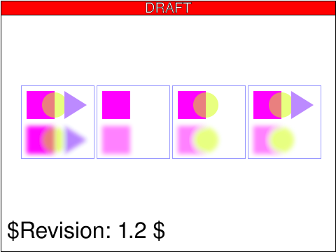 |
| [`filters-blend-01-b`](../../Tests/SVGConformanceTests/Resources/W3C-SVG-1.1/svg/filters-blend-01-b.svg) | `skipped` feature family not yet supported by SVGeeKit | — | 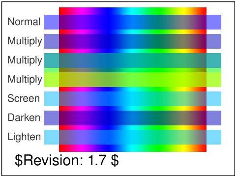 |
| [`filters-color-01-b`](../../Tests/SVGConformanceTests/Resources/W3C-SVG-1.1/svg/filters-color-01-b.svg) | `skipped` feature family not yet supported by SVGeeKit | — | 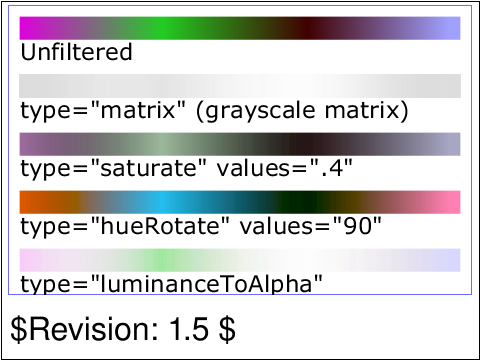 |
| [`filters-color-02-b`](../../Tests/SVGConformanceTests/Resources/W3C-SVG-1.1/svg/filters-color-02-b.svg) | `skipped` feature family not yet supported by SVGeeKit | — | 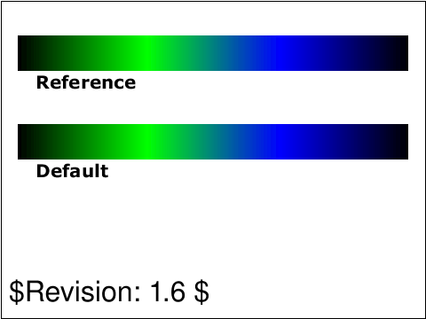 |
| [`filters-composite-02-b`](../../Tests/SVGConformanceTests/Resources/W3C-SVG-1.1/svg/filters-composite-02-b.svg) | `skipped` feature family not yet supported by SVGeeKit | — | 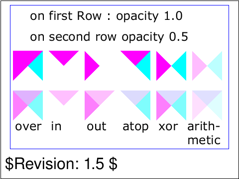 |
| [`filters-composite-03-f`](../../Tests/SVGConformanceTests/Resources/W3C-SVG-1.1/svg/filters-composite-03-f.svg) | `skipped` feature family not yet supported by SVGeeKit | — | 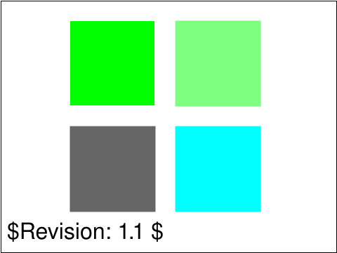 |
| [`filters-composite-04-f`](../../Tests/SVGConformanceTests/Resources/W3C-SVG-1.1/svg/filters-composite-04-f.svg) | `skipped` feature family not yet supported by SVGeeKit | — | 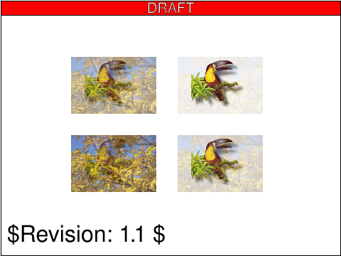 |
| [`filters-composite-05-f`](../../Tests/SVGConformanceTests/Resources/W3C-SVG-1.1/svg/filters-composite-05-f.svg) | `skipped` feature family not yet supported by SVGeeKit | — | 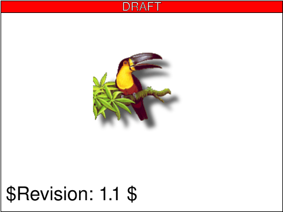 |
| [`filters-comptran-01-b`](../../Tests/SVGConformanceTests/Resources/W3C-SVG-1.1/svg/filters-comptran-01-b.svg) | `skipped` feature family not yet supported by SVGeeKit | — | 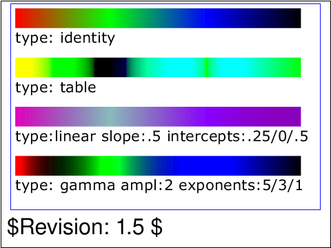 |
| [`filters-conv-01-f`](../../Tests/SVGConformanceTests/Resources/W3C-SVG-1.1/svg/filters-conv-01-f.svg) | `skipped` feature family not yet supported by SVGeeKit | — | 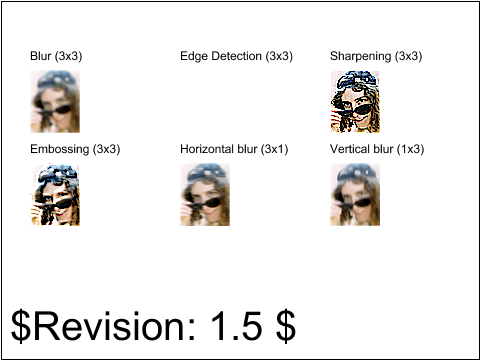 |
| [`filters-conv-02-f`](../../Tests/SVGConformanceTests/Resources/W3C-SVG-1.1/svg/filters-conv-02-f.svg) | `skipped` feature family not yet supported by SVGeeKit | — | 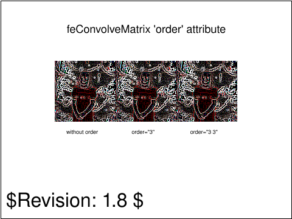 |
| [`filters-conv-03-f`](../../Tests/SVGConformanceTests/Resources/W3C-SVG-1.1/svg/filters-conv-03-f.svg) | `skipped` feature family not yet supported by SVGeeKit | — | 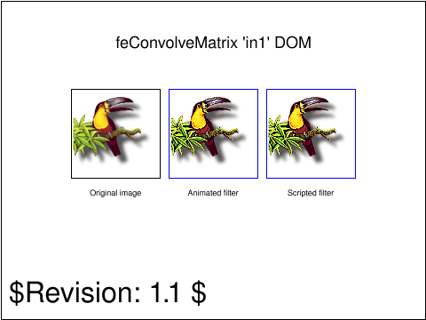 |
| [`filters-conv-04-f`](../../Tests/SVGConformanceTests/Resources/W3C-SVG-1.1/svg/filters-conv-04-f.svg) | `skipped` feature family not yet supported by SVGeeKit | — | 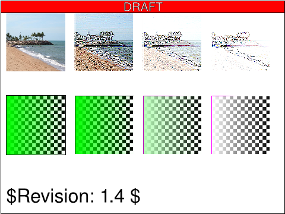 |
| [`filters-conv-05-f`](../../Tests/SVGConformanceTests/Resources/W3C-SVG-1.1/svg/filters-conv-05-f.svg) | `skipped` feature family not yet supported by SVGeeKit | — | 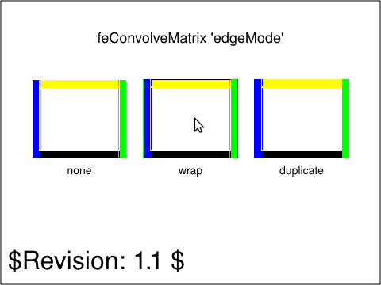 |
| [`filters-diffuse-01-f`](../../Tests/SVGConformanceTests/Resources/W3C-SVG-1.1/svg/filters-diffuse-01-f.svg) | `skipped` feature family not yet supported by SVGeeKit | — | 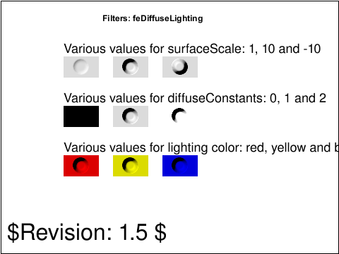 |
| [`filters-displace-01-f`](../../Tests/SVGConformanceTests/Resources/W3C-SVG-1.1/svg/filters-displace-01-f.svg) | `skipped` feature family not yet supported by SVGeeKit | — | 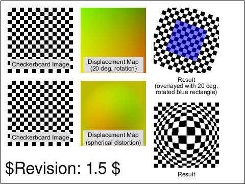 |
| [`filters-displace-02-f`](../../Tests/SVGConformanceTests/Resources/W3C-SVG-1.1/svg/filters-displace-02-f.svg) | `skipped` feature family not yet supported by SVGeeKit | — | 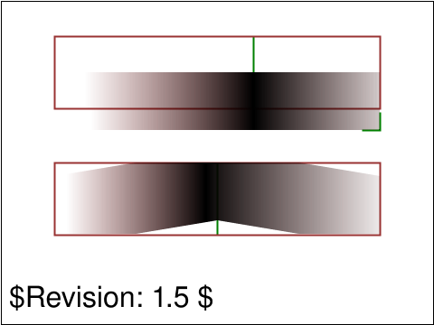 |
| [`filters-example-01-b`](../../Tests/SVGConformanceTests/Resources/W3C-SVG-1.1/svg/filters-example-01-b.svg) | `skipped` feature family not yet supported by SVGeeKit | — |  |
| [`filters-felem-01-b`](../../Tests/SVGConformanceTests/Resources/W3C-SVG-1.1/svg/filters-felem-01-b.svg) | `skipped` feature family not yet supported by SVGeeKit | — | 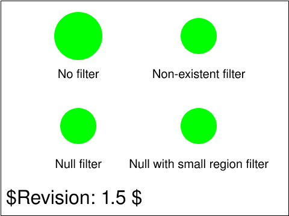 |
| [`filters-felem-02-f`](../../Tests/SVGConformanceTests/Resources/W3C-SVG-1.1/svg/filters-felem-02-f.svg) | `skipped` feature family not yet supported by SVGeeKit | — | 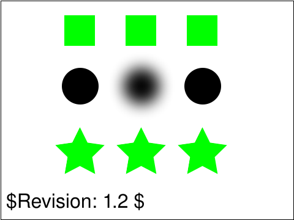 |
| [`filters-gauss-01-b`](../../Tests/SVGConformanceTests/Resources/W3C-SVG-1.1/svg/filters-gauss-01-b.svg) | `skipped` feature family not yet supported by SVGeeKit | — | 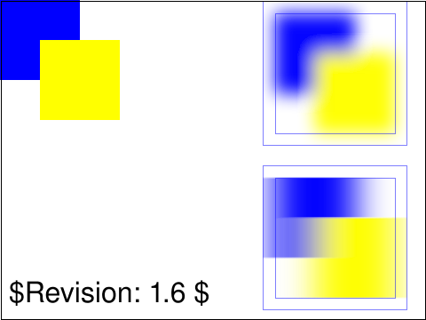 |
| [`filters-gauss-02-f`](../../Tests/SVGConformanceTests/Resources/W3C-SVG-1.1/svg/filters-gauss-02-f.svg) | `skipped` feature family not yet supported by SVGeeKit | — | 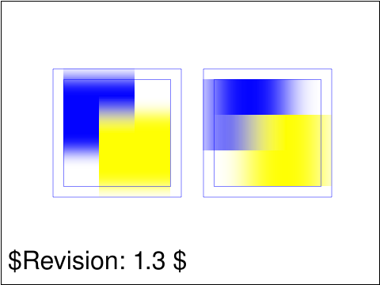 |
| [`filters-gauss-03-f`](../../Tests/SVGConformanceTests/Resources/W3C-SVG-1.1/svg/filters-gauss-03-f.svg) | `skipped` feature family not yet supported by SVGeeKit | — | 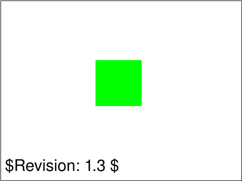 |
| [`filters-image-01-b`](../../Tests/SVGConformanceTests/Resources/W3C-SVG-1.1/svg/filters-image-01-b.svg) | `skipped` feature family not yet supported by SVGeeKit | — |  |
| [`filters-image-02-b`](../../Tests/SVGConformanceTests/Resources/W3C-SVG-1.1/svg/filters-image-02-b.svg) | `skipped` feature family not yet supported by SVGeeKit | — | 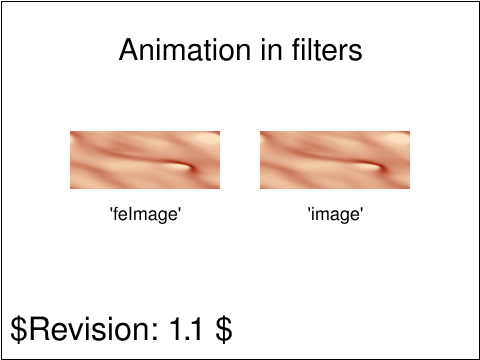 |
| [`filters-image-03-f`](../../Tests/SVGConformanceTests/Resources/W3C-SVG-1.1/svg/filters-image-03-f.svg) | `skipped` feature family not yet supported by SVGeeKit | — | 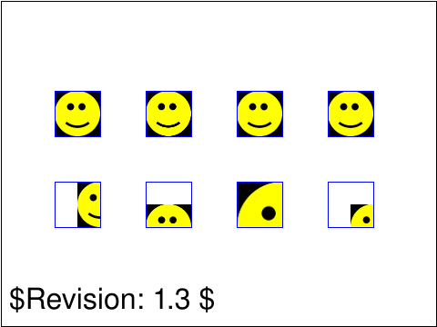 |
| [`filters-image-04-f`](../../Tests/SVGConformanceTests/Resources/W3C-SVG-1.1/svg/filters-image-04-f.svg) | `skipped` feature family not yet supported by SVGeeKit | — | 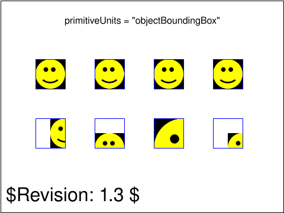 |
| [`filters-image-05-f`](../../Tests/SVGConformanceTests/Resources/W3C-SVG-1.1/svg/filters-image-05-f.svg) | `skipped` feature family not yet supported by SVGeeKit | — | 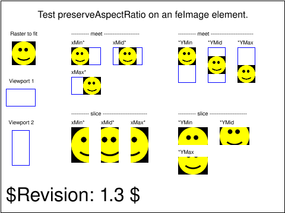 |
| [`filters-light-01-f`](../../Tests/SVGConformanceTests/Resources/W3C-SVG-1.1/svg/filters-light-01-f.svg) | `skipped` feature family not yet supported by SVGeeKit | — | 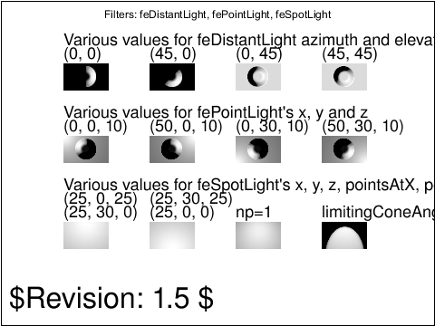 |
| [`filters-light-02-f`](../../Tests/SVGConformanceTests/Resources/W3C-SVG-1.1/svg/filters-light-02-f.svg) | `skipped` feature family not yet supported by SVGeeKit | — | 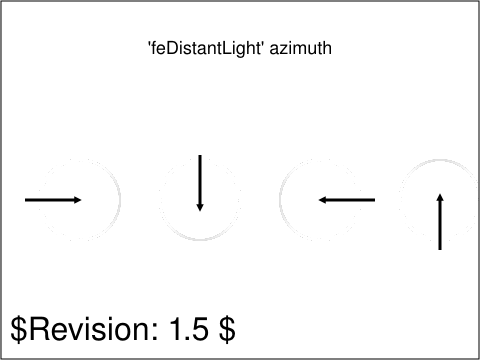 |
| [`filters-light-03-f`](../../Tests/SVGConformanceTests/Resources/W3C-SVG-1.1/svg/filters-light-03-f.svg) | `skipped` feature family not yet supported by SVGeeKit | — | 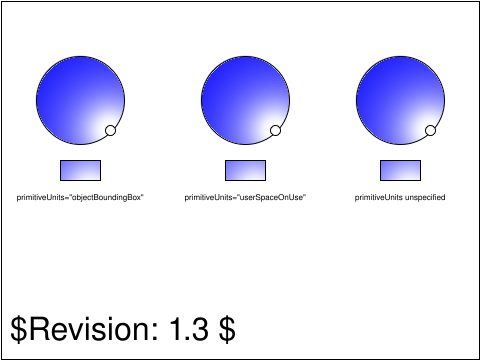 |
| [`filters-light-04-f`](../../Tests/SVGConformanceTests/Resources/W3C-SVG-1.1/svg/filters-light-04-f.svg) | `skipped` feature family not yet supported by SVGeeKit | — | 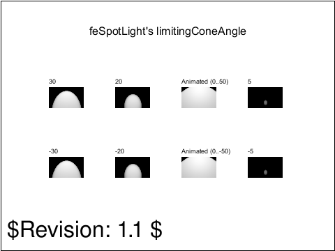 |
| [`filters-light-05-f`](../../Tests/SVGConformanceTests/Resources/W3C-SVG-1.1/svg/filters-light-05-f.svg) | `skipped` feature family not yet supported by SVGeeKit | — | 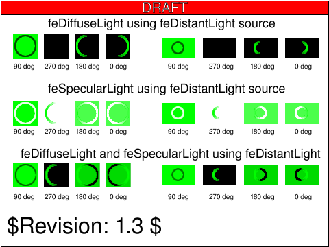 |
| [`filters-morph-01-f`](../../Tests/SVGConformanceTests/Resources/W3C-SVG-1.1/svg/filters-morph-01-f.svg) | `skipped` feature family not yet supported by SVGeeKit | — | 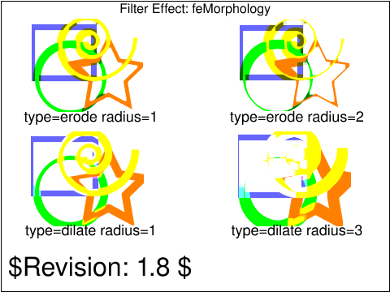 |
| [`filters-offset-01-b`](../../Tests/SVGConformanceTests/Resources/W3C-SVG-1.1/svg/filters-offset-01-b.svg) | `skipped` feature family not yet supported by SVGeeKit | — |  |
| [`filters-offset-02-b`](../../Tests/SVGConformanceTests/Resources/W3C-SVG-1.1/svg/filters-offset-02-b.svg) | `skipped` feature family not yet supported by SVGeeKit | — | 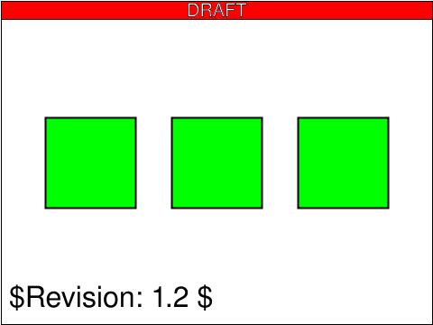 |
| [`filters-overview-01-b`](../../Tests/SVGConformanceTests/Resources/W3C-SVG-1.1/svg/filters-overview-01-b.svg) | `skipped` feature family not yet supported by SVGeeKit | — | 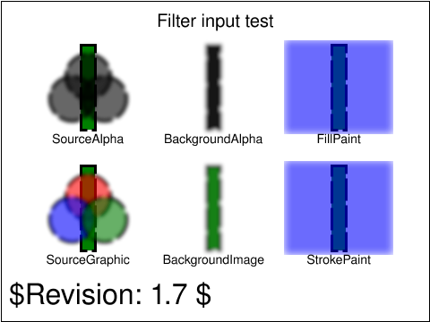 |
| [`filters-overview-02-b`](../../Tests/SVGConformanceTests/Resources/W3C-SVG-1.1/svg/filters-overview-02-b.svg) | `skipped` feature family not yet supported by SVGeeKit | — |  |
| [`filters-overview-03-b`](../../Tests/SVGConformanceTests/Resources/W3C-SVG-1.1/svg/filters-overview-03-b.svg) | `skipped` feature family not yet supported by SVGeeKit | — | 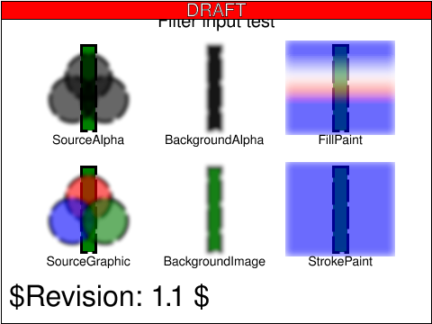 |
| [`filters-specular-01-f`](../../Tests/SVGConformanceTests/Resources/W3C-SVG-1.1/svg/filters-specular-01-f.svg) | `skipped` feature family not yet supported by SVGeeKit | — | 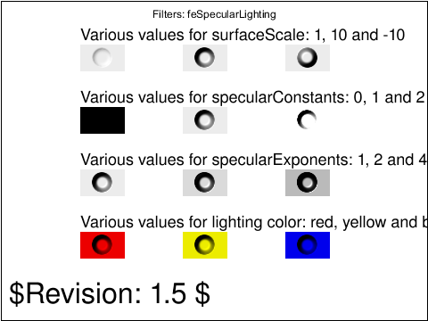 |
| [`filters-tile-01-b`](../../Tests/SVGConformanceTests/Resources/W3C-SVG-1.1/svg/filters-tile-01-b.svg) | `skipped` feature family not yet supported by SVGeeKit | — | 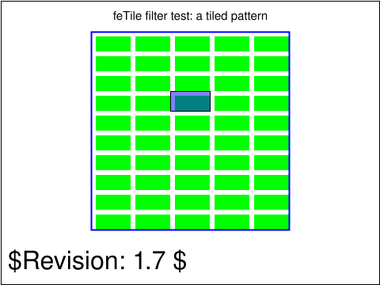 |
| [`filters-turb-01-f`](../../Tests/SVGConformanceTests/Resources/W3C-SVG-1.1/svg/filters-turb-01-f.svg) | `skipped` feature family not yet supported by SVGeeKit | — | 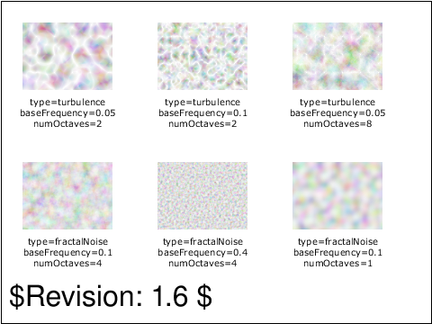 |
| [`filters-turb-02-f`](../../Tests/SVGConformanceTests/Resources/W3C-SVG-1.1/svg/filters-turb-02-f.svg) | `skipped` feature family not yet supported by SVGeeKit | — | 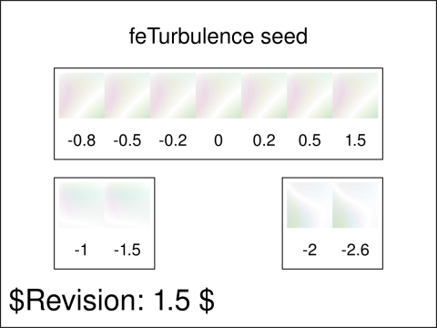 |

