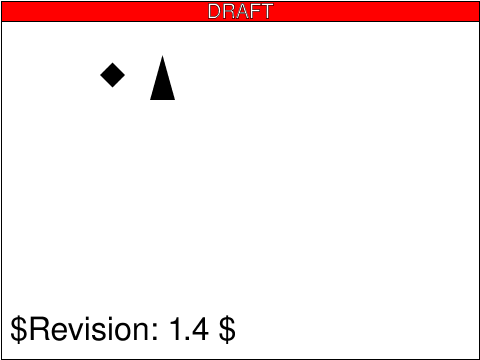
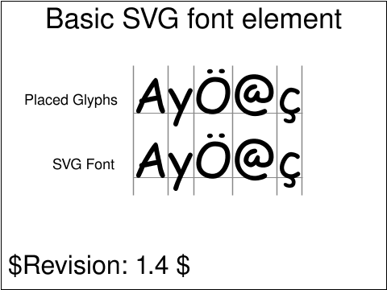
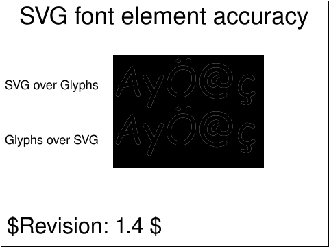
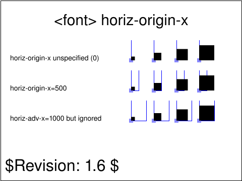
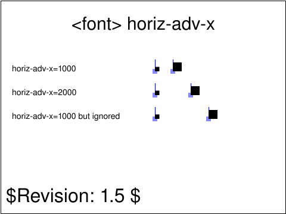
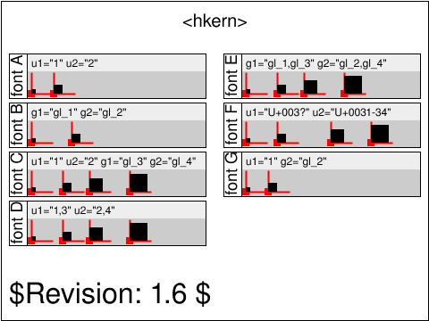

<!-- Generated by SVGConformanceMarkdownReport. Do not edit. -->

# fonts

17 tests · generated 2026-08-20 · [coverage index](README.md)

| Status | Count |
| --- | ---: |
| `passed` | 0 |
| `partialBaseline` | 0 |
| `skipped` | 17 |

## Renders

| Test | Status | SVGeeKit | W3C reference |
| --- | --- | --- | --- |
| [`fonts-desc-01-t`](../../Tests/SVGConformanceTests/Resources/W3C-SVG-1.1/svg/fonts-desc-01-t.svg) | `skipped` feature family not yet supported by SVGeeKit | — |  |
| [`fonts-desc-02-t`](../../Tests/SVGConformanceTests/Resources/W3C-SVG-1.1/svg/fonts-desc-02-t.svg) | `skipped` feature family not yet supported by SVGeeKit | — |  |
| [`fonts-desc-03-t`](../../Tests/SVGConformanceTests/Resources/W3C-SVG-1.1/svg/fonts-desc-03-t.svg) | `skipped` feature family not yet supported by SVGeeKit | — |  |
| [`fonts-desc-04-t`](../../Tests/SVGConformanceTests/Resources/W3C-SVG-1.1/svg/fonts-desc-04-t.svg) | `skipped` feature family not yet supported by SVGeeKit | — |  |
| [`fonts-desc-05-t`](../../Tests/SVGConformanceTests/Resources/W3C-SVG-1.1/svg/fonts-desc-05-t.svg) | `skipped` feature family not yet supported by SVGeeKit | — |  |
| [`fonts-elem-01-t`](../../Tests/SVGConformanceTests/Resources/W3C-SVG-1.1/svg/fonts-elem-01-t.svg) | `skipped` feature family not yet supported by SVGeeKit | — |  |
| [`fonts-elem-02-t`](../../Tests/SVGConformanceTests/Resources/W3C-SVG-1.1/svg/fonts-elem-02-t.svg) | `skipped` feature family not yet supported by SVGeeKit | — |  |
| [`fonts-elem-03-b`](../../Tests/SVGConformanceTests/Resources/W3C-SVG-1.1/svg/fonts-elem-03-b.svg) | `skipped` feature family not yet supported by SVGeeKit | — |  |
| [`fonts-elem-04-b`](../../Tests/SVGConformanceTests/Resources/W3C-SVG-1.1/svg/fonts-elem-04-b.svg) | `skipped` feature family not yet supported by SVGeeKit | — |  |
| [`fonts-elem-05-t`](../../Tests/SVGConformanceTests/Resources/W3C-SVG-1.1/svg/fonts-elem-05-t.svg) | `skipped` feature family not yet supported by SVGeeKit | — |  |
| [`fonts-elem-06-t`](../../Tests/SVGConformanceTests/Resources/W3C-SVG-1.1/svg/fonts-elem-06-t.svg) | `skipped` feature family not yet supported by SVGeeKit | — |  |
| [`fonts-elem-07-b`](../../Tests/SVGConformanceTests/Resources/W3C-SVG-1.1/svg/fonts-elem-07-b.svg) | `skipped` feature family not yet supported by SVGeeKit | — |  |
| [`fonts-glyph-02-t`](../../Tests/SVGConformanceTests/Resources/W3C-SVG-1.1/svg/fonts-glyph-02-t.svg) | `skipped` feature family not yet supported by SVGeeKit | — |  |
| [`fonts-glyph-03-t`](../../Tests/SVGConformanceTests/Resources/W3C-SVG-1.1/svg/fonts-glyph-03-t.svg) | `skipped` feature family not yet supported by SVGeeKit | — |  |
| [`fonts-glyph-04-t`](../../Tests/SVGConformanceTests/Resources/W3C-SVG-1.1/svg/fonts-glyph-04-t.svg) | `skipped` feature family not yet supported by SVGeeKit | — |  |
| [`fonts-kern-01-t`](../../Tests/SVGConformanceTests/Resources/W3C-SVG-1.1/svg/fonts-kern-01-t.svg) | `skipped` feature family not yet supported by SVGeeKit | — |  |
| [`fonts-overview-201-t`](../../Tests/SVGConformanceTests/Resources/W3C-SVG-1.1/svg/fonts-overview-201-t.svg) | `skipped` feature family not yet supported by SVGeeKit | — |  |

