<!-- Generated by SVGConformanceMarkdownReport. Do not edit. -->

# interact

24 tests · generated 2026-08-20 · [coverage index](README.md)

| Status | Count |
| --- | ---: |
| `passed` | 0 |
| `partialBaseline` | 0 |
| `skipped` | 24 |

## Renders

| Test | Status | SVGeeKit | W3C reference |
| --- | --- | --- | --- |
| [`interact-cursor-01-f`](../../Tests/SVGConformanceTests/Resources/W3C-SVG-1.1/svg/interact-cursor-01-f.svg) | `skipped` feature family not yet supported by SVGeeKit | — | 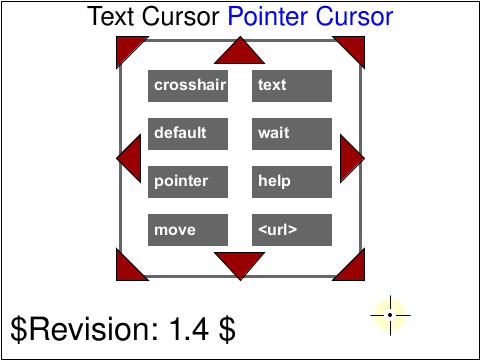 |
| [`interact-dom-01-b`](../../Tests/SVGConformanceTests/Resources/W3C-SVG-1.1/svg/interact-dom-01-b.svg) | `skipped` feature family not yet supported by SVGeeKit | — |  |
| [`interact-events-01-b`](../../Tests/SVGConformanceTests/Resources/W3C-SVG-1.1/svg/interact-events-01-b.svg) | `skipped` feature family not yet supported by SVGeeKit | — | 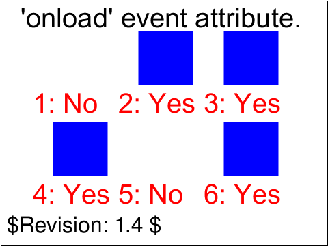 |
| [`interact-events-02-b`](../../Tests/SVGConformanceTests/Resources/W3C-SVG-1.1/svg/interact-events-02-b.svg) | `skipped` feature family not yet supported by SVGeeKit | — |  |
| [`interact-events-202-f`](../../Tests/SVGConformanceTests/Resources/W3C-SVG-1.1/svg/interact-events-202-f.svg) | `skipped` feature family not yet supported by SVGeeKit | — |  |
| [`interact-events-203-t`](../../Tests/SVGConformanceTests/Resources/W3C-SVG-1.1/svg/interact-events-203-t.svg) | `skipped` feature family not yet supported by SVGeeKit | — |  |
| [`interact-order-01-b`](../../Tests/SVGConformanceTests/Resources/W3C-SVG-1.1/svg/interact-order-01-b.svg) | `skipped` feature family not yet supported by SVGeeKit | — | 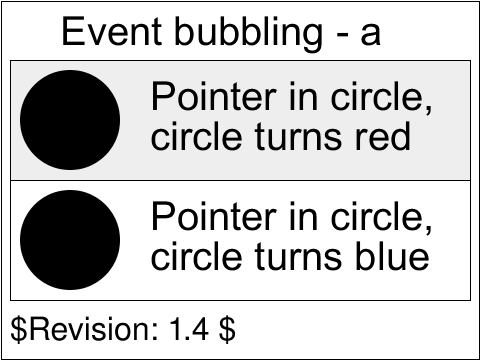 |
| [`interact-order-02-b`](../../Tests/SVGConformanceTests/Resources/W3C-SVG-1.1/svg/interact-order-02-b.svg) | `skipped` feature family not yet supported by SVGeeKit | — | 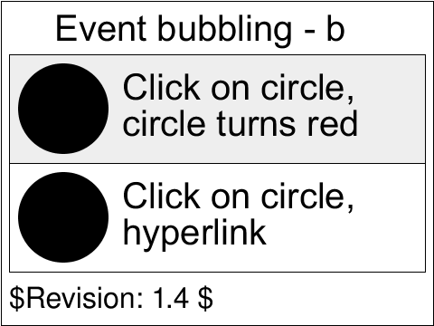 |
| [`interact-order-03-b`](../../Tests/SVGConformanceTests/Resources/W3C-SVG-1.1/svg/interact-order-03-b.svg) | `skipped` feature family not yet supported by SVGeeKit | — | 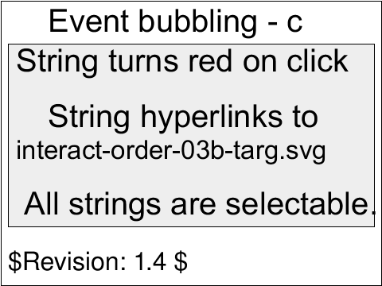 |
| [`interact-pevents-01-b`](../../Tests/SVGConformanceTests/Resources/W3C-SVG-1.1/svg/interact-pevents-01-b.svg) | `skipped` feature family not yet supported by SVGeeKit | — | 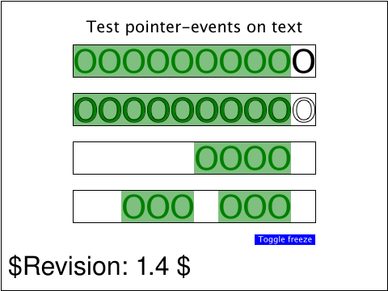 |
| [`interact-pevents-03-b`](../../Tests/SVGConformanceTests/Resources/W3C-SVG-1.1/svg/interact-pevents-03-b.svg) | `skipped` feature family not yet supported by SVGeeKit | — |  |
| [`interact-pevents-04-t`](../../Tests/SVGConformanceTests/Resources/W3C-SVG-1.1/svg/interact-pevents-04-t.svg) | `skipped` feature family not yet supported by SVGeeKit | — |  |
| [`interact-pevents-05-b`](../../Tests/SVGConformanceTests/Resources/W3C-SVG-1.1/svg/interact-pevents-05-b.svg) | `skipped` feature family not yet supported by SVGeeKit | — | 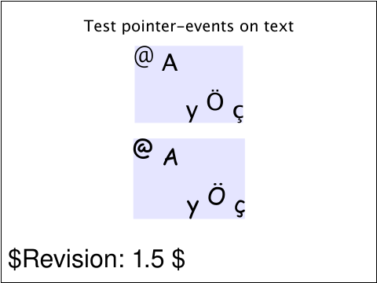 |
| [`interact-pevents-07-t`](../../Tests/SVGConformanceTests/Resources/W3C-SVG-1.1/svg/interact-pevents-07-t.svg) | `skipped` feature family not yet supported by SVGeeKit | — | 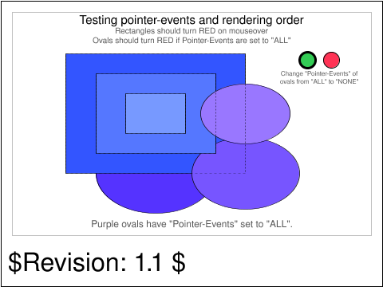 |
| [`interact-pevents-08-f`](../../Tests/SVGConformanceTests/Resources/W3C-SVG-1.1/svg/interact-pevents-08-f.svg) | `skipped` feature family not yet supported by SVGeeKit | — | 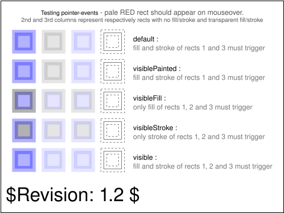 |
| [`interact-pevents-09-f`](../../Tests/SVGConformanceTests/Resources/W3C-SVG-1.1/svg/interact-pevents-09-f.svg) | `skipped` feature family not yet supported by SVGeeKit | — | 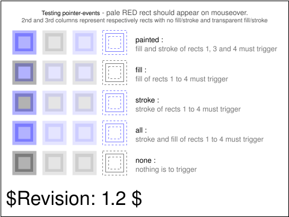 |
| [`interact-pevents-10-f`](../../Tests/SVGConformanceTests/Resources/W3C-SVG-1.1/svg/interact-pevents-10-f.svg) | `skipped` feature family not yet supported by SVGeeKit | — |  |
| [`interact-pointer-01-t`](../../Tests/SVGConformanceTests/Resources/W3C-SVG-1.1/svg/interact-pointer-01-t.svg) | `skipped` feature family not yet supported by SVGeeKit | — |  |
| [`interact-pointer-02-t`](../../Tests/SVGConformanceTests/Resources/W3C-SVG-1.1/svg/interact-pointer-02-t.svg) | `skipped` feature family not yet supported by SVGeeKit | — |  |
| [`interact-pointer-03-t`](../../Tests/SVGConformanceTests/Resources/W3C-SVG-1.1/svg/interact-pointer-03-t.svg) | `skipped` feature family not yet supported by SVGeeKit | — |  |
| [`interact-pointer-04-f`](../../Tests/SVGConformanceTests/Resources/W3C-SVG-1.1/svg/interact-pointer-04-f.svg) | `skipped` feature family not yet supported by SVGeeKit | — | 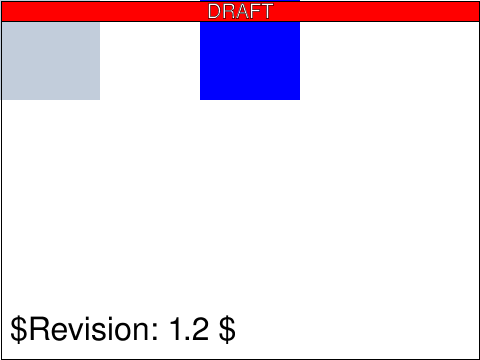 |
| [`interact-zoom-01-t`](../../Tests/SVGConformanceTests/Resources/W3C-SVG-1.1/svg/interact-zoom-01-t.svg) | `skipped` feature family not yet supported by SVGeeKit | — | 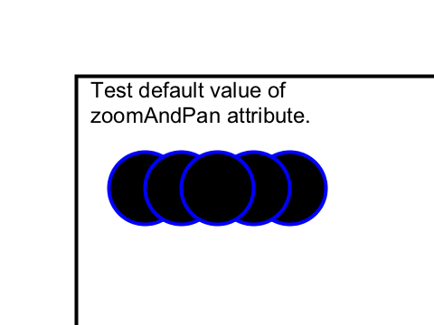 |
| [`interact-zoom-02-t`](../../Tests/SVGConformanceTests/Resources/W3C-SVG-1.1/svg/interact-zoom-02-t.svg) | `skipped` feature family not yet supported by SVGeeKit | — | 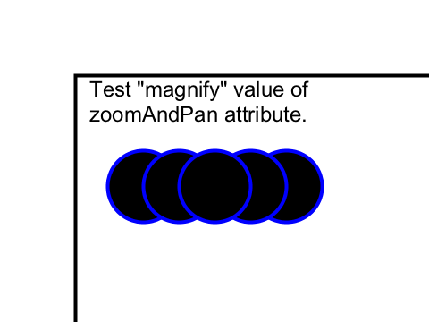 |
| [`interact-zoom-03-t`](../../Tests/SVGConformanceTests/Resources/W3C-SVG-1.1/svg/interact-zoom-03-t.svg) | `skipped` feature family not yet supported by SVGeeKit | — | 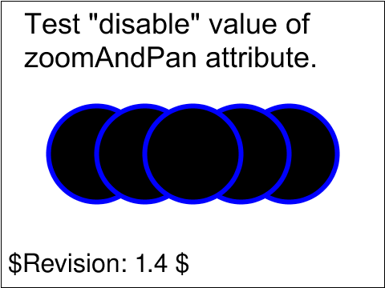 |

