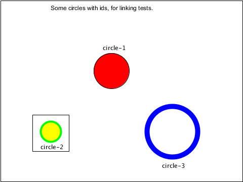
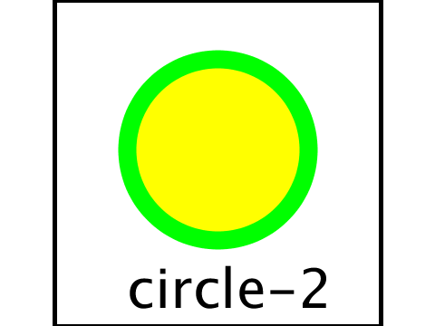
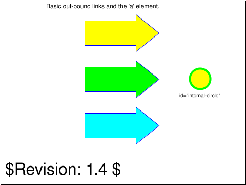
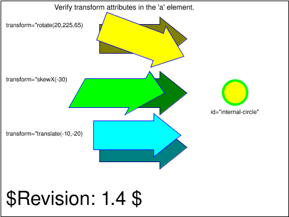
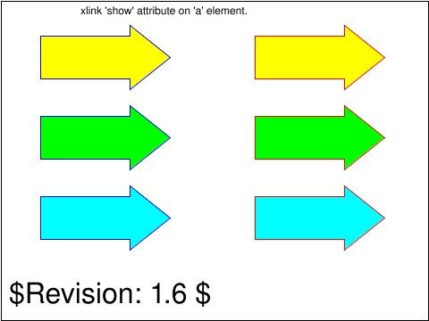
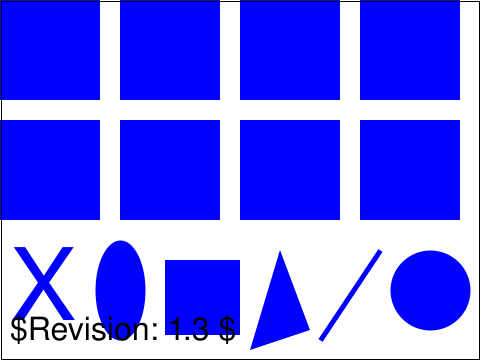
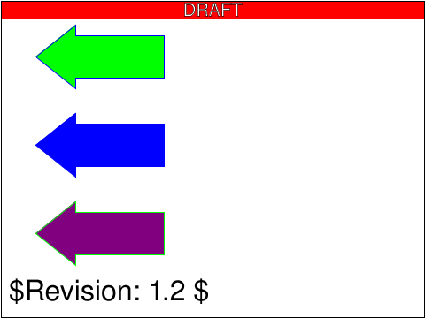
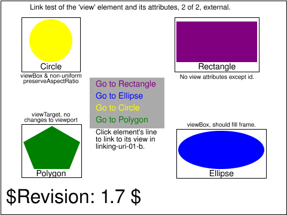
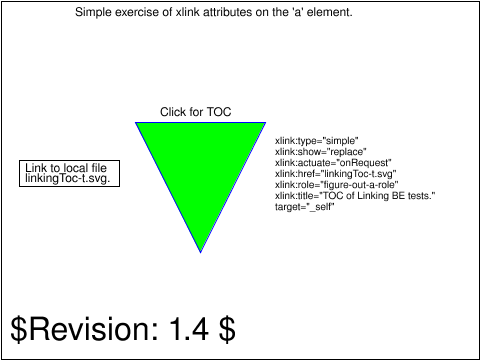

<!-- Generated by SVGConformanceMarkdownReport. Do not edit. -->

# linking

12 tests · generated 2026-08-20 · [coverage index](README.md)

| Status | Count |
| --- | ---: |
| `passed` | 0 |
| `partialBaseline` | 0 |
| `skipped` | 12 |

## Renders

| Test | Status | SVGeeKit | W3C reference |
| --- | --- | --- | --- |
| [`linking-a-01-b`](../../Tests/SVGConformanceTests/Resources/W3C-SVG-1.1/svg/linking-a-01-b.svg) | `skipped` feature family not yet supported by SVGeeKit | — |  |
| [`linking-a-03-b`](../../Tests/SVGConformanceTests/Resources/W3C-SVG-1.1/svg/linking-a-03-b.svg) | `skipped` feature family not yet supported by SVGeeKit | — |  |
| [`linking-a-04-t`](../../Tests/SVGConformanceTests/Resources/W3C-SVG-1.1/svg/linking-a-04-t.svg) | `skipped` feature family not yet supported by SVGeeKit | — |  |
| [`linking-a-05-t`](../../Tests/SVGConformanceTests/Resources/W3C-SVG-1.1/svg/linking-a-05-t.svg) | `skipped` feature family not yet supported by SVGeeKit | — |  |
| [`linking-a-07-t`](../../Tests/SVGConformanceTests/Resources/W3C-SVG-1.1/svg/linking-a-07-t.svg) | `skipped` feature family not yet supported by SVGeeKit | — |  |
| [`linking-a-08-t`](../../Tests/SVGConformanceTests/Resources/W3C-SVG-1.1/svg/linking-a-08-t.svg) | `skipped` feature family not yet supported by SVGeeKit | — |  |
| [`linking-a-09-b`](../../Tests/SVGConformanceTests/Resources/W3C-SVG-1.1/svg/linking-a-09-b.svg) | `skipped` feature family not yet supported by SVGeeKit | — |  |
| [`linking-a-10-f`](../../Tests/SVGConformanceTests/Resources/W3C-SVG-1.1/svg/linking-a-10-f.svg) | `skipped` feature family not yet supported by SVGeeKit | — |  |
| [`linking-frag-01-f`](../../Tests/SVGConformanceTests/Resources/W3C-SVG-1.1/svg/linking-frag-01-f.svg) | `skipped` feature family not yet supported by SVGeeKit | — |  |
| [`linking-uri-01-b`](../../Tests/SVGConformanceTests/Resources/W3C-SVG-1.1/svg/linking-uri-01-b.svg) | `skipped` feature family not yet supported by SVGeeKit | — |  |
| [`linking-uri-02-b`](../../Tests/SVGConformanceTests/Resources/W3C-SVG-1.1/svg/linking-uri-02-b.svg) | `skipped` feature family not yet supported by SVGeeKit | — |  |
| [`linking-uri-03-t`](../../Tests/SVGConformanceTests/Resources/W3C-SVG-1.1/svg/linking-uri-03-t.svg) | `skipped` feature family not yet supported by SVGeeKit | — |  |

