<!-- Generated by SVGConformanceMarkdownReport. Do not edit. -->

# masking

19 tests · generated 2026-08-20 · [coverage index](README.md)

| Status | Count |
| --- | ---: |
| `passed` | 15 |
| `partialBaseline` | 0 |
| `skipped` | 4 |

## Renders

| Test | Status | SVGeeKit | W3C reference |
| --- | --- | --- | --- |
| [`masking-filter-01-f`](../../Tests/SVGConformanceTests/Resources/W3C-SVG-1.1/svg/masking-filter-01-f.svg) | `skipped` feature family not yet supported by SVGeeKit | — |  |
| [`masking-intro-01-f`](../../Tests/SVGConformanceTests/Resources/W3C-SVG-1.1/svg/masking-intro-01-f.svg) | `skipped` feature family not yet supported by SVGeeKit | — | 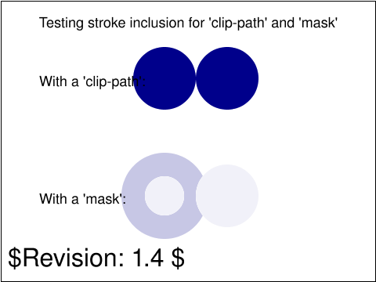 |
| [`masking-mask-01-b`](../../Tests/SVGConformanceTests/Resources/W3C-SVG-1.1/svg/masking-mask-01-b.svg) | `passed` |  |  |
| [`masking-mask-02-f`](../../Tests/SVGConformanceTests/Resources/W3C-SVG-1.1/svg/masking-mask-02-f.svg) | `passed` |  |  |
| [`masking-opacity-01-b`](../../Tests/SVGConformanceTests/Resources/W3C-SVG-1.1/svg/masking-opacity-01-b.svg) | `passed` | 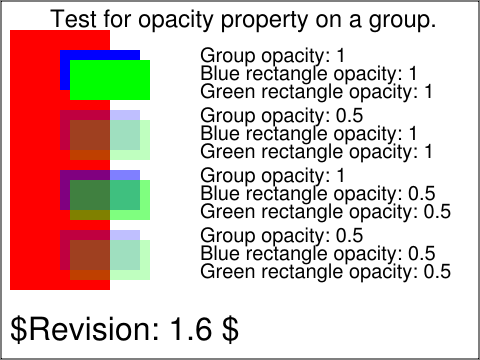 | 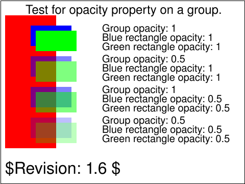 |
| [`masking-path-01-b`](../../Tests/SVGConformanceTests/Resources/W3C-SVG-1.1/svg/masking-path-01-b.svg) | `passed` | 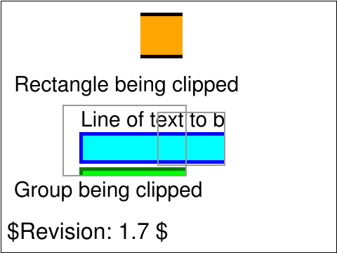 | 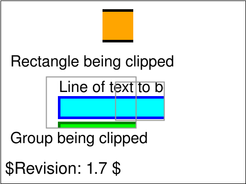 |
| [`masking-path-02-b`](../../Tests/SVGConformanceTests/Resources/W3C-SVG-1.1/svg/masking-path-02-b.svg) | `passed` |  | 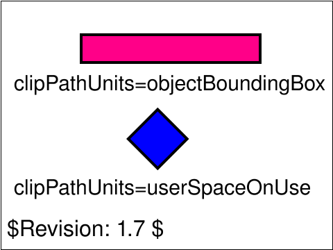 |
| [`masking-path-03-b`](../../Tests/SVGConformanceTests/Resources/W3C-SVG-1.1/svg/masking-path-03-b.svg) | `passed` | 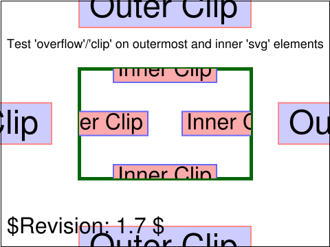 | 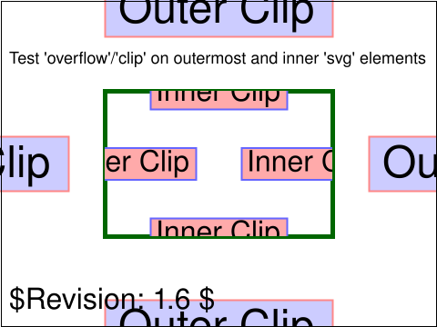 |
| [`masking-path-04-b`](../../Tests/SVGConformanceTests/Resources/W3C-SVG-1.1/svg/masking-path-04-b.svg) | `passed` |  |  |
| [`masking-path-05-f`](../../Tests/SVGConformanceTests/Resources/W3C-SVG-1.1/svg/masking-path-05-f.svg) | `passed` |  | 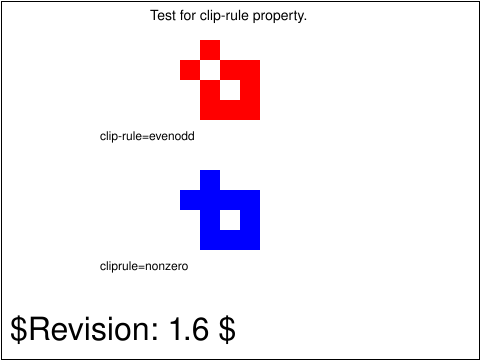 |
| [`masking-path-06-b`](../../Tests/SVGConformanceTests/Resources/W3C-SVG-1.1/svg/masking-path-06-b.svg) | `passed` | 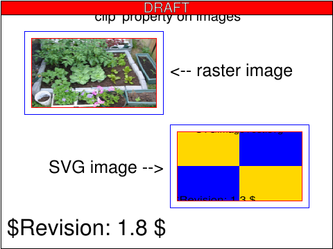 | 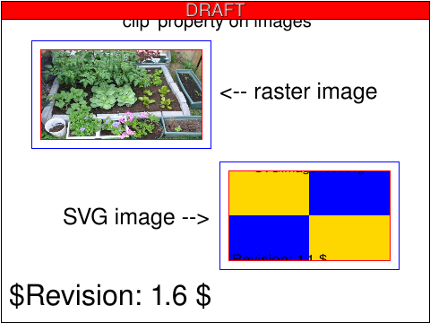 |
| [`masking-path-07-b`](../../Tests/SVGConformanceTests/Resources/W3C-SVG-1.1/svg/masking-path-07-b.svg) | `passed` | 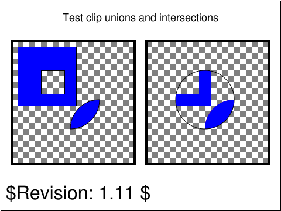 | 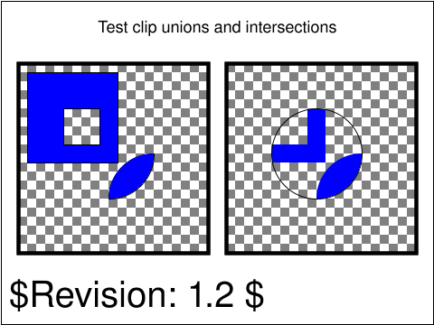 |
| [`masking-path-08-b`](../../Tests/SVGConformanceTests/Resources/W3C-SVG-1.1/svg/masking-path-08-b.svg) | `passed` | 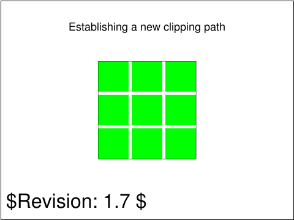 | 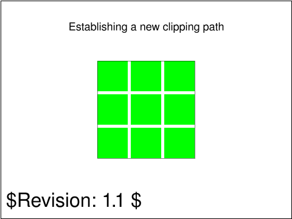 |
| [`masking-path-09-b`](../../Tests/SVGConformanceTests/Resources/W3C-SVG-1.1/svg/masking-path-09-b.svg) | `skipped` feature family not yet supported by SVGeeKit | — |  |
| [`masking-path-10-b`](../../Tests/SVGConformanceTests/Resources/W3C-SVG-1.1/svg/masking-path-10-b.svg) | `passed` | 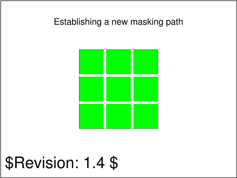 | 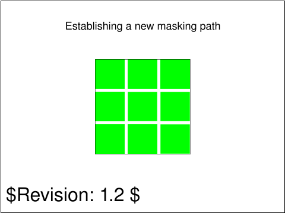 |
| [`masking-path-11-b`](../../Tests/SVGConformanceTests/Resources/W3C-SVG-1.1/svg/masking-path-11-b.svg) | `passed` | 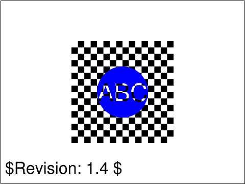 | 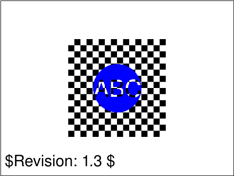 |
| [`masking-path-12-f`](../../Tests/SVGConformanceTests/Resources/W3C-SVG-1.1/svg/masking-path-12-f.svg) | `skipped` feature family not yet supported by SVGeeKit | — | 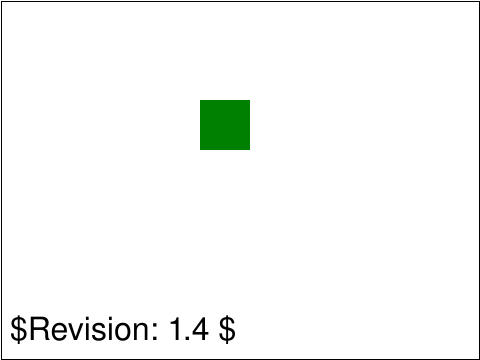 |
| [`masking-path-13-f`](../../Tests/SVGConformanceTests/Resources/W3C-SVG-1.1/svg/masking-path-13-f.svg) | `passed` |  |  |
| [`masking-path-14-f`](../../Tests/SVGConformanceTests/Resources/W3C-SVG-1.1/svg/masking-path-14-f.svg) | `passed` |  |  |

