<!-- Generated by SVGConformanceMarkdownReport. Do not edit. -->

# other

19 tests · generated 2026-08-20 · [coverage index](README.md)

| Status | Count |
| --- | ---: |
| `passed` | 1 |
| `partialBaseline` | 5 |
| `skipped` | 13 |

> `partialBaseline` means the render is tracked but **not** visually verified. Do not treat a matching partial snapshot as a pass.

## Renders

| Test | Status | SVGeeKit | W3C reference |
| --- | --- | --- | --- |
| [`conform-viewers-02-f`](../../Tests/SVGConformanceTests/Resources/W3C-SVG-1.1/svg/conform-viewers-02-f.svg) | `partialBaseline` |  |  |
| [`conform-viewers-03-f`](../../Tests/SVGConformanceTests/Resources/W3C-SVG-1.1/svg/conform-viewers-03-f.svg) | `partialBaseline` |  | 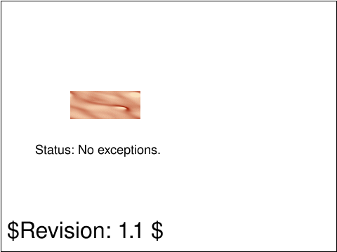 |
| [`imp-path-01-f`](../../Tests/SVGConformanceTests/Resources/W3C-SVG-1.1/svg/imp-path-01-f.svg) | `partialBaseline` | 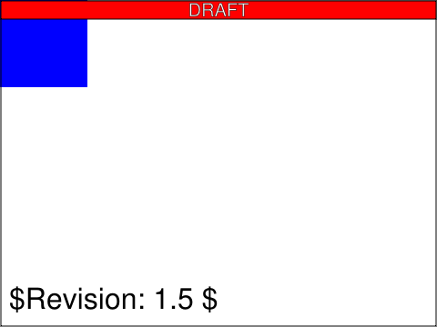 |  |
| [`svgdom-over-01-f`](../../Tests/SVGConformanceTests/Resources/W3C-SVG-1.1/svg/svgdom-over-01-f.svg) | `partialBaseline` | 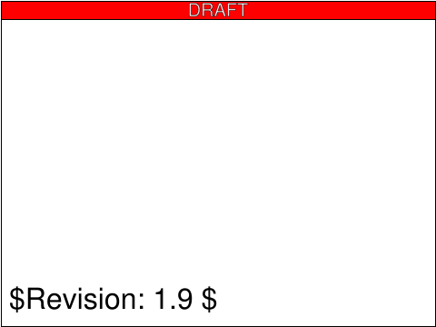 | 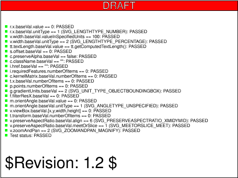 |
| [`types-basic-01-f`](../../Tests/SVGConformanceTests/Resources/W3C-SVG-1.1/svg/types-basic-01-f.svg) | `passed` |  | 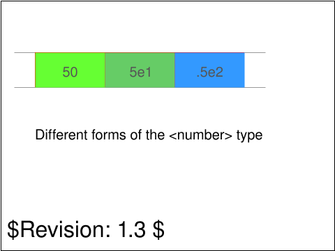 |
| [`types-basic-02-f`](../../Tests/SVGConformanceTests/Resources/W3C-SVG-1.1/svg/types-basic-02-f.svg) | `partialBaseline` | 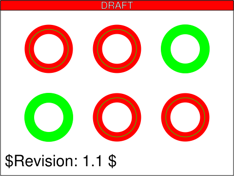 | 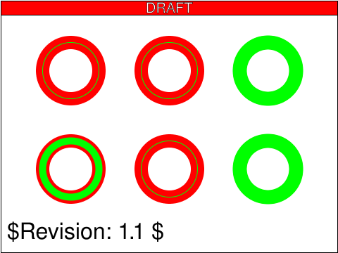 |
| [`types-dom-01-b`](../../Tests/SVGConformanceTests/Resources/W3C-SVG-1.1/svg/types-dom-01-b.svg) | `skipped` DOM API mutation; out of scope |  | 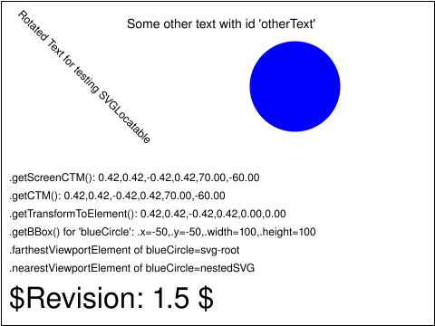 |
| [`types-dom-02-f`](../../Tests/SVGConformanceTests/Resources/W3C-SVG-1.1/svg/types-dom-02-f.svg) | `skipped` DOM API mutation; out of scope |  | 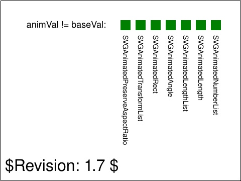 |
| [`types-dom-03-b`](../../Tests/SVGConformanceTests/Resources/W3C-SVG-1.1/svg/types-dom-03-b.svg) | `skipped` DOM API mutation; out of scope |  |  |
| [`types-dom-04-b`](../../Tests/SVGConformanceTests/Resources/W3C-SVG-1.1/svg/types-dom-04-b.svg) | `skipped` DOM API mutation; out of scope |  | 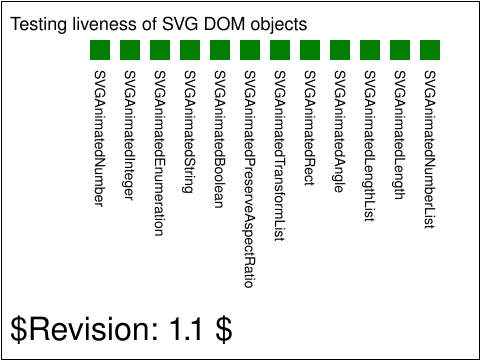 |
| [`types-dom-05-b`](../../Tests/SVGConformanceTests/Resources/W3C-SVG-1.1/svg/types-dom-05-b.svg) | `skipped` DOM API mutation; out of scope |  |  |
| [`types-dom-06-f`](../../Tests/SVGConformanceTests/Resources/W3C-SVG-1.1/svg/types-dom-06-f.svg) | `skipped` DOM API mutation; out of scope | 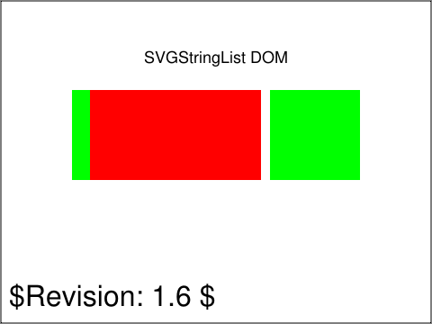 | 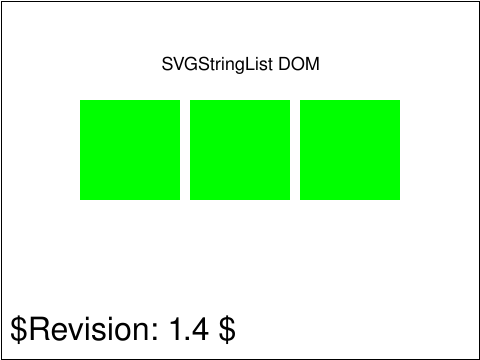 |
| [`types-dom-07-f`](../../Tests/SVGConformanceTests/Resources/W3C-SVG-1.1/svg/types-dom-07-f.svg) | `skipped` DOM API mutation; out of scope |  |  |
| [`types-dom-08-f`](../../Tests/SVGConformanceTests/Resources/W3C-SVG-1.1/svg/types-dom-08-f.svg) | `skipped` DOM API mutation; out of scope | 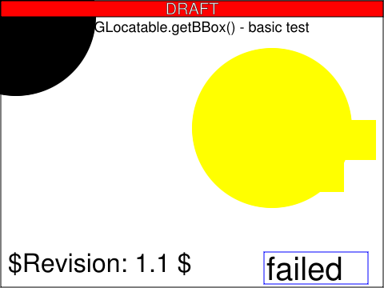 | 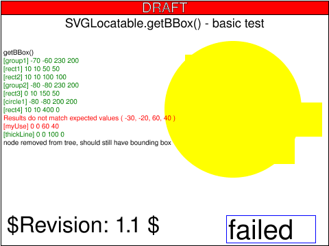 |
| [`types-dom-svgfittoviewbox-01-f`](../../Tests/SVGConformanceTests/Resources/W3C-SVG-1.1/svg/types-dom-svgfittoviewbox-01-f.svg) | `skipped` DOM API mutation; out of scope |  | 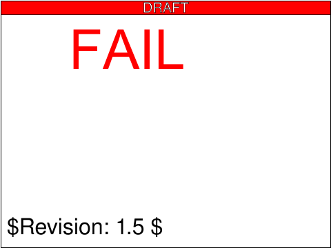 |
| [`types-dom-svglengthlist-01-f`](../../Tests/SVGConformanceTests/Resources/W3C-SVG-1.1/svg/types-dom-svglengthlist-01-f.svg) | `skipped` DOM API mutation; out of scope |  |  |
| [`types-dom-svgnumberlist-01-f`](../../Tests/SVGConformanceTests/Resources/W3C-SVG-1.1/svg/types-dom-svgnumberlist-01-f.svg) | `skipped` DOM API mutation; out of scope |  |  |
| [`types-dom-svgstringlist-01-f`](../../Tests/SVGConformanceTests/Resources/W3C-SVG-1.1/svg/types-dom-svgstringlist-01-f.svg) | `skipped` DOM API mutation; out of scope |  |  |
| [`types-dom-svgtransformable-01-f`](../../Tests/SVGConformanceTests/Resources/W3C-SVG-1.1/svg/types-dom-svgtransformable-01-f.svg) | `skipped` DOM API mutation; out of scope | 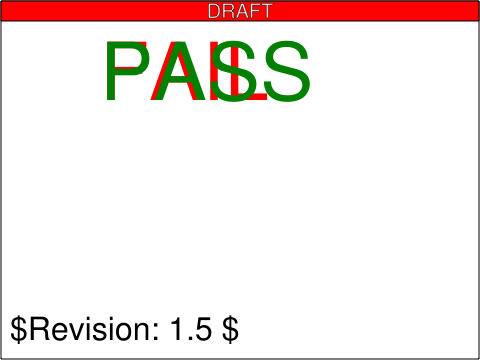 |  |

