<!-- Generated by SVGConformanceMarkdownReport. Do not edit. -->

# painting

31 tests · generated 2026-08-20 · [coverage index](README.md)

| Status | Count |
| --- | ---: |
| `passed` | 22 |
| `partialBaseline` | 0 |
| `skipped` | 9 |

## Renders

| Test | Status | SVGeeKit | W3C reference |
| --- | --- | --- | --- |
| [`painting-control-01-f`](../../Tests/SVGConformanceTests/Resources/W3C-SVG-1.1/svg/painting-control-01-f.svg) | `passed` |  |  |
| [`painting-control-02-f`](../../Tests/SVGConformanceTests/Resources/W3C-SVG-1.1/svg/painting-control-02-f.svg) | `passed` |  |  |
| [`painting-control-03-f`](../../Tests/SVGConformanceTests/Resources/W3C-SVG-1.1/svg/painting-control-03-f.svg) | `passed` |  | 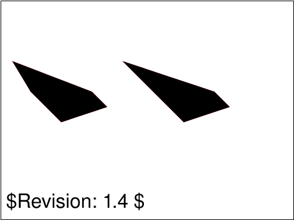 |
| [`painting-control-04-f`](../../Tests/SVGConformanceTests/Resources/W3C-SVG-1.1/svg/painting-control-04-f.svg) | `passed` | 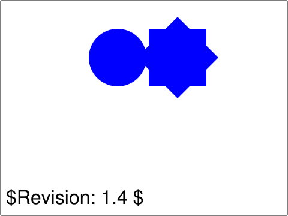 | 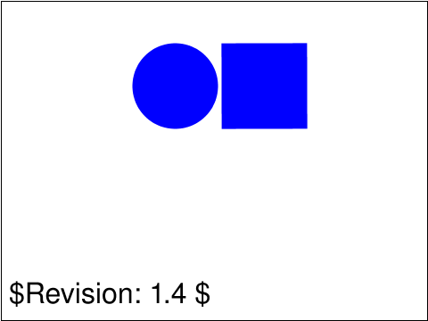 |
| [`painting-control-05-f`](../../Tests/SVGConformanceTests/Resources/W3C-SVG-1.1/svg/painting-control-05-f.svg) | `passed` | 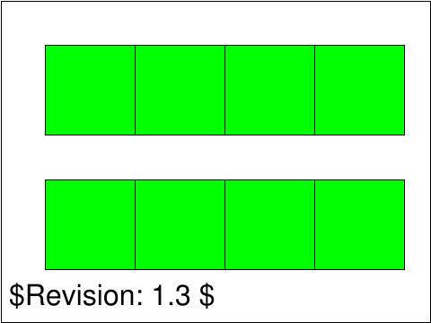 |  |
| [`painting-control-06-f`](../../Tests/SVGConformanceTests/Resources/W3C-SVG-1.1/svg/painting-control-06-f.svg) | `passed` | 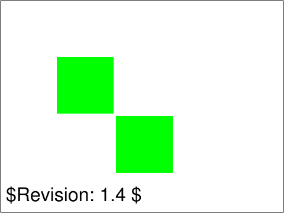 |  |
| [`painting-fill-01-t`](../../Tests/SVGConformanceTests/Resources/W3C-SVG-1.1/svg/painting-fill-01-t.svg) | `passed` |  |  |
| [`painting-fill-02-t`](../../Tests/SVGConformanceTests/Resources/W3C-SVG-1.1/svg/painting-fill-02-t.svg) | `passed` | 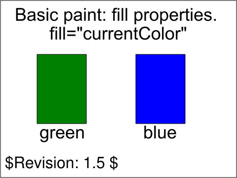 | 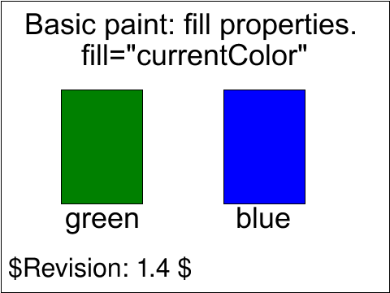 |
| [`painting-fill-03-t`](../../Tests/SVGConformanceTests/Resources/W3C-SVG-1.1/svg/painting-fill-03-t.svg) | `passed` | 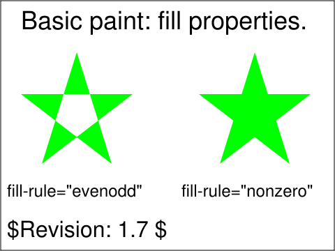 |  |
| [`painting-fill-04-t`](../../Tests/SVGConformanceTests/Resources/W3C-SVG-1.1/svg/painting-fill-04-t.svg) | `passed` |  | 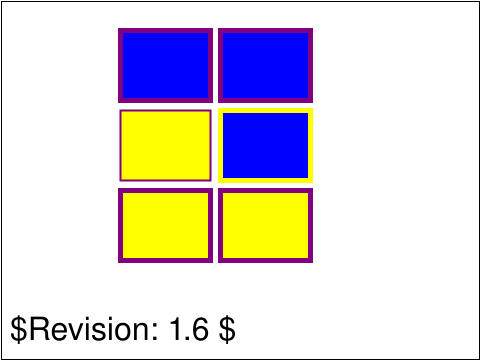 |
| [`painting-fill-05-b`](../../Tests/SVGConformanceTests/Resources/W3C-SVG-1.1/svg/painting-fill-05-b.svg) | `passed` | 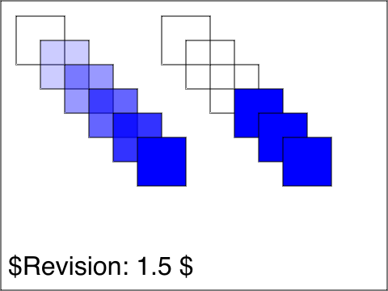 |  |
| [`painting-marker-01-f`](../../Tests/SVGConformanceTests/Resources/W3C-SVG-1.1/svg/painting-marker-01-f.svg) | `skipped` &lt;marker&gt; element not supported | — | 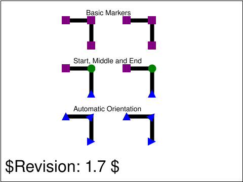 |
| [`painting-marker-02-f`](../../Tests/SVGConformanceTests/Resources/W3C-SVG-1.1/svg/painting-marker-02-f.svg) | `skipped` &lt;marker&gt; element not supported | — | 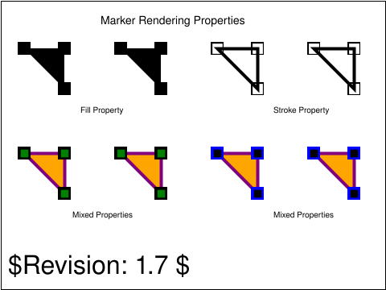 |
| [`painting-marker-03-f`](../../Tests/SVGConformanceTests/Resources/W3C-SVG-1.1/svg/painting-marker-03-f.svg) | `skipped` &lt;marker&gt; element not supported | — | 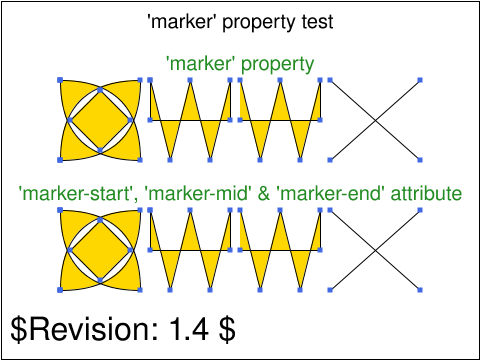 |
| [`painting-marker-04-f`](../../Tests/SVGConformanceTests/Resources/W3C-SVG-1.1/svg/painting-marker-04-f.svg) | `skipped` &lt;marker&gt; element not supported | — | 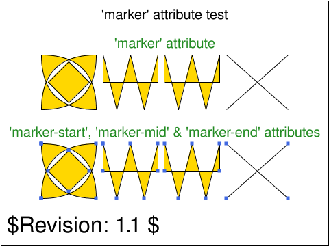 |
| [`painting-marker-05-f`](../../Tests/SVGConformanceTests/Resources/W3C-SVG-1.1/svg/painting-marker-05-f.svg) | `skipped` &lt;marker&gt; element not supported | — | 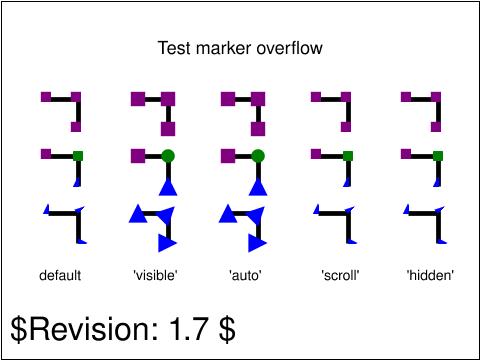 |
| [`painting-marker-06-f`](../../Tests/SVGConformanceTests/Resources/W3C-SVG-1.1/svg/painting-marker-06-f.svg) | `skipped` &lt;marker&gt; element not supported | — |  |
| [`painting-marker-07-f`](../../Tests/SVGConformanceTests/Resources/W3C-SVG-1.1/svg/painting-marker-07-f.svg) | `skipped` &lt;marker&gt; element not supported | — |  |
| [`painting-marker-properties-01-f`](../../Tests/SVGConformanceTests/Resources/W3C-SVG-1.1/svg/painting-marker-properties-01-f.svg) | `skipped` &lt;marker&gt; element not supported | — | 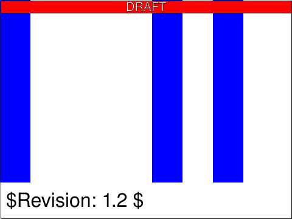 |
| [`painting-render-01-b`](../../Tests/SVGConformanceTests/Resources/W3C-SVG-1.1/svg/painting-render-01-b.svg) | `passed` | 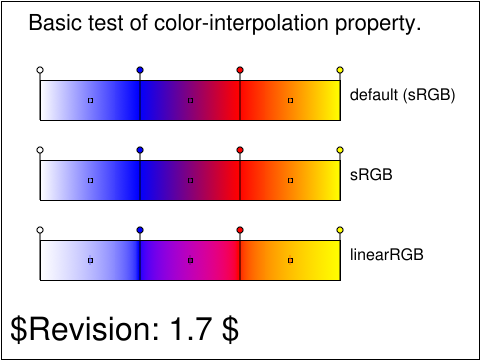 |  |
| [`painting-render-02-b`](../../Tests/SVGConformanceTests/Resources/W3C-SVG-1.1/svg/painting-render-02-b.svg) | `skipped` requires color-interpolation=linearRGB compositing; out of scope | — | 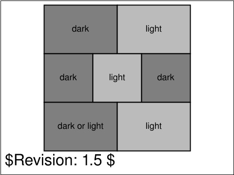 |
| [`painting-stroke-01-t`](../../Tests/SVGConformanceTests/Resources/W3C-SVG-1.1/svg/painting-stroke-01-t.svg) | `passed` | 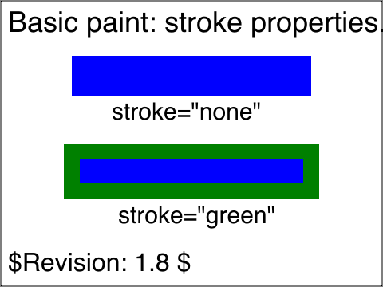 | 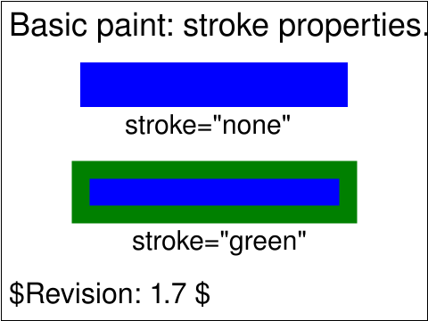 |
| [`painting-stroke-02-t`](../../Tests/SVGConformanceTests/Resources/W3C-SVG-1.1/svg/painting-stroke-02-t.svg) | `passed` | 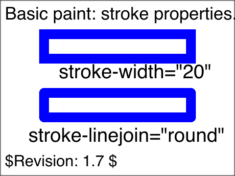 |  |
| [`painting-stroke-03-t`](../../Tests/SVGConformanceTests/Resources/W3C-SVG-1.1/svg/painting-stroke-03-t.svg) | `passed` | 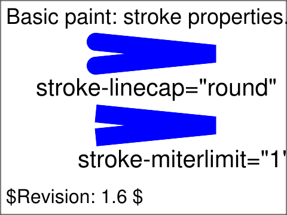 | 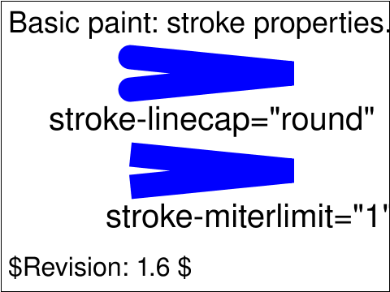 |
| [`painting-stroke-04-t`](../../Tests/SVGConformanceTests/Resources/W3C-SVG-1.1/svg/painting-stroke-04-t.svg) | `passed` | 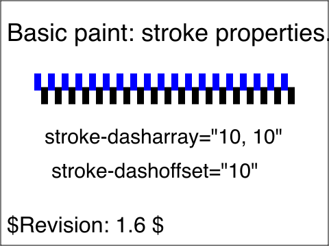 | 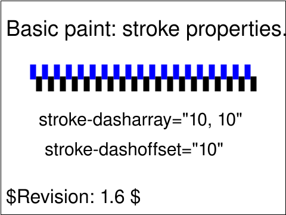 |
| [`painting-stroke-05-t`](../../Tests/SVGConformanceTests/Resources/W3C-SVG-1.1/svg/painting-stroke-05-t.svg) | `passed` | 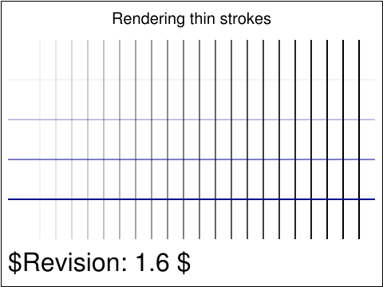 | 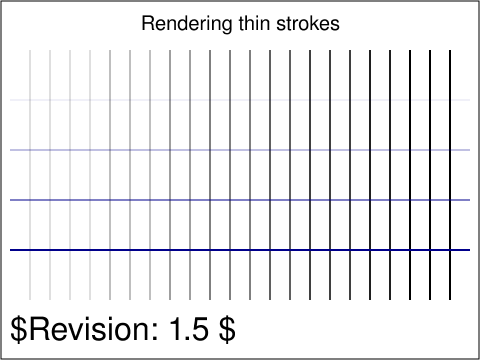 |
| [`painting-stroke-06-t`](../../Tests/SVGConformanceTests/Resources/W3C-SVG-1.1/svg/painting-stroke-06-t.svg) | `passed` | 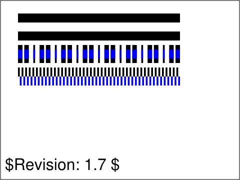 | 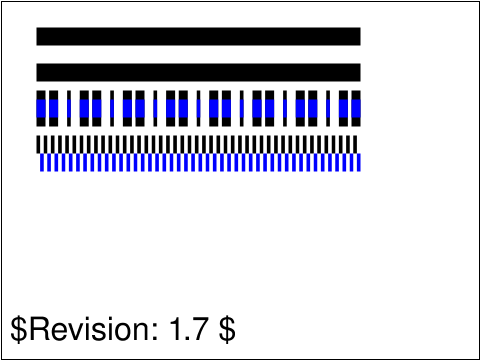 |
| [`painting-stroke-07-t`](../../Tests/SVGConformanceTests/Resources/W3C-SVG-1.1/svg/painting-stroke-07-t.svg) | `passed` |  |  |
| [`painting-stroke-08-t`](../../Tests/SVGConformanceTests/Resources/W3C-SVG-1.1/svg/painting-stroke-08-t.svg) | `passed` | 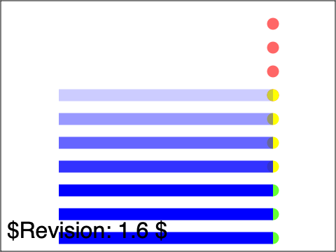 | 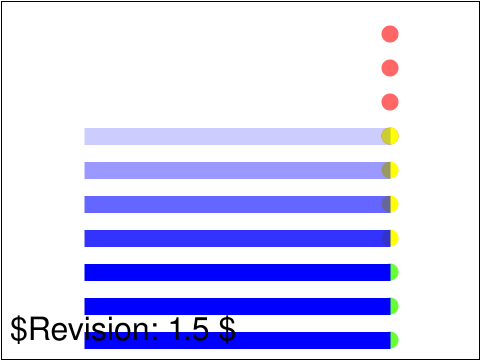 |
| [`painting-stroke-09-t`](../../Tests/SVGConformanceTests/Resources/W3C-SVG-1.1/svg/painting-stroke-09-t.svg) | `passed` |  |  |
| [`painting-stroke-10-t`](../../Tests/SVGConformanceTests/Resources/W3C-SVG-1.1/svg/painting-stroke-10-t.svg) | `passed` | 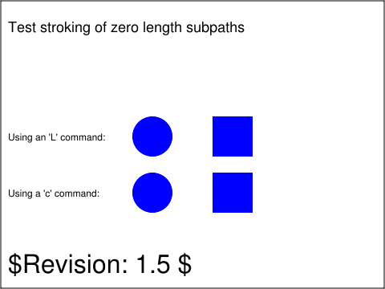 | 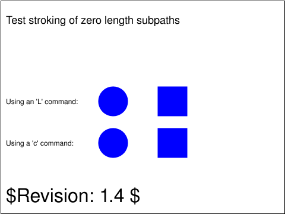 |

