<!-- Generated by SVGConformanceMarkdownReport. Do not edit. -->

# paths

21 tests · generated 2026-08-20 · [coverage index](README.md)

| Status | Count |
| --- | ---: |
| `passed` | 19 |
| `partialBaseline` | 0 |
| `skipped` | 2 |

## Renders

| Test | Status | SVGeeKit | W3C reference |
| --- | --- | --- | --- |
| [`paths-data-01-t`](../../Tests/SVGConformanceTests/Resources/W3C-SVG-1.1/svg/paths-data-01-t.svg) | `passed` | 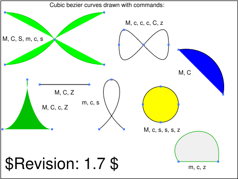 | 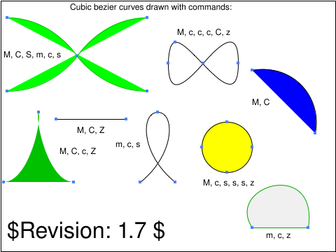 |
| [`paths-data-02-t`](../../Tests/SVGConformanceTests/Resources/W3C-SVG-1.1/svg/paths-data-02-t.svg) | `passed` | 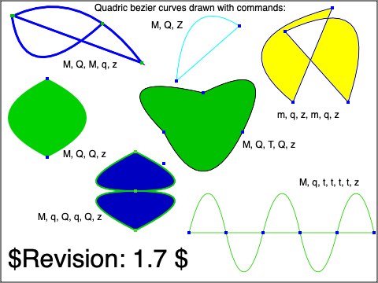 |  |
| [`paths-data-03-f`](../../Tests/SVGConformanceTests/Resources/W3C-SVG-1.1/svg/paths-data-03-f.svg) | `passed` |  | 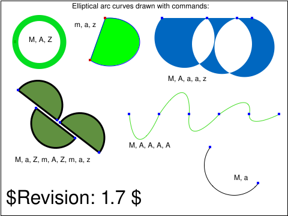 |
| [`paths-data-04-t`](../../Tests/SVGConformanceTests/Resources/W3C-SVG-1.1/svg/paths-data-04-t.svg) | `passed` | 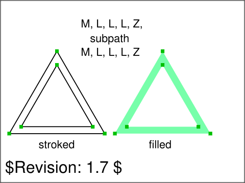 | 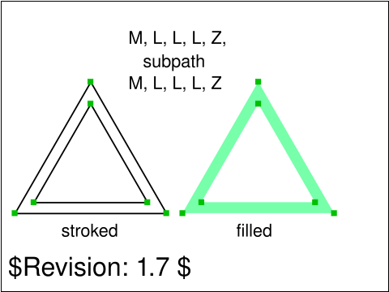 |
| [`paths-data-05-t`](../../Tests/SVGConformanceTests/Resources/W3C-SVG-1.1/svg/paths-data-05-t.svg) | `passed` | 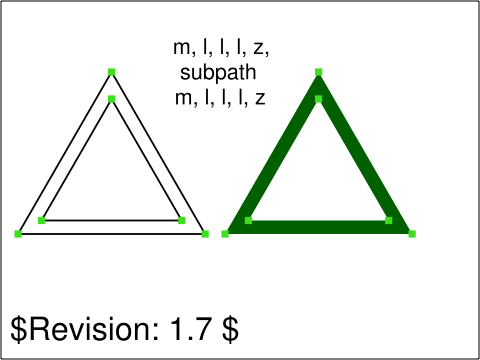 | 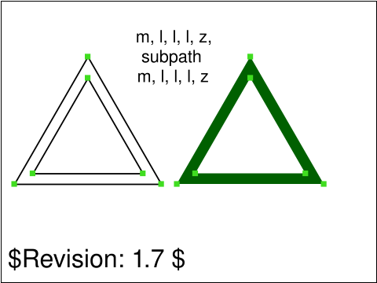 |
| [`paths-data-06-t`](../../Tests/SVGConformanceTests/Resources/W3C-SVG-1.1/svg/paths-data-06-t.svg) | `passed` |  | 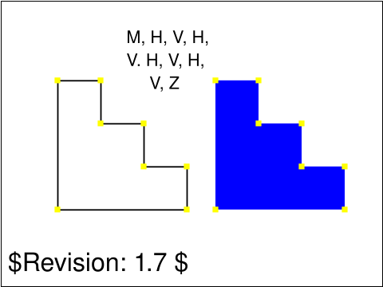 |
| [`paths-data-07-t`](../../Tests/SVGConformanceTests/Resources/W3C-SVG-1.1/svg/paths-data-07-t.svg) | `passed` |  | 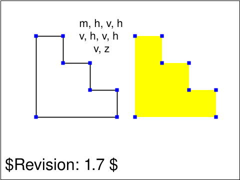 |
| [`paths-data-08-t`](../../Tests/SVGConformanceTests/Resources/W3C-SVG-1.1/svg/paths-data-08-t.svg) | `passed` | 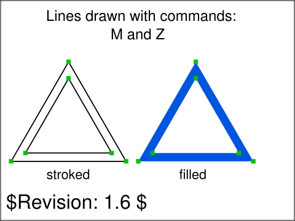 |  |
| [`paths-data-09-t`](../../Tests/SVGConformanceTests/Resources/W3C-SVG-1.1/svg/paths-data-09-t.svg) | `passed` | 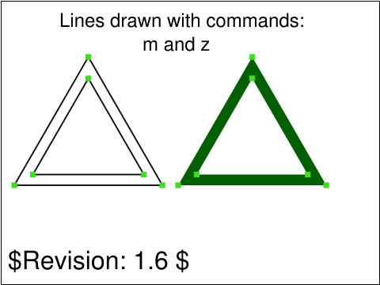 | 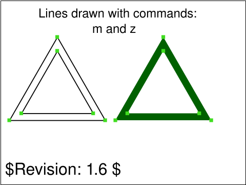 |
| [`paths-data-10-t`](../../Tests/SVGConformanceTests/Resources/W3C-SVG-1.1/svg/paths-data-10-t.svg) | `passed` |  |  |
| [`paths-data-12-t`](../../Tests/SVGConformanceTests/Resources/W3C-SVG-1.1/svg/paths-data-12-t.svg) | `passed` |  |  |
| [`paths-data-13-t`](../../Tests/SVGConformanceTests/Resources/W3C-SVG-1.1/svg/paths-data-13-t.svg) | `passed` | 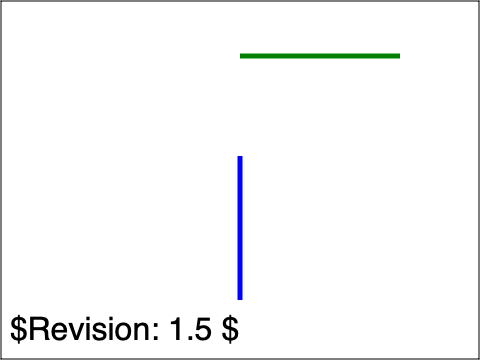 | 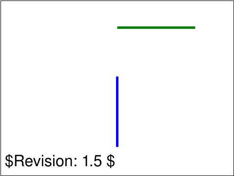 |
| [`paths-data-14-t`](../../Tests/SVGConformanceTests/Resources/W3C-SVG-1.1/svg/paths-data-14-t.svg) | `passed` | 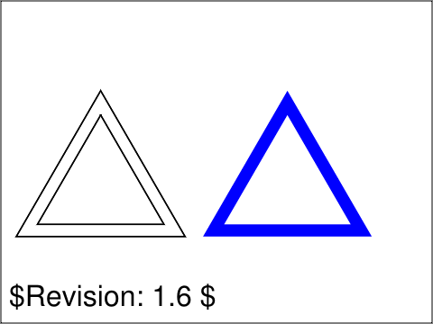 |  |
| [`paths-data-15-t`](../../Tests/SVGConformanceTests/Resources/W3C-SVG-1.1/svg/paths-data-15-t.svg) | `passed` |  | 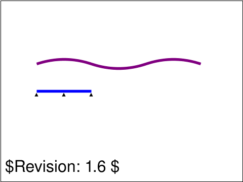 |
| [`paths-data-16-t`](../../Tests/SVGConformanceTests/Resources/W3C-SVG-1.1/svg/paths-data-16-t.svg) | `passed` | 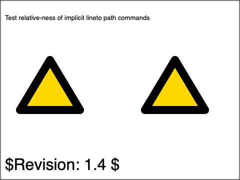 |  |
| [`paths-data-17-f`](../../Tests/SVGConformanceTests/Resources/W3C-SVG-1.1/svg/paths-data-17-f.svg) | `passed` |  |  |
| [`paths-data-18-f`](../../Tests/SVGConformanceTests/Resources/W3C-SVG-1.1/svg/paths-data-18-f.svg) | `passed` | 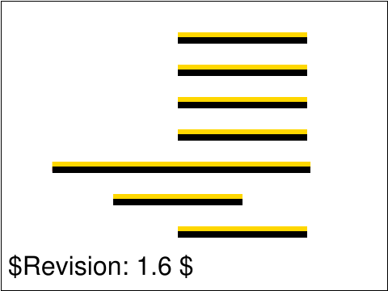 | 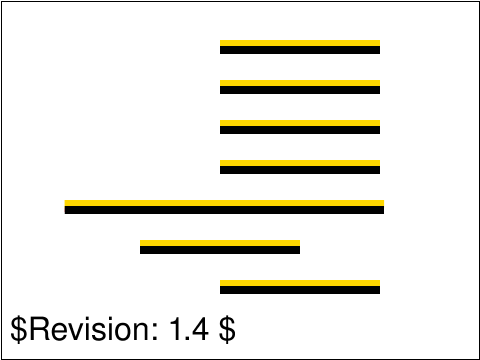 |
| [`paths-data-19-f`](../../Tests/SVGConformanceTests/Resources/W3C-SVG-1.1/svg/paths-data-19-f.svg) | `passed` |  | 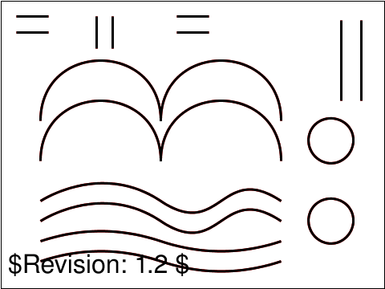 |
| [`paths-data-20-f`](../../Tests/SVGConformanceTests/Resources/W3C-SVG-1.1/svg/paths-data-20-f.svg) | `passed` | 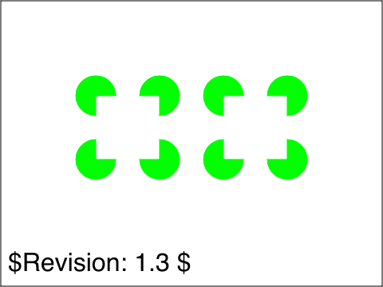 | 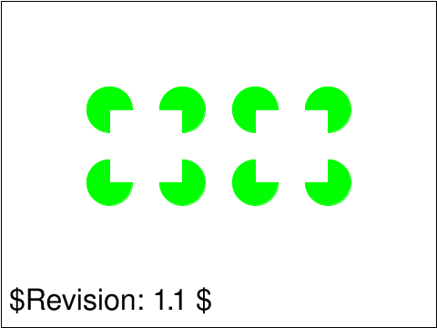 |
| [`paths-dom-01-f`](../../Tests/SVGConformanceTests/Resources/W3C-SVG-1.1/svg/paths-dom-01-f.svg) | `skipped` script-driven DOM mutation; out of scope |  | 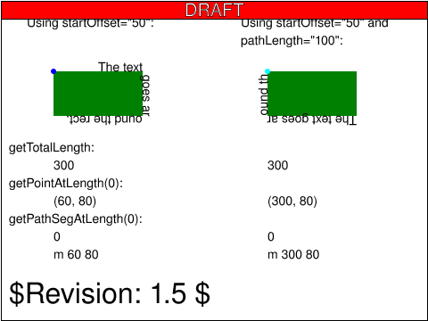 |
| [`paths-dom-02-f`](../../Tests/SVGConformanceTests/Resources/W3C-SVG-1.1/svg/paths-dom-02-f.svg) | `skipped` script-driven DOM mutation; out of scope |  | 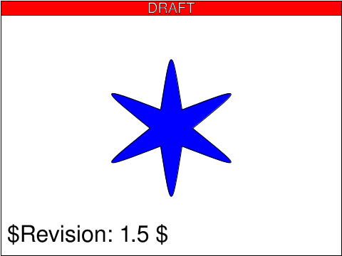 |

