<!-- Generated by SVGConformanceMarkdownReport. Do not edit. -->

# pservers

33 tests · generated 2026-08-20 · [coverage index](README.md)

| Status | Count |
| --- | ---: |
| `passed` | 33 |
| `partialBaseline` | 0 |
| `skipped` | 0 |

## Renders

| Test | Status | SVGeeKit | W3C reference |
| --- | --- | --- | --- |
| [`pservers-grad-01-b`](../../Tests/SVGConformanceTests/Resources/W3C-SVG-1.1/svg/pservers-grad-01-b.svg) | `passed` | 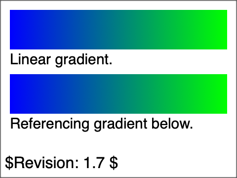 |  |
| [`pservers-grad-02-b`](../../Tests/SVGConformanceTests/Resources/W3C-SVG-1.1/svg/pservers-grad-02-b.svg) | `passed` | 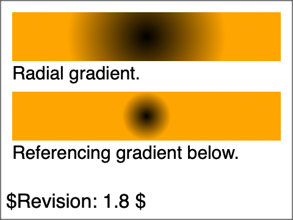 | 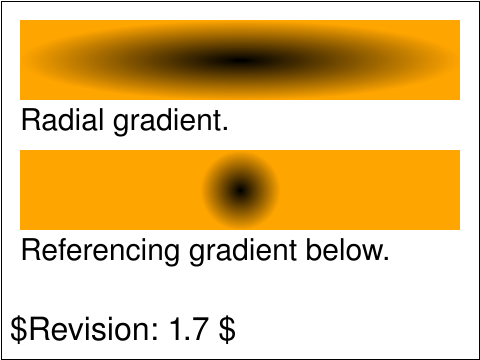 |
| [`pservers-grad-03-b`](../../Tests/SVGConformanceTests/Resources/W3C-SVG-1.1/svg/pservers-grad-03-b.svg) | `passed` | 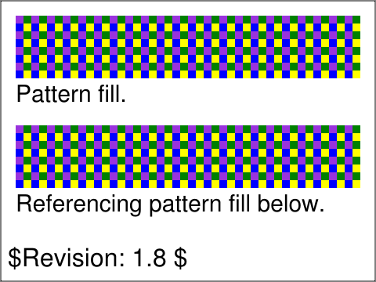 |  |
| [`pservers-grad-04-b`](../../Tests/SVGConformanceTests/Resources/W3C-SVG-1.1/svg/pservers-grad-04-b.svg) | `passed` |  | 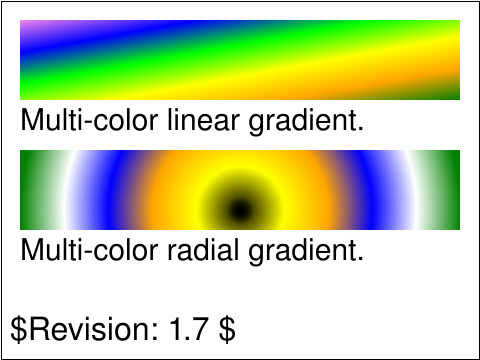 |
| [`pservers-grad-05-b`](../../Tests/SVGConformanceTests/Resources/W3C-SVG-1.1/svg/pservers-grad-05-b.svg) | `passed` | 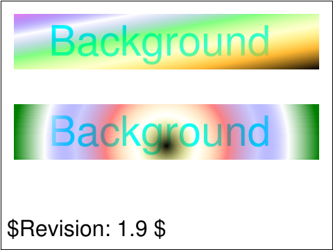 | 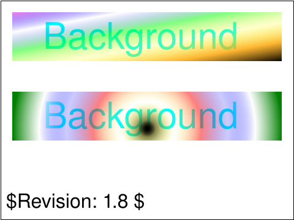 |
| [`pservers-grad-06-b`](../../Tests/SVGConformanceTests/Resources/W3C-SVG-1.1/svg/pservers-grad-06-b.svg) | `passed` |  | 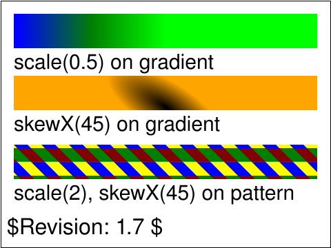 |
| [`pservers-grad-07-b`](../../Tests/SVGConformanceTests/Resources/W3C-SVG-1.1/svg/pservers-grad-07-b.svg) | `passed` |  |  |
| [`pservers-grad-08-b`](../../Tests/SVGConformanceTests/Resources/W3C-SVG-1.1/svg/pservers-grad-08-b.svg) | `passed` | 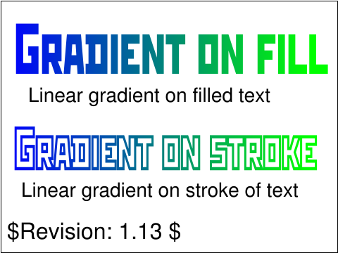 | 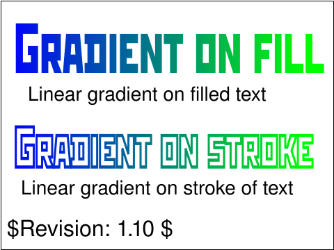 |
| [`pservers-grad-09-b`](../../Tests/SVGConformanceTests/Resources/W3C-SVG-1.1/svg/pservers-grad-09-b.svg) | `passed` | 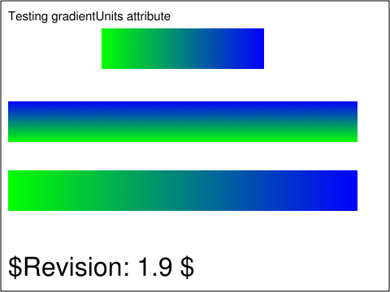 |  |
| [`pservers-grad-10-b`](../../Tests/SVGConformanceTests/Resources/W3C-SVG-1.1/svg/pservers-grad-10-b.svg) | `passed` | 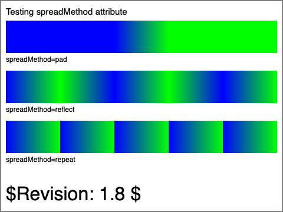 | 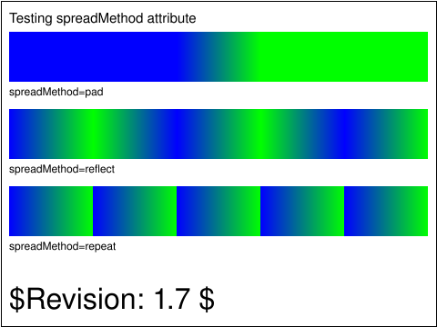 |
| [`pservers-grad-11-b`](../../Tests/SVGConformanceTests/Resources/W3C-SVG-1.1/svg/pservers-grad-11-b.svg) | `passed` | 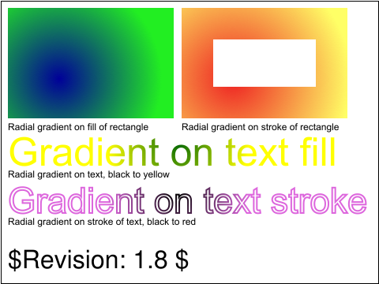 |  |
| [`pservers-grad-12-b`](../../Tests/SVGConformanceTests/Resources/W3C-SVG-1.1/svg/pservers-grad-12-b.svg) | `passed` |  | 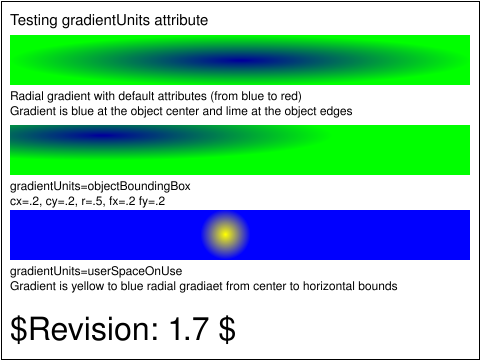 |
| [`pservers-grad-13-b`](../../Tests/SVGConformanceTests/Resources/W3C-SVG-1.1/svg/pservers-grad-13-b.svg) | `passed` | 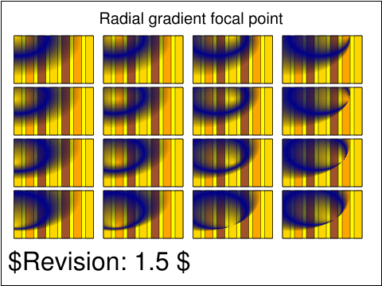 |  |
| [`pservers-grad-14-b`](../../Tests/SVGConformanceTests/Resources/W3C-SVG-1.1/svg/pservers-grad-14-b.svg) | `passed` |  | 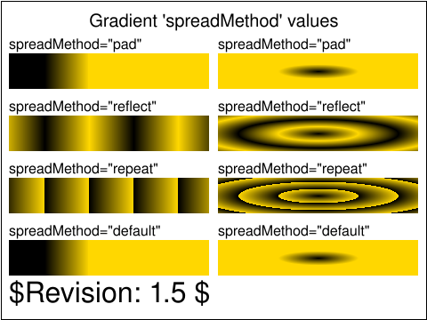 |
| [`pservers-grad-15-b`](../../Tests/SVGConformanceTests/Resources/W3C-SVG-1.1/svg/pservers-grad-15-b.svg) | `passed` |  | 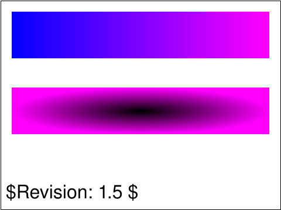 |
| [`pservers-grad-16-b`](../../Tests/SVGConformanceTests/Resources/W3C-SVG-1.1/svg/pservers-grad-16-b.svg) | `passed` |  | 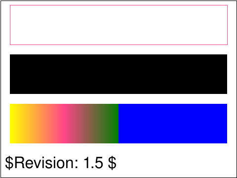 |
| [`pservers-grad-17-b`](../../Tests/SVGConformanceTests/Resources/W3C-SVG-1.1/svg/pservers-grad-17-b.svg) | `passed` | 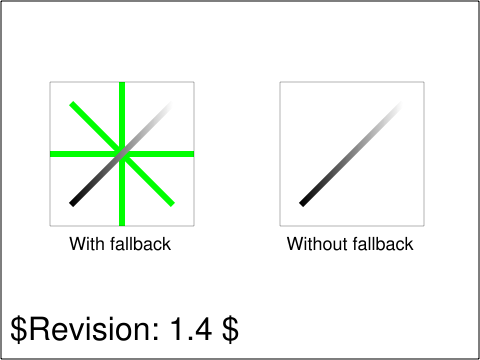 |  |
| [`pservers-grad-18-b`](../../Tests/SVGConformanceTests/Resources/W3C-SVG-1.1/svg/pservers-grad-18-b.svg) | `passed` | 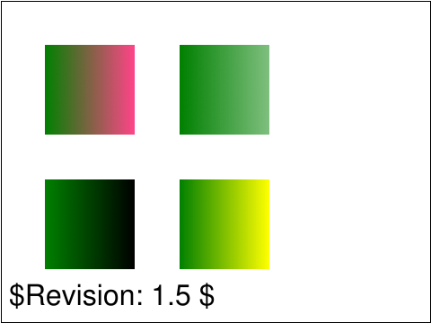 |  |
| [`pservers-grad-20-b`](../../Tests/SVGConformanceTests/Resources/W3C-SVG-1.1/svg/pservers-grad-20-b.svg) | `passed` |  |  |
| [`pservers-grad-21-b`](../../Tests/SVGConformanceTests/Resources/W3C-SVG-1.1/svg/pservers-grad-21-b.svg) | `passed` | 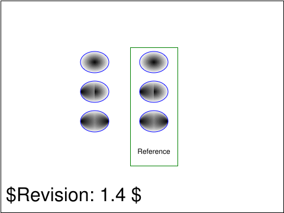 | 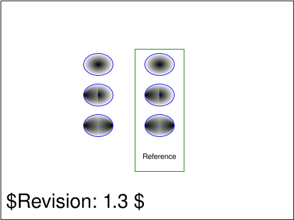 |
| [`pservers-grad-22-b`](../../Tests/SVGConformanceTests/Resources/W3C-SVG-1.1/svg/pservers-grad-22-b.svg) | `passed` | 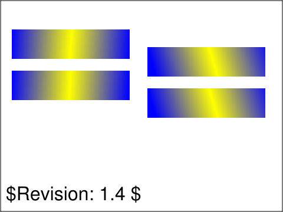 |  |
| [`pservers-grad-23-f`](../../Tests/SVGConformanceTests/Resources/W3C-SVG-1.1/svg/pservers-grad-23-f.svg) | `passed` |  |  |
| [`pservers-grad-24-f`](../../Tests/SVGConformanceTests/Resources/W3C-SVG-1.1/svg/pservers-grad-24-f.svg) | `passed` |  |  |
| [`pservers-grad-stops-01-f`](../../Tests/SVGConformanceTests/Resources/W3C-SVG-1.1/svg/pservers-grad-stops-01-f.svg) | `passed` | 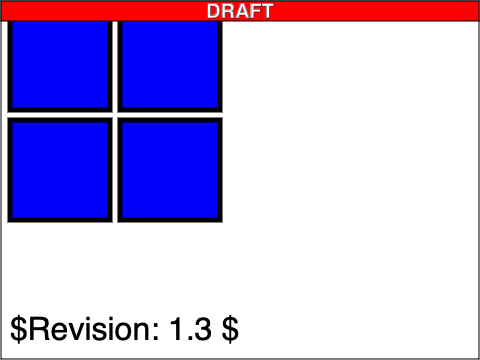 | 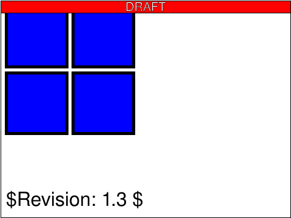 |
| [`pservers-pattern-01-b`](../../Tests/SVGConformanceTests/Resources/W3C-SVG-1.1/svg/pservers-pattern-01-b.svg) | `passed` | 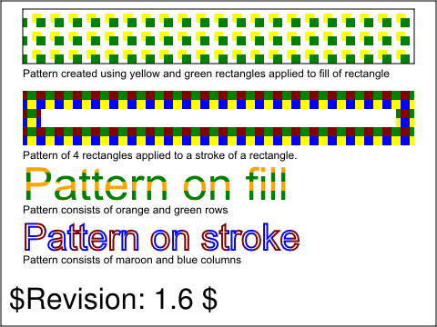 | 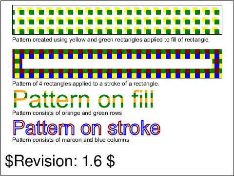 |
| [`pservers-pattern-02-f`](../../Tests/SVGConformanceTests/Resources/W3C-SVG-1.1/svg/pservers-pattern-02-f.svg) | `passed` | 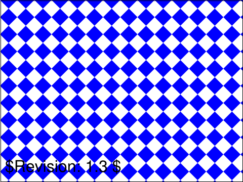 | 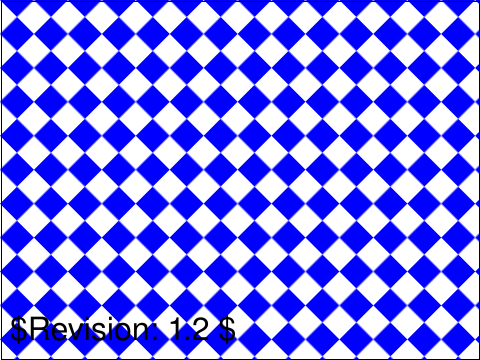 |
| [`pservers-pattern-03-f`](../../Tests/SVGConformanceTests/Resources/W3C-SVG-1.1/svg/pservers-pattern-03-f.svg) | `passed` | 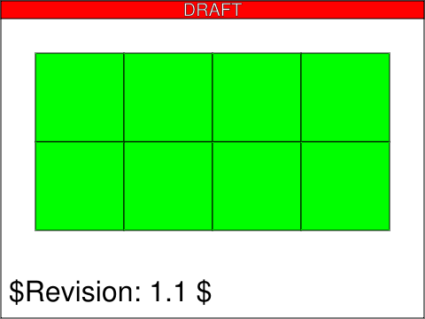 | 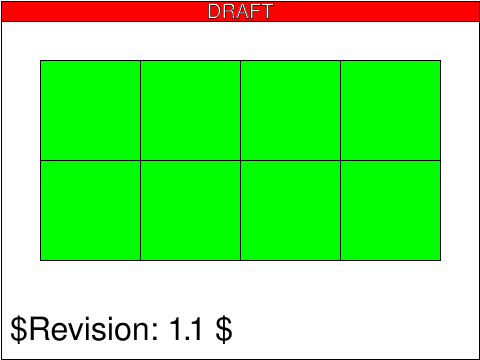 |
| [`pservers-pattern-04-f`](../../Tests/SVGConformanceTests/Resources/W3C-SVG-1.1/svg/pservers-pattern-04-f.svg) | `passed` | 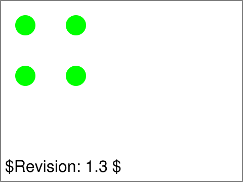 | 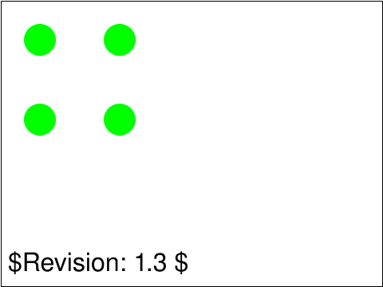 |
| [`pservers-pattern-05-f`](../../Tests/SVGConformanceTests/Resources/W3C-SVG-1.1/svg/pservers-pattern-05-f.svg) | `passed` | 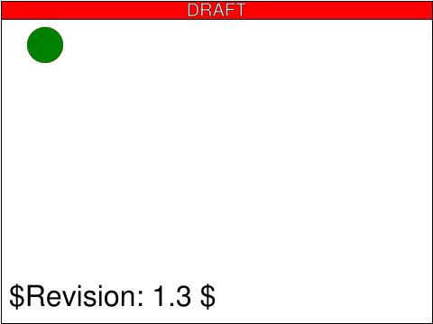 |  |
| [`pservers-pattern-06-f`](../../Tests/SVGConformanceTests/Resources/W3C-SVG-1.1/svg/pservers-pattern-06-f.svg) | `passed` |  |  |
| [`pservers-pattern-07-f`](../../Tests/SVGConformanceTests/Resources/W3C-SVG-1.1/svg/pservers-pattern-07-f.svg) | `passed` | 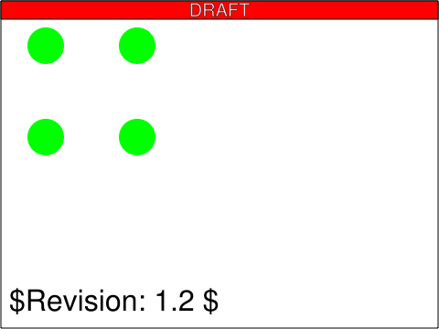 | 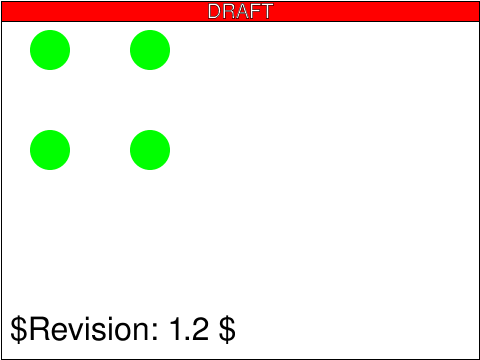 |
| [`pservers-pattern-08-f`](../../Tests/SVGConformanceTests/Resources/W3C-SVG-1.1/svg/pservers-pattern-08-f.svg) | `passed` | 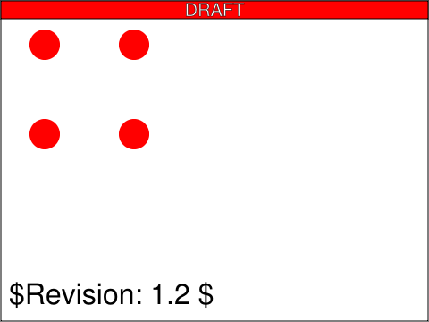 |  |
| [`pservers-pattern-09-f`](../../Tests/SVGConformanceTests/Resources/W3C-SVG-1.1/svg/pservers-pattern-09-f.svg) | `passed` | 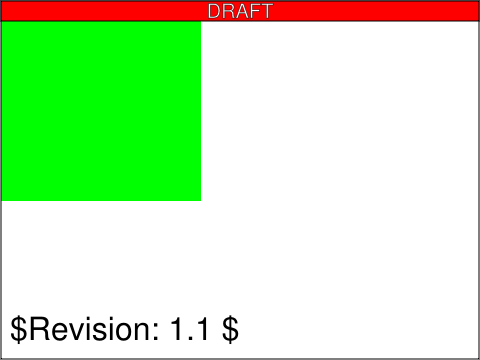 | 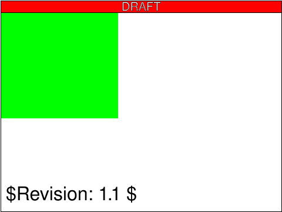 |

