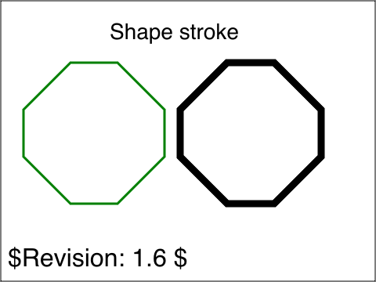
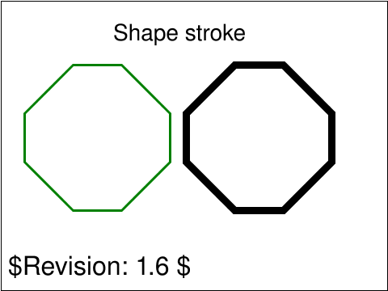
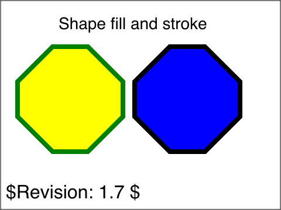
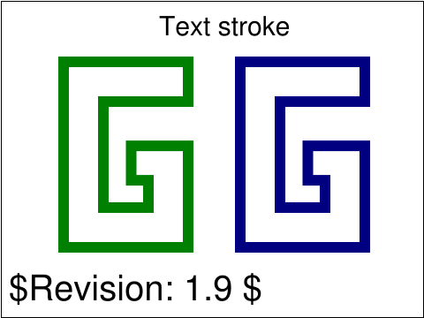
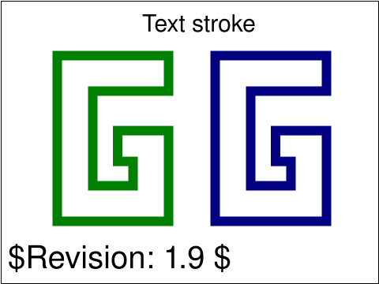
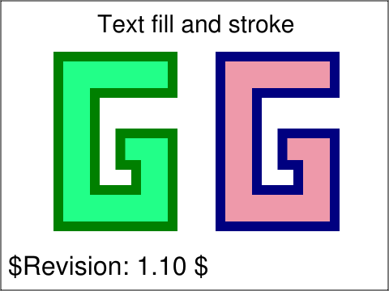
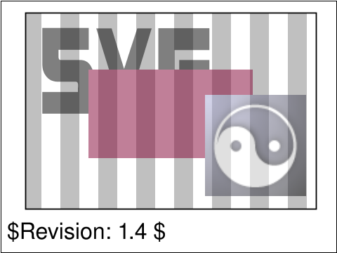

<!-- Generated by SVGConformanceMarkdownReport. Do not edit. -->

# render

8 tests · generated 2026-08-20 · [coverage index](README.md)

| Status | Count |
| --- | ---: |
| `passed` | 8 |
| `partialBaseline` | 0 |
| `skipped` | 0 |

## Renders

| Test | Status | SVGeeKit | W3C reference |
| --- | --- | --- | --- |
| [`render-elems-01-t`](../../Tests/SVGConformanceTests/Resources/W3C-SVG-1.1/svg/render-elems-01-t.svg) | `passed` |  |  |
| [`render-elems-02-t`](../../Tests/SVGConformanceTests/Resources/W3C-SVG-1.1/svg/render-elems-02-t.svg) | `passed` |  |  |
| [`render-elems-03-t`](../../Tests/SVGConformanceTests/Resources/W3C-SVG-1.1/svg/render-elems-03-t.svg) | `passed` |  |  |
| [`render-elems-06-t`](../../Tests/SVGConformanceTests/Resources/W3C-SVG-1.1/svg/render-elems-06-t.svg) | `passed` |  |  |
| [`render-elems-07-t`](../../Tests/SVGConformanceTests/Resources/W3C-SVG-1.1/svg/render-elems-07-t.svg) | `passed` |  |  |
| [`render-elems-08-t`](../../Tests/SVGConformanceTests/Resources/W3C-SVG-1.1/svg/render-elems-08-t.svg) | `passed` |  |  |
| [`render-groups-01-b`](../../Tests/SVGConformanceTests/Resources/W3C-SVG-1.1/svg/render-groups-01-b.svg) | `passed` |  |  |
| [`render-groups-03-t`](../../Tests/SVGConformanceTests/Resources/W3C-SVG-1.1/svg/render-groups-03-t.svg) | `passed` |  |  |

