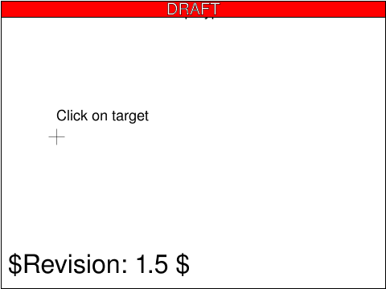

<!-- Generated by SVGConformanceMarkdownReport. Do not edit. -->

# script

6 tests · generated 2026-08-20 · [coverage index](README.md)

| Status | Count |
| --- | ---: |
| `passed` | 1 |
| `partialBaseline` | 0 |
| `skipped` | 5 |

## Renders

| Test | Status | SVGeeKit | W3C reference |
| --- | --- | --- | --- |
| [`script-handle-01-b`](../../Tests/SVGConformanceTests/Resources/W3C-SVG-1.1/svg/script-handle-01-b.svg) | `passed` |  |  |
| [`script-handle-02-b`](../../Tests/SVGConformanceTests/Resources/W3C-SVG-1.1/svg/script-handle-02-b.svg) | `skipped` feature family not yet supported by SVGeeKit | — |  |
| [`script-handle-03-b`](../../Tests/SVGConformanceTests/Resources/W3C-SVG-1.1/svg/script-handle-03-b.svg) | `skipped` feature family not yet supported by SVGeeKit | — |  |
| [`script-handle-04-b`](../../Tests/SVGConformanceTests/Resources/W3C-SVG-1.1/svg/script-handle-04-b.svg) | `skipped` feature family not yet supported by SVGeeKit | — |  |
| [`script-specify-01-f`](../../Tests/SVGConformanceTests/Resources/W3C-SVG-1.1/svg/script-specify-01-f.svg) | `skipped` feature family not yet supported by SVGeeKit | — |  |
| [`script-specify-02-f`](../../Tests/SVGConformanceTests/Resources/W3C-SVG-1.1/svg/script-specify-02-f.svg) | `skipped` feature family not yet supported by SVGeeKit | — |  |

