<!-- Generated by SVGConformanceMarkdownReport. Do not edit. -->

# shapes

30 tests · generated 2026-08-20 · [coverage index](README.md)

| Status | Count |
| --- | ---: |
| `passed` | 30 |
| `partialBaseline` | 0 |
| `skipped` | 0 |

## Renders

| Test | Status | SVGeeKit | W3C reference |
| --- | --- | --- | --- |
| [`shapes-circle-01`](../../Tests/SVGConformanceTests/Resources/W3C-SVG-1.1/svg/shapes-circle-01.svg) | `passed` | 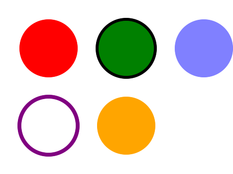 | — |
| [`shapes-circle-01-t`](../../Tests/SVGConformanceTests/Resources/W3C-SVG-1.1/svg/shapes-circle-01-t.svg) | `passed` | 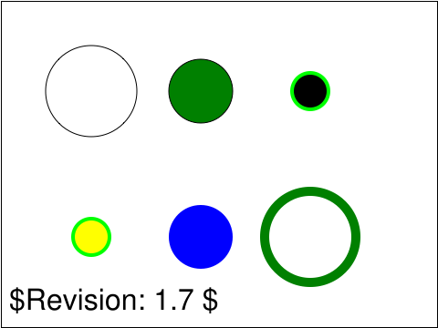 | 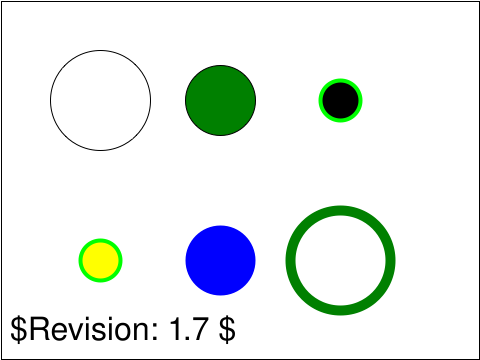 |
| [`shapes-circle-02-t`](../../Tests/SVGConformanceTests/Resources/W3C-SVG-1.1/svg/shapes-circle-02-t.svg) | `passed` |  |  |
| [`shapes-ellipse-01`](../../Tests/SVGConformanceTests/Resources/W3C-SVG-1.1/svg/shapes-ellipse-01.svg) | `passed` | 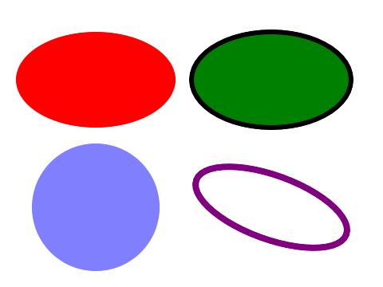 | — |
| [`shapes-ellipse-01-t`](../../Tests/SVGConformanceTests/Resources/W3C-SVG-1.1/svg/shapes-ellipse-01-t.svg) | `passed` | 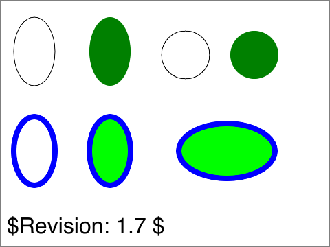 | 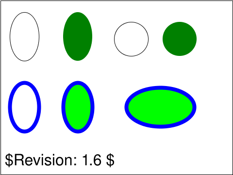 |
| [`shapes-ellipse-02-t`](../../Tests/SVGConformanceTests/Resources/W3C-SVG-1.1/svg/shapes-ellipse-02-t.svg) | `passed` | 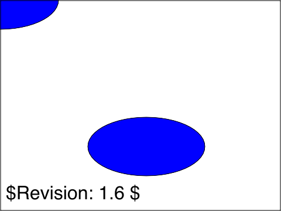 | 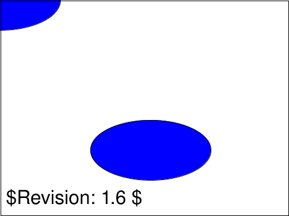 |
| [`shapes-ellipse-03-f`](../../Tests/SVGConformanceTests/Resources/W3C-SVG-1.1/svg/shapes-ellipse-03-f.svg) | `passed` |  |  |
| [`shapes-grammar-01-f`](../../Tests/SVGConformanceTests/Resources/W3C-SVG-1.1/svg/shapes-grammar-01-f.svg) | `passed` |  | 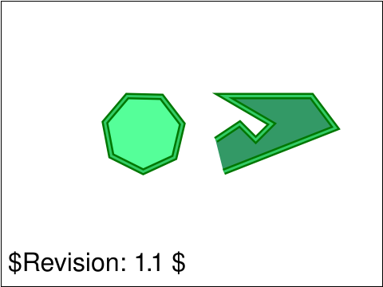 |
| [`shapes-intro-01-t`](../../Tests/SVGConformanceTests/Resources/W3C-SVG-1.1/svg/shapes-intro-01-t.svg) | `passed` |  |  |
| [`shapes-intro-02-f`](../../Tests/SVGConformanceTests/Resources/W3C-SVG-1.1/svg/shapes-intro-02-f.svg) | `passed` | 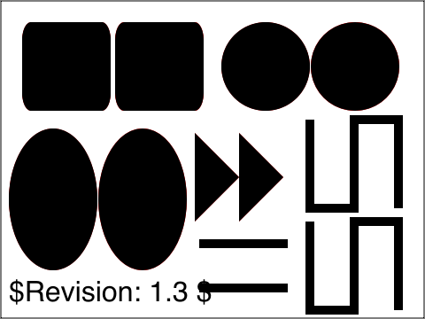 | 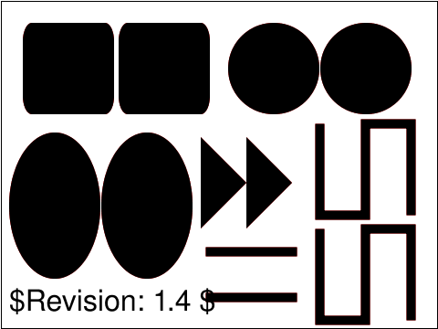 |
| [`shapes-line-01`](../../Tests/SVGConformanceTests/Resources/W3C-SVG-1.1/svg/shapes-line-01.svg) | `passed` | 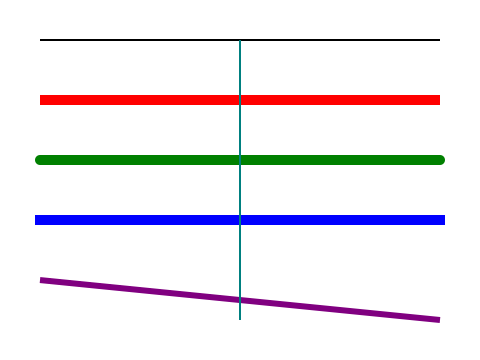 | — |
| [`shapes-line-01-t`](../../Tests/SVGConformanceTests/Resources/W3C-SVG-1.1/svg/shapes-line-01-t.svg) | `passed` | 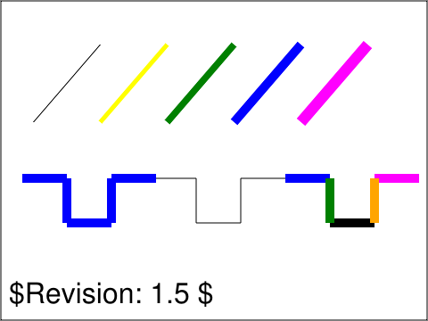 | 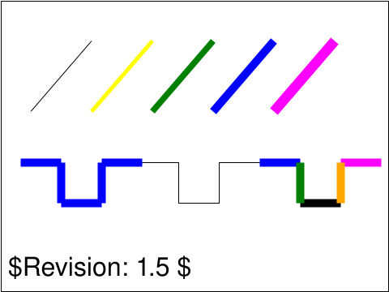 |
| [`shapes-line-02-f`](../../Tests/SVGConformanceTests/Resources/W3C-SVG-1.1/svg/shapes-line-02-f.svg) | `passed` |  |  |
| [`shapes-path-01`](../../Tests/SVGConformanceTests/Resources/W3C-SVG-1.1/svg/shapes-path-01.svg) | `passed` | 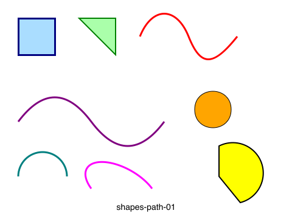 | — |
| [`shapes-polygon-01`](../../Tests/SVGConformanceTests/Resources/W3C-SVG-1.1/svg/shapes-polygon-01.svg) | `passed` | 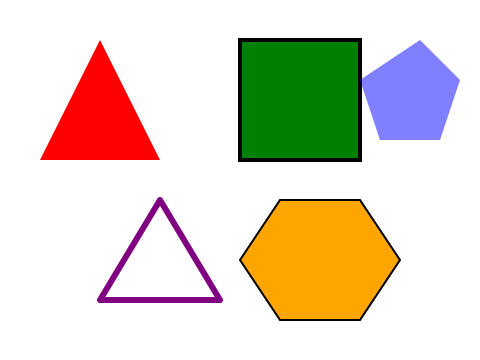 | — |
| [`shapes-polygon-01-t`](../../Tests/SVGConformanceTests/Resources/W3C-SVG-1.1/svg/shapes-polygon-01-t.svg) | `passed` |  | 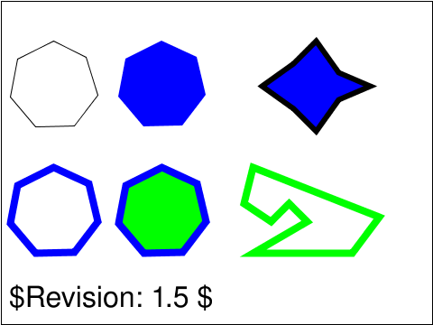 |
| [`shapes-polygon-02-t`](../../Tests/SVGConformanceTests/Resources/W3C-SVG-1.1/svg/shapes-polygon-02-t.svg) | `passed` |  | 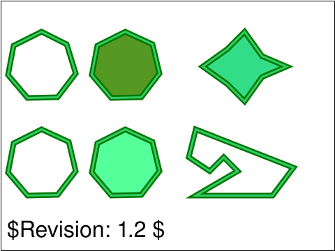 |
| [`shapes-polygon-03-t`](../../Tests/SVGConformanceTests/Resources/W3C-SVG-1.1/svg/shapes-polygon-03-t.svg) | `passed` | 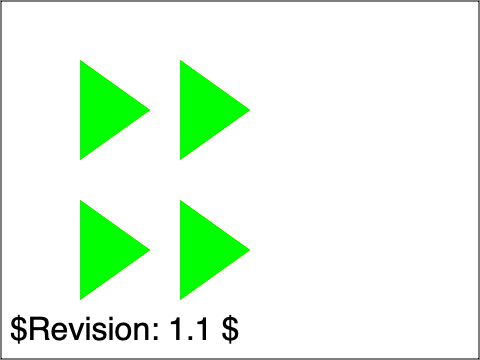 | 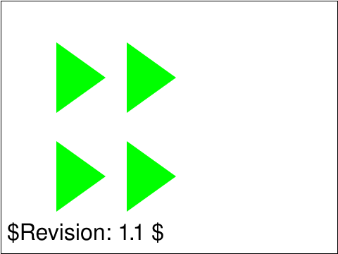 |
| [`shapes-polyline-01`](../../Tests/SVGConformanceTests/Resources/W3C-SVG-1.1/svg/shapes-polyline-01.svg) | `passed` | 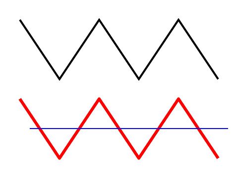 | — |
| [`shapes-polyline-01-t`](../../Tests/SVGConformanceTests/Resources/W3C-SVG-1.1/svg/shapes-polyline-01-t.svg) | `passed` | 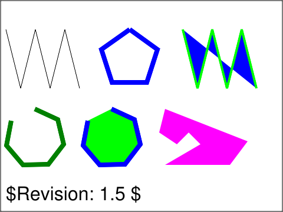 | 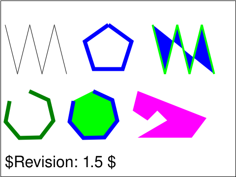 |
| [`shapes-polyline-02-t`](../../Tests/SVGConformanceTests/Resources/W3C-SVG-1.1/svg/shapes-polyline-02-t.svg) | `passed` | 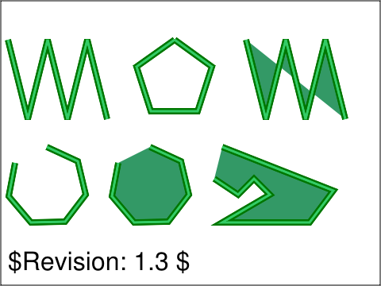 | 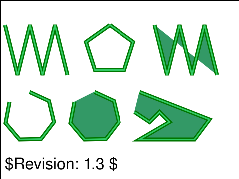 |
| [`shapes-rect-01-t`](../../Tests/SVGConformanceTests/Resources/W3C-SVG-1.1/svg/shapes-rect-01-t.svg) | `passed` | 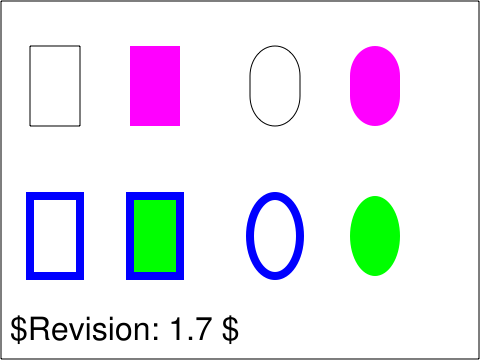 | 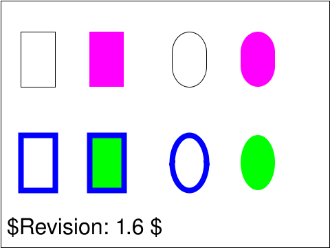 |
| [`shapes-rect-02-t`](../../Tests/SVGConformanceTests/Resources/W3C-SVG-1.1/svg/shapes-rect-02-t.svg) | `passed` |  | 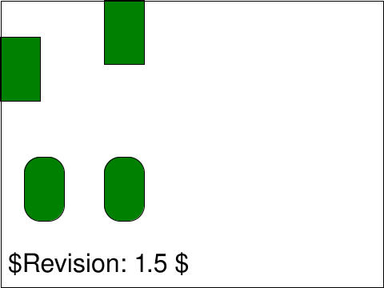 |
| [`shapes-rect-03-t`](../../Tests/SVGConformanceTests/Resources/W3C-SVG-1.1/svg/shapes-rect-03-t.svg) | `passed` | 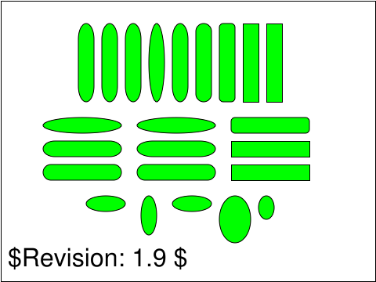 | 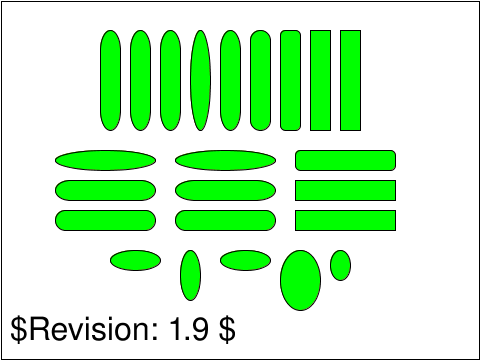 |
| [`shapes-rect-04-f`](../../Tests/SVGConformanceTests/Resources/W3C-SVG-1.1/svg/shapes-rect-04-f.svg) | `passed` | 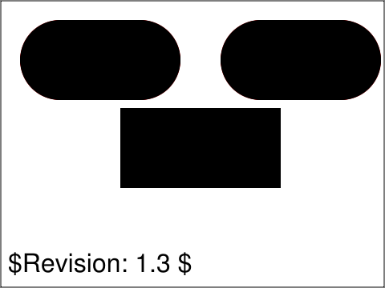 | 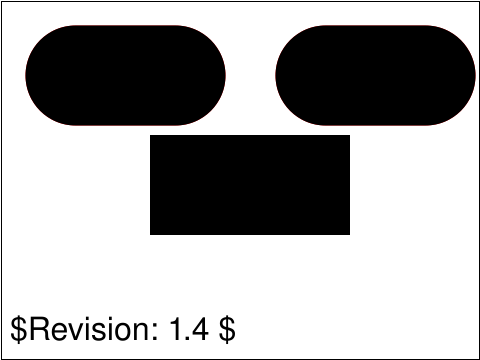 |
| [`shapes-rect-05-f`](../../Tests/SVGConformanceTests/Resources/W3C-SVG-1.1/svg/shapes-rect-05-f.svg) | `passed` | 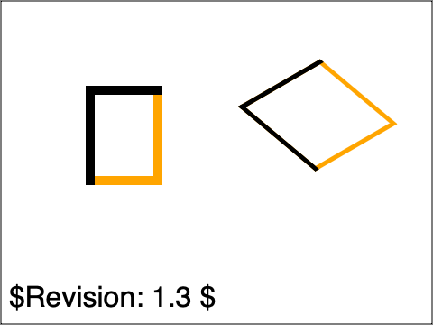 | 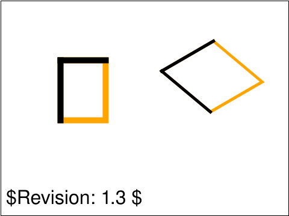 |
| [`shapes-rect-06-f`](../../Tests/SVGConformanceTests/Resources/W3C-SVG-1.1/svg/shapes-rect-06-f.svg) | `passed` | 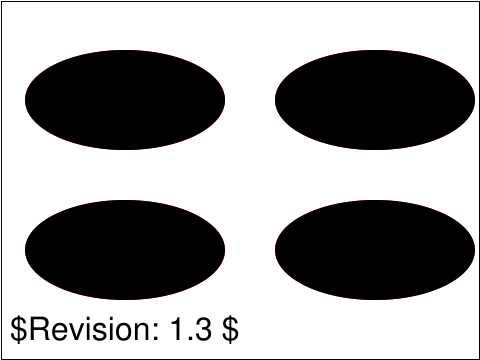 | 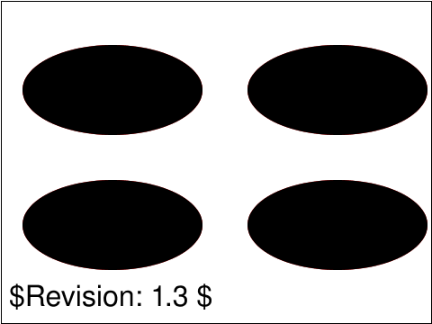 |
| [`shapes-rect-07-f`](../../Tests/SVGConformanceTests/Resources/W3C-SVG-1.1/svg/shapes-rect-07-f.svg) | `passed` | 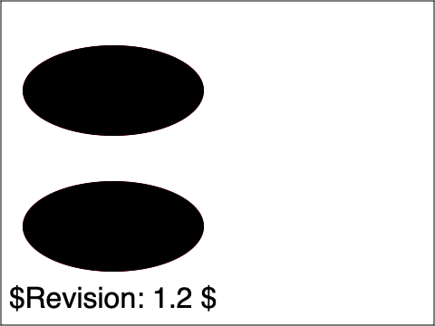 | 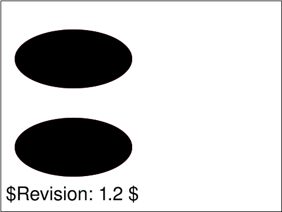 |
| [`shapes-rect-basic-01`](../../Tests/SVGConformanceTests/Resources/W3C-SVG-1.1/svg/shapes-rect-basic-01.svg) | `passed` | 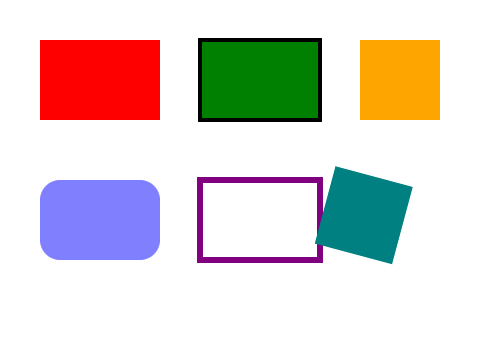 | — |
| [`shapes-text-01`](../../Tests/SVGConformanceTests/Resources/W3C-SVG-1.1/svg/shapes-text-01.svg) | `passed` | 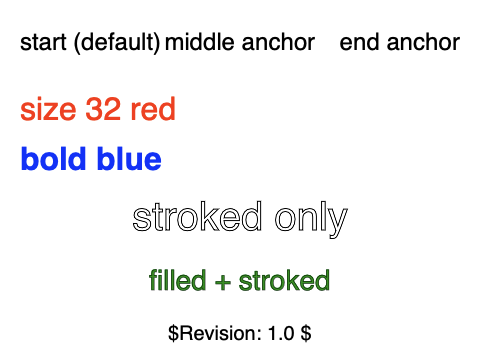 | — |

