<!-- Generated by SVGConformanceMarkdownReport. Do not edit. -->

# struct

72 tests · generated 2026-08-20 · [coverage index](README.md)

| Status | Count |
| --- | ---: |
| `passed` | 38 |
| `partialBaseline` | 8 |
| `skipped` | 26 |

> `partialBaseline` means the render is tracked but **not** visually verified. Do not treat a matching partial snapshot as a pass.

## Renders

| Test | Status | SVGeeKit | W3C reference |
| --- | --- | --- | --- |
| [`struct-cond-01-t`](../../Tests/SVGConformanceTests/Resources/W3C-SVG-1.1/svg/struct-cond-01-t.svg) | `passed` |  |  |
| [`struct-cond-02-t`](../../Tests/SVGConformanceTests/Resources/W3C-SVG-1.1/svg/struct-cond-02-t.svg) | `passed` |  |  |
| [`struct-cond-03-t`](../../Tests/SVGConformanceTests/Resources/W3C-SVG-1.1/svg/struct-cond-03-t.svg) | `partialBaseline` | 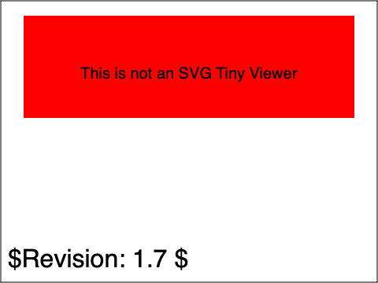 | 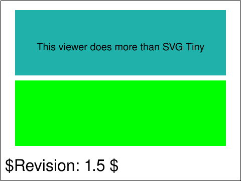 |
| [`struct-cond-overview-02-f`](../../Tests/SVGConformanceTests/Resources/W3C-SVG-1.1/svg/struct-cond-overview-02-f.svg) | `passed` | 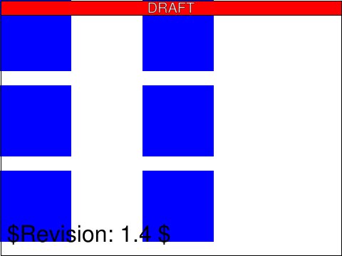 |  |
| [`struct-cond-overview-03-f`](../../Tests/SVGConformanceTests/Resources/W3C-SVG-1.1/svg/struct-cond-overview-03-f.svg) | `passed` | 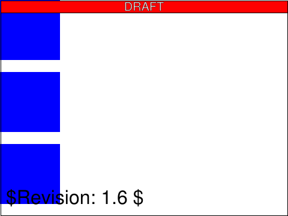 |  |
| [`struct-cond-overview-04-f`](../../Tests/SVGConformanceTests/Resources/W3C-SVG-1.1/svg/struct-cond-overview-04-f.svg) | `passed` |  | 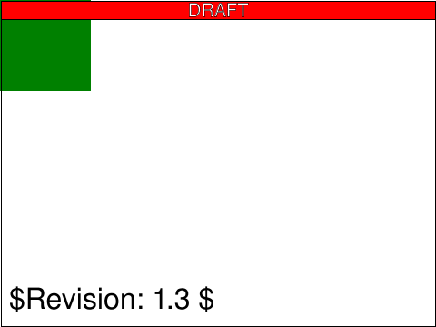 |
| [`struct-cond-overview-05-f`](../../Tests/SVGConformanceTests/Resources/W3C-SVG-1.1/svg/struct-cond-overview-05-f.svg) | `passed` |  | 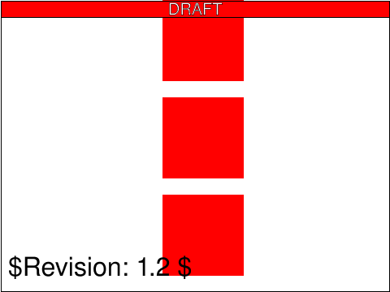 |
| [`struct-defs-01-t`](../../Tests/SVGConformanceTests/Resources/W3C-SVG-1.1/svg/struct-defs-01-t.svg) | `passed` | 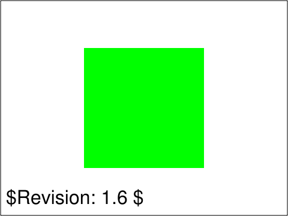 | 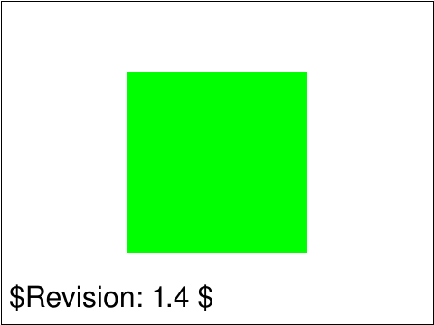 |
| [`struct-dom-01-b`](../../Tests/SVGConformanceTests/Resources/W3C-SVG-1.1/svg/struct-dom-01-b.svg) | `skipped` DOM API mutation; out of scope |  |  |
| [`struct-dom-02-b`](../../Tests/SVGConformanceTests/Resources/W3C-SVG-1.1/svg/struct-dom-02-b.svg) | `skipped` DOM API mutation; out of scope |  |  |
| [`struct-dom-03-b`](../../Tests/SVGConformanceTests/Resources/W3C-SVG-1.1/svg/struct-dom-03-b.svg) | `skipped` DOM API mutation; out of scope |  |  |
| [`struct-dom-04-b`](../../Tests/SVGConformanceTests/Resources/W3C-SVG-1.1/svg/struct-dom-04-b.svg) | `skipped` DOM API mutation; out of scope |  |  |
| [`struct-dom-05-b`](../../Tests/SVGConformanceTests/Resources/W3C-SVG-1.1/svg/struct-dom-05-b.svg) | `skipped` DOM API mutation; out of scope |  |  |
| [`struct-dom-06-b`](../../Tests/SVGConformanceTests/Resources/W3C-SVG-1.1/svg/struct-dom-06-b.svg) | `skipped` DOM API mutation; out of scope |  |  |
| [`struct-dom-07-f`](../../Tests/SVGConformanceTests/Resources/W3C-SVG-1.1/svg/struct-dom-07-f.svg) | `skipped` DOM API mutation; out of scope | 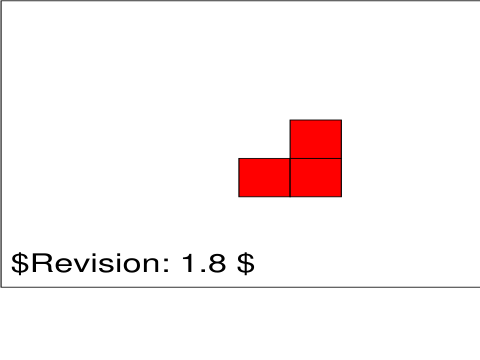 | 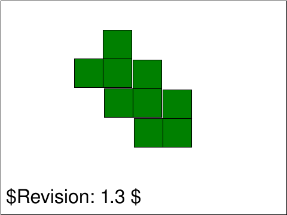 |
| [`struct-dom-08-f`](../../Tests/SVGConformanceTests/Resources/W3C-SVG-1.1/svg/struct-dom-08-f.svg) | `skipped` DOM API mutation; out of scope |  |  |
| [`struct-dom-11-f`](../../Tests/SVGConformanceTests/Resources/W3C-SVG-1.1/svg/struct-dom-11-f.svg) | `skipped` DOM API mutation; out of scope |  |  |
| [`struct-dom-12-b`](../../Tests/SVGConformanceTests/Resources/W3C-SVG-1.1/svg/struct-dom-12-b.svg) | `skipped` DOM API mutation; out of scope |  | 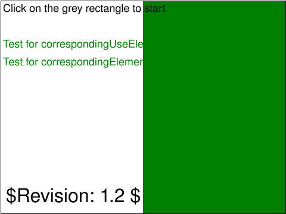 |
| [`struct-dom-13-f`](../../Tests/SVGConformanceTests/Resources/W3C-SVG-1.1/svg/struct-dom-13-f.svg) | `skipped` DOM API mutation; out of scope |  | 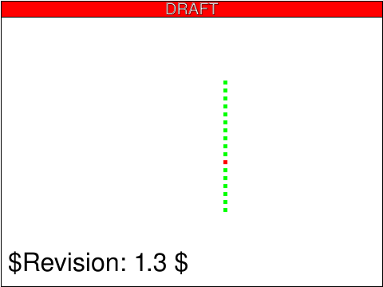 |
| [`struct-dom-14-f`](../../Tests/SVGConformanceTests/Resources/W3C-SVG-1.1/svg/struct-dom-14-f.svg) | `skipped` DOM API mutation; out of scope | 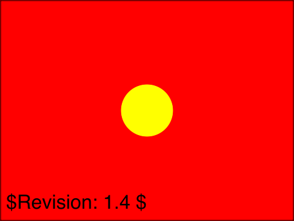 | 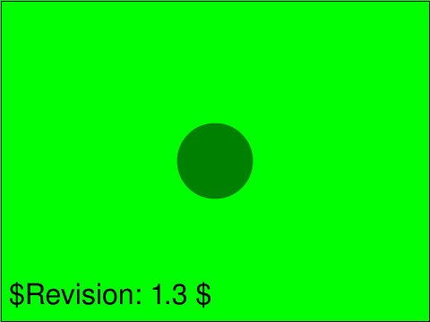 |
| [`struct-dom-15-f`](../../Tests/SVGConformanceTests/Resources/W3C-SVG-1.1/svg/struct-dom-15-f.svg) | `skipped` DOM API mutation; out of scope | 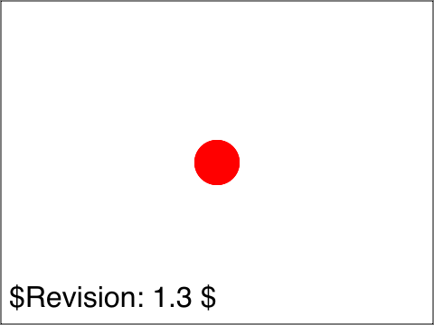 | 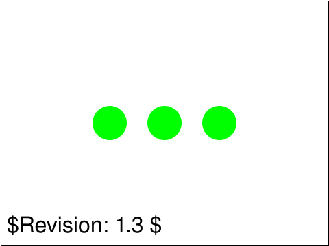 |
| [`struct-dom-16-f`](../../Tests/SVGConformanceTests/Resources/W3C-SVG-1.1/svg/struct-dom-16-f.svg) | `skipped` DOM API mutation; out of scope |  | 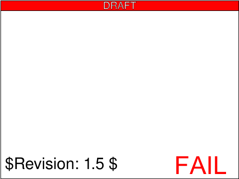 |
| [`struct-dom-17-f`](../../Tests/SVGConformanceTests/Resources/W3C-SVG-1.1/svg/struct-dom-17-f.svg) | `skipped` DOM API mutation; out of scope | 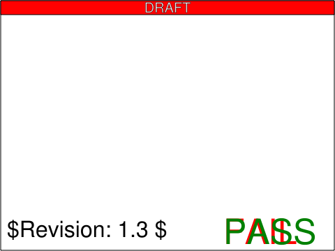 | 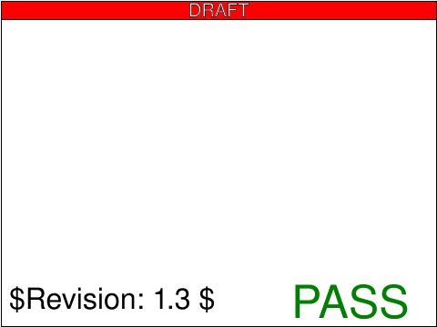 |
| [`struct-dom-18-f`](../../Tests/SVGConformanceTests/Resources/W3C-SVG-1.1/svg/struct-dom-18-f.svg) | `skipped` DOM API mutation; out of scope | 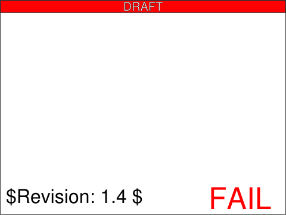 | 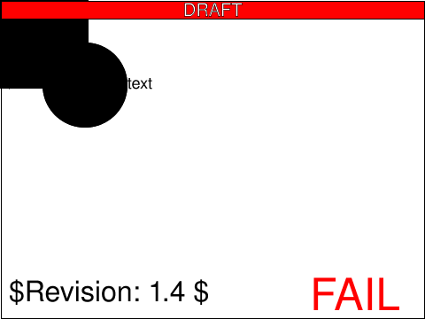 |
| [`struct-dom-19-f`](../../Tests/SVGConformanceTests/Resources/W3C-SVG-1.1/svg/struct-dom-19-f.svg) | `skipped` DOM API mutation; out of scope |  |  |
| [`struct-dom-20-f`](../../Tests/SVGConformanceTests/Resources/W3C-SVG-1.1/svg/struct-dom-20-f.svg) | `skipped` DOM API mutation; out of scope |  | 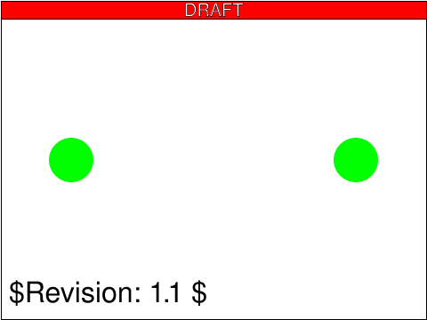 |
| [`struct-frag-01-t`](../../Tests/SVGConformanceTests/Resources/W3C-SVG-1.1/svg/struct-frag-01-t.svg) | `passed` |  |  |
| [`struct-frag-02-t`](../../Tests/SVGConformanceTests/Resources/W3C-SVG-1.1/svg/struct-frag-02-t.svg) | `passed` | 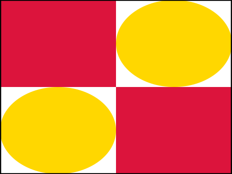 | 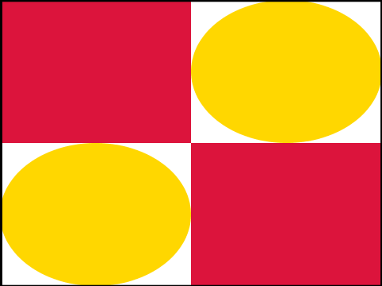 |
| [`struct-frag-03-t`](../../Tests/SVGConformanceTests/Resources/W3C-SVG-1.1/svg/struct-frag-03-t.svg) | `partialBaseline` |  | 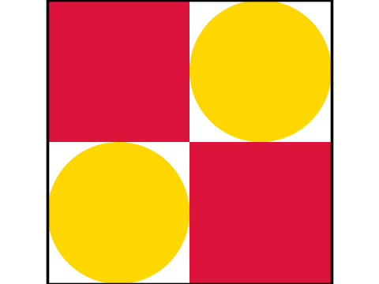 |
| [`struct-frag-04-t`](../../Tests/SVGConformanceTests/Resources/W3C-SVG-1.1/svg/struct-frag-04-t.svg) | `passed` |  |  |
| [`struct-frag-05-t`](../../Tests/SVGConformanceTests/Resources/W3C-SVG-1.1/svg/struct-frag-05-t.svg) | `partialBaseline` | 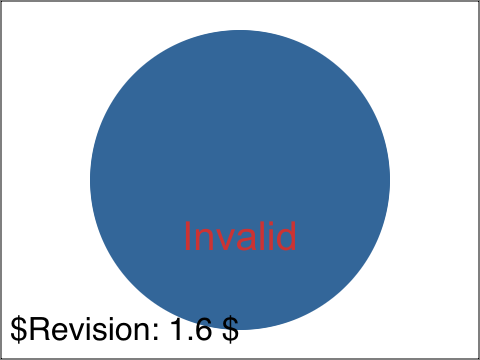 | 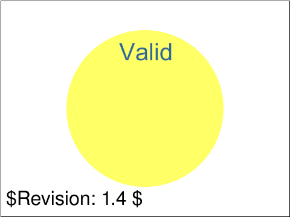 |
| [`struct-frag-06-t`](../../Tests/SVGConformanceTests/Resources/W3C-SVG-1.1/svg/struct-frag-06-t.svg) | `passed` | 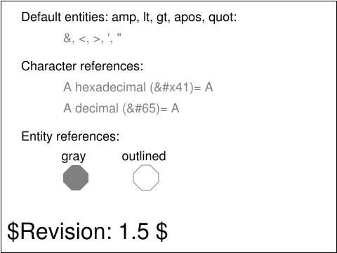 |  |
| [`struct-group-01-t`](../../Tests/SVGConformanceTests/Resources/W3C-SVG-1.1/svg/struct-group-01-t.svg) | `passed` |  | 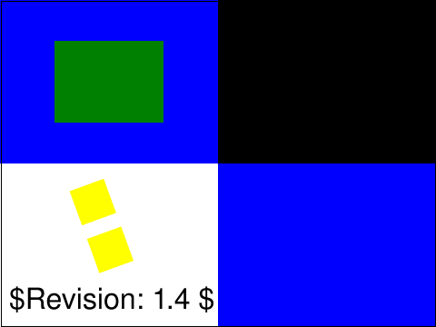 |
| [`struct-group-02-b`](../../Tests/SVGConformanceTests/Resources/W3C-SVG-1.1/svg/struct-group-02-b.svg) | `passed` | 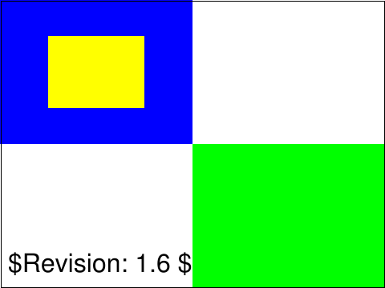 |  |
| [`struct-group-03-t`](../../Tests/SVGConformanceTests/Resources/W3C-SVG-1.1/svg/struct-group-03-t.svg) | `partialBaseline` | 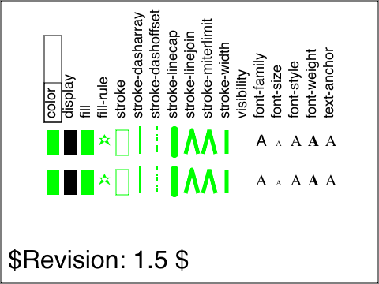 | 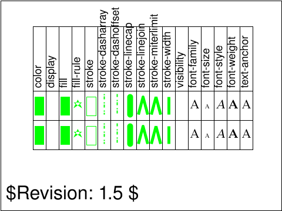 |
| [`struct-image-01-t`](../../Tests/SVGConformanceTests/Resources/W3C-SVG-1.1/svg/struct-image-01-t.svg) | `passed` | 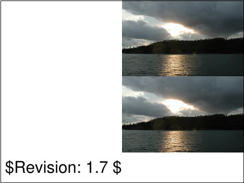 |  |
| [`struct-image-02-b`](../../Tests/SVGConformanceTests/Resources/W3C-SVG-1.1/svg/struct-image-02-b.svg) | `partialBaseline` | 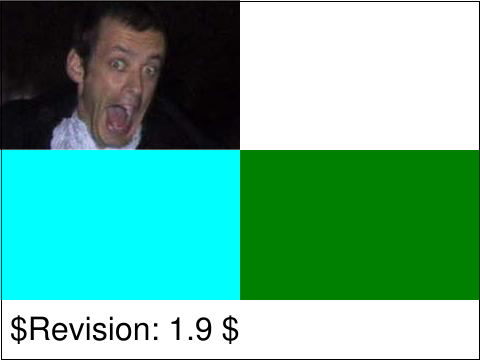 | 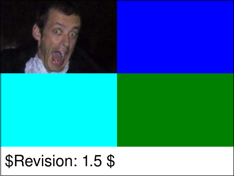 |
| [`struct-image-03-t`](../../Tests/SVGConformanceTests/Resources/W3C-SVG-1.1/svg/struct-image-03-t.svg) | `passed` |  |  |
| [`struct-image-04-t`](../../Tests/SVGConformanceTests/Resources/W3C-SVG-1.1/svg/struct-image-04-t.svg) | `passed` |  |  |
| [`struct-image-05-b`](../../Tests/SVGConformanceTests/Resources/W3C-SVG-1.1/svg/struct-image-05-b.svg) | `passed` | 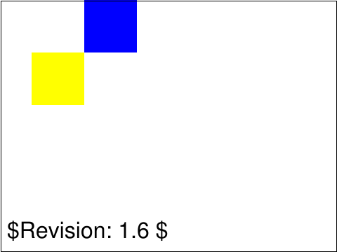 |  |
| [`struct-image-06-t`](../../Tests/SVGConformanceTests/Resources/W3C-SVG-1.1/svg/struct-image-06-t.svg) | `passed` | 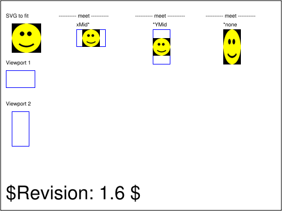 | 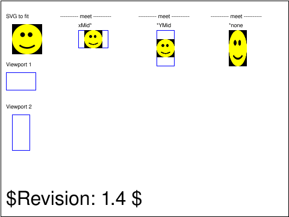 |
| [`struct-image-07-t`](../../Tests/SVGConformanceTests/Resources/W3C-SVG-1.1/svg/struct-image-07-t.svg) | `passed` |  |  |
| [`struct-image-08-t`](../../Tests/SVGConformanceTests/Resources/W3C-SVG-1.1/svg/struct-image-08-t.svg) | `passed` |  | 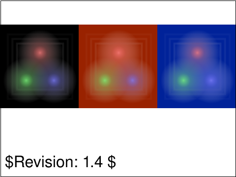 |
| [`struct-image-09-t`](../../Tests/SVGConformanceTests/Resources/W3C-SVG-1.1/svg/struct-image-09-t.svg) | `passed` |  | 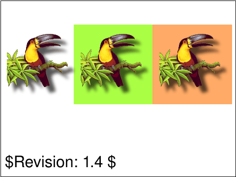 |
| [`struct-image-10-t`](../../Tests/SVGConformanceTests/Resources/W3C-SVG-1.1/svg/struct-image-10-t.svg) | `passed` | 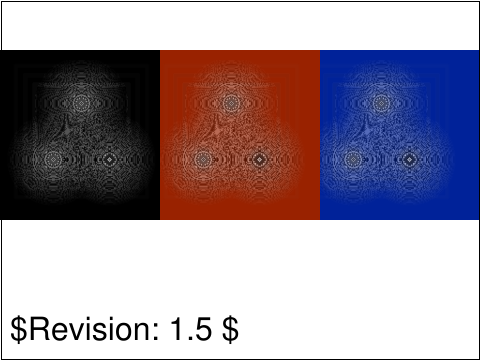 | 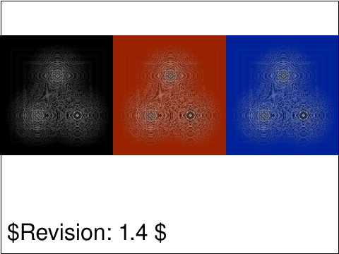 |
| [`struct-image-11-b`](../../Tests/SVGConformanceTests/Resources/W3C-SVG-1.1/svg/struct-image-11-b.svg) | `skipped` onclick event handlers on referenced images; interaction out of scope |  | 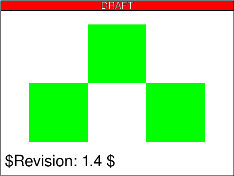 |
| [`struct-image-12-b`](../../Tests/SVGConformanceTests/Resources/W3C-SVG-1.1/svg/struct-image-12-b.svg) | `passed` | 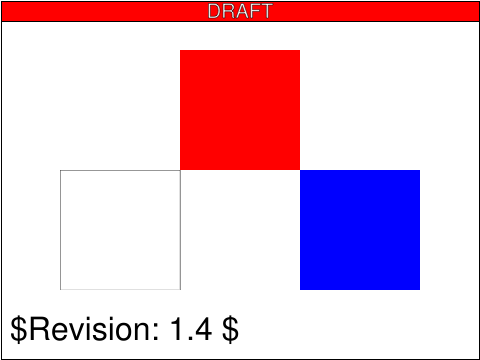 |  |
| [`struct-image-13-f`](../../Tests/SVGConformanceTests/Resources/W3C-SVG-1.1/svg/struct-image-13-f.svg) | `passed` | 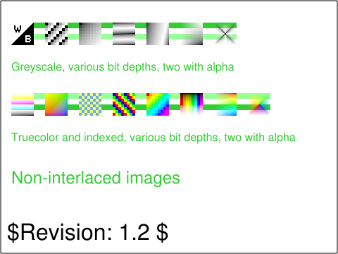 | 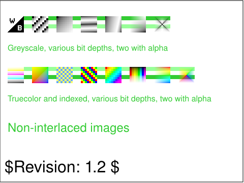 |
| [`struct-image-14-f`](../../Tests/SVGConformanceTests/Resources/W3C-SVG-1.1/svg/struct-image-14-f.svg) | `passed` | 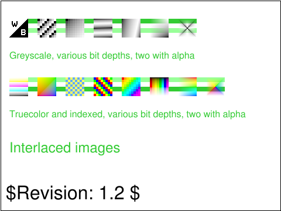 | 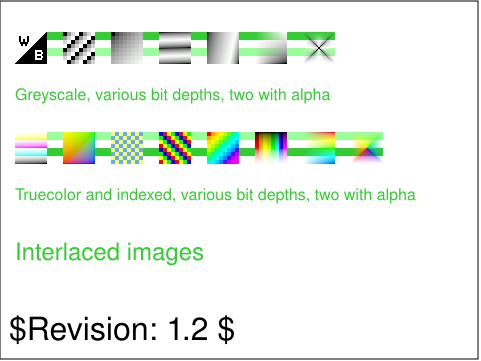 |
| [`struct-image-15-f`](../../Tests/SVGConformanceTests/Resources/W3C-SVG-1.1/svg/struct-image-15-f.svg) | `passed` | 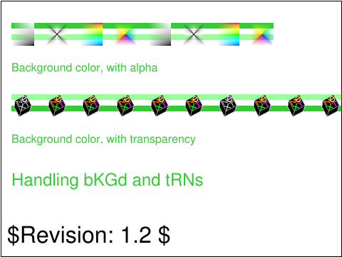 | 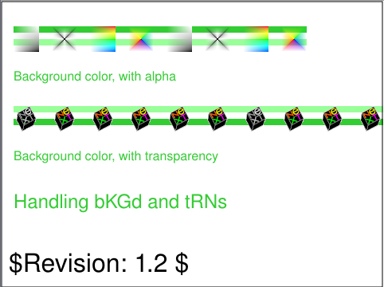 |
| [`struct-image-16-f`](../../Tests/SVGConformanceTests/Resources/W3C-SVG-1.1/svg/struct-image-16-f.svg) | `partialBaseline` |  |  |
| [`struct-image-17-b`](../../Tests/SVGConformanceTests/Resources/W3C-SVG-1.1/svg/struct-image-17-b.svg) | `passed` |  |  |
| [`struct-image-18-f`](../../Tests/SVGConformanceTests/Resources/W3C-SVG-1.1/svg/struct-image-18-f.svg) | `passed` |  |  |
| [`struct-image-19-f`](../../Tests/SVGConformanceTests/Resources/W3C-SVG-1.1/svg/struct-image-19-f.svg) | `passed` |  |  |
| [`struct-svg-01-f`](../../Tests/SVGConformanceTests/Resources/W3C-SVG-1.1/svg/struct-svg-01-f.svg) | `skipped` script-driven DOM API; out of scope |  |  |
| [`struct-svg-02-f`](../../Tests/SVGConformanceTests/Resources/W3C-SVG-1.1/svg/struct-svg-02-f.svg) | `skipped` script-driven DOM API; out of scope |  |  |
| [`struct-svg-03-f`](../../Tests/SVGConformanceTests/Resources/W3C-SVG-1.1/svg/struct-svg-03-f.svg) | `passed` |  |  |
| [`struct-symbol-01-b`](../../Tests/SVGConformanceTests/Resources/W3C-SVG-1.1/svg/struct-symbol-01-b.svg) | `partialBaseline` |  |  |
| [`struct-use-01-t`](../../Tests/SVGConformanceTests/Resources/W3C-SVG-1.1/svg/struct-use-01-t.svg) | `passed` |  |  |
| [`struct-use-03-t`](../../Tests/SVGConformanceTests/Resources/W3C-SVG-1.1/svg/struct-use-03-t.svg) | `passed` |  |  |
| [`struct-use-04-b`](../../Tests/SVGConformanceTests/Resources/W3C-SVG-1.1/svg/struct-use-04-b.svg) | `passed` |  |  |
| [`struct-use-05-b`](../../Tests/SVGConformanceTests/Resources/W3C-SVG-1.1/svg/struct-use-05-b.svg) | `passed` |  |  |
| [`struct-use-06-b`](../../Tests/SVGConformanceTests/Resources/W3C-SVG-1.1/svg/struct-use-06-b.svg) | `skipped` onclick handlers in external use content; interaction out of scope |  |  |
| [`struct-use-07-b`](../../Tests/SVGConformanceTests/Resources/W3C-SVG-1.1/svg/struct-use-07-b.svg) | `skipped` onclick event handlers; interaction out of scope |  |  |
| [`struct-use-08-b`](../../Tests/SVGConformanceTests/Resources/W3C-SVG-1.1/svg/struct-use-08-b.svg) | `partialBaseline` |  |  |
| [`struct-use-09-b`](../../Tests/SVGConformanceTests/Resources/W3C-SVG-1.1/svg/struct-use-09-b.svg) | `passed` |  |  |
| [`struct-use-10-f`](../../Tests/SVGConformanceTests/Resources/W3C-SVG-1.1/svg/struct-use-10-f.svg) | `passed` |  |  |
| [`struct-use-11-f`](../../Tests/SVGConformanceTests/Resources/W3C-SVG-1.1/svg/struct-use-11-f.svg) | `passed` |  |  |
| [`struct-use-12-f`](../../Tests/SVGConformanceTests/Resources/W3C-SVG-1.1/svg/struct-use-12-f.svg) | `passed` |  |  |
| [`struct-use-13-f`](../../Tests/SVGConformanceTests/Resources/W3C-SVG-1.1/svg/struct-use-13-f.svg) | `skipped` script-driven DOM mutation; out of scope |  |  |
| [`struct-use-14-f`](../../Tests/SVGConformanceTests/Resources/W3C-SVG-1.1/svg/struct-use-14-f.svg) | `skipped` script-driven DOM mutation; out of scope |  |  |
| [`struct-use-15-f`](../../Tests/SVGConformanceTests/Resources/W3C-SVG-1.1/svg/struct-use-15-f.svg) | `skipped` script-driven DOM mutation; out of scope |  |  |

