<!-- Generated by SVGConformanceMarkdownReport. Do not edit. -->

# styling

18 tests · generated 2026-08-20 · [coverage index](README.md)

| Status | Count |
| --- | ---: |
| `passed` | 15 |
| `partialBaseline` | 0 |
| `skipped` | 3 |

## Renders

| Test | Status | SVGeeKit | W3C reference |
| --- | --- | --- | --- |
| [`styling-class-01-f`](../../Tests/SVGConformanceTests/Resources/W3C-SVG-1.1/svg/styling-class-01-f.svg) | `passed` | 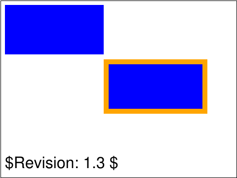 | 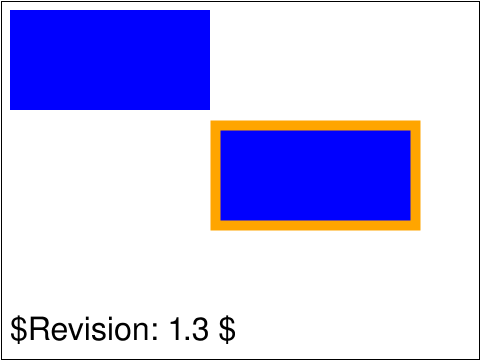 |
| [`styling-css-01-b`](../../Tests/SVGConformanceTests/Resources/W3C-SVG-1.1/svg/styling-css-01-b.svg) | `passed` |  |  |
| [`styling-css-02-b`](../../Tests/SVGConformanceTests/Resources/W3C-SVG-1.1/svg/styling-css-02-b.svg) | `passed` |  | 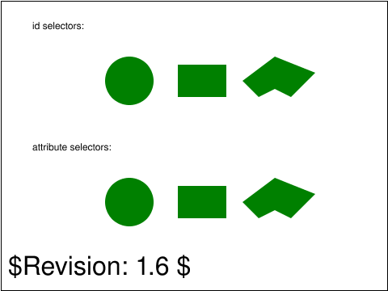 |
| [`styling-css-03-b`](../../Tests/SVGConformanceTests/Resources/W3C-SVG-1.1/svg/styling-css-03-b.svg) | `passed` |  |  |
| [`styling-css-04-f`](../../Tests/SVGConformanceTests/Resources/W3C-SVG-1.1/svg/styling-css-04-f.svg) | `passed` |  | 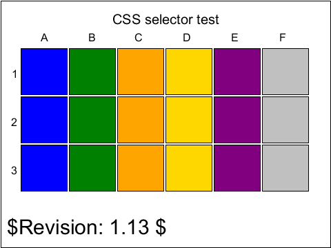 |
| [`styling-css-05-b`](../../Tests/SVGConformanceTests/Resources/W3C-SVG-1.1/svg/styling-css-05-b.svg) | `skipped` requires :lang() text rendering; deferred to Phase 3 text |  | 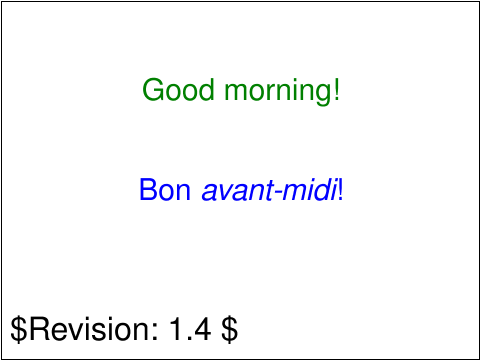 |
| [`styling-css-06-b`](../../Tests/SVGConformanceTests/Resources/W3C-SVG-1.1/svg/styling-css-06-b.svg) | `skipped` dynamic pseudo-classes (:link, :hover, :focus); interaction out of scope |  | 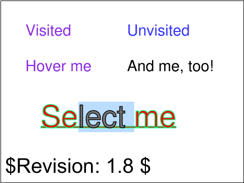 |
| [`styling-css-07-f`](../../Tests/SVGConformanceTests/Resources/W3C-SVG-1.1/svg/styling-css-07-f.svg) | `passed` |  |  |
| [`styling-css-08-f`](../../Tests/SVGConformanceTests/Resources/W3C-SVG-1.1/svg/styling-css-08-f.svg) | `passed` | 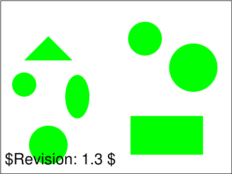 |  |
| [`styling-css-09-f`](../../Tests/SVGConformanceTests/Resources/W3C-SVG-1.1/svg/styling-css-09-f.svg) | `passed` | 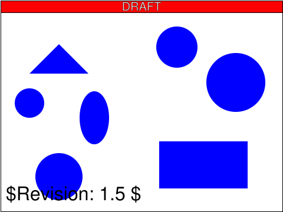 |  |
| [`styling-css-10-f`](../../Tests/SVGConformanceTests/Resources/W3C-SVG-1.1/svg/styling-css-10-f.svg) | `passed` | 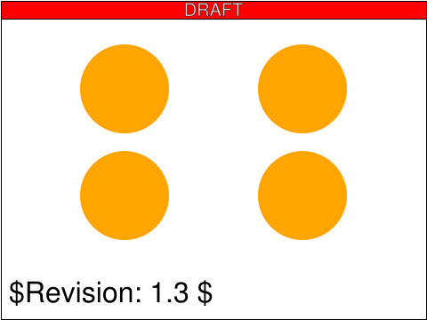 | 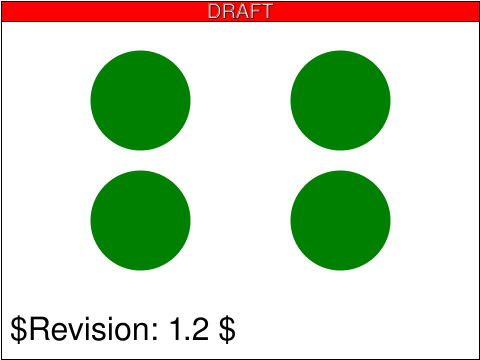 |
| [`styling-elem-01-b`](../../Tests/SVGConformanceTests/Resources/W3C-SVG-1.1/svg/styling-elem-01-b.svg) | `passed` |  |  |
| [`styling-inherit-01-b`](../../Tests/SVGConformanceTests/Resources/W3C-SVG-1.1/svg/styling-inherit-01-b.svg) | `passed` | 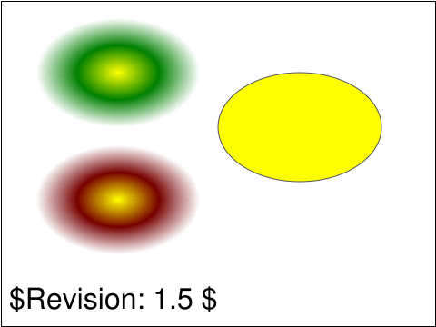 |  |
| [`styling-pres-01-t`](../../Tests/SVGConformanceTests/Resources/W3C-SVG-1.1/svg/styling-pres-01-t.svg) | `passed` | 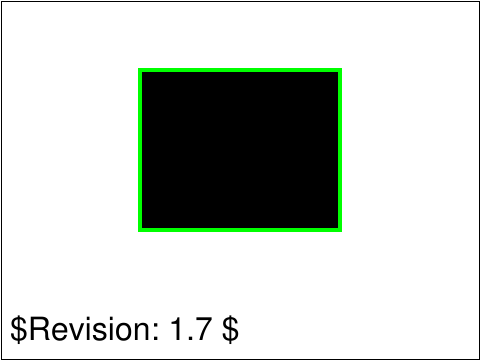 | 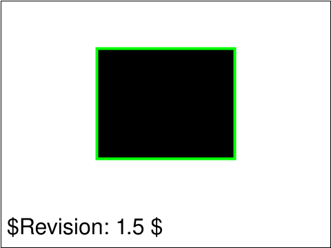 |
| [`styling-pres-02-f`](../../Tests/SVGConformanceTests/Resources/W3C-SVG-1.1/svg/styling-pres-02-f.svg) | `skipped` script-driven getComputedStyle property collection; requires SVGScript |  | 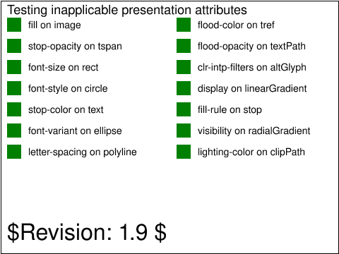 |
| [`styling-pres-03-f`](../../Tests/SVGConformanceTests/Resources/W3C-SVG-1.1/svg/styling-pres-03-f.svg) | `passed` | 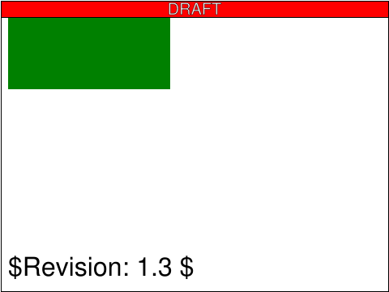 |  |
| [`styling-pres-04-f`](../../Tests/SVGConformanceTests/Resources/W3C-SVG-1.1/svg/styling-pres-04-f.svg) | `passed` |  |  |
| [`styling-pres-05-f`](../../Tests/SVGConformanceTests/Resources/W3C-SVG-1.1/svg/styling-pres-05-f.svg) | `passed` | 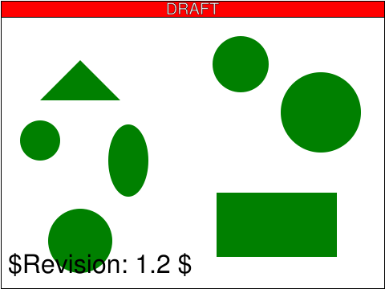 |  |

