<!-- Generated by SVGConformanceMarkdownReport. Do not edit. -->

# text

64 tests · generated 2026-08-20 · [coverage index](README.md)

| Status | Count |
| --- | ---: |
| `passed` | 4 |
| `partialBaseline` | 0 |
| `skipped` | 60 |

## Renders

| Test | Status | SVGeeKit | W3C reference |
| --- | --- | --- | --- |
| [`text-align-01-b`](../../Tests/SVGConformanceTests/Resources/W3C-SVG-1.1/svg/text-align-01-b.svg) | `passed` | 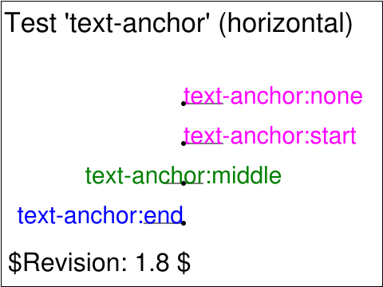 | 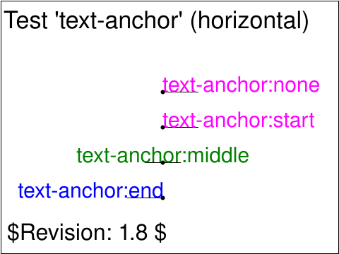 |
| [`text-align-02-b`](../../Tests/SVGConformanceTests/Resources/W3C-SVG-1.1/svg/text-align-02-b.svg) | `skipped` feature family not yet supported by SVGeeKit | — | 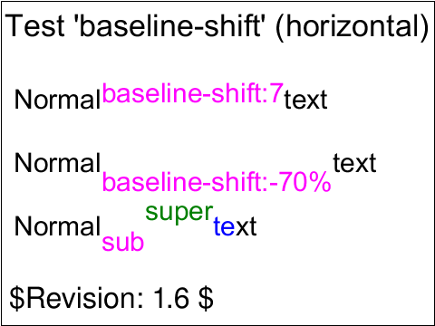 |
| [`text-align-03-b`](../../Tests/SVGConformanceTests/Resources/W3C-SVG-1.1/svg/text-align-03-b.svg) | `skipped` feature family not yet supported by SVGeeKit | — | 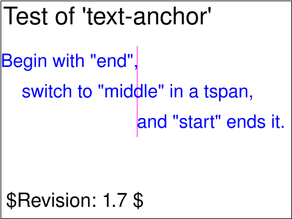 |
| [`text-align-04-b`](../../Tests/SVGConformanceTests/Resources/W3C-SVG-1.1/svg/text-align-04-b.svg) | `skipped` feature family not yet supported by SVGeeKit | — | 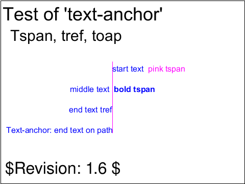 |
| [`text-align-05-b`](../../Tests/SVGConformanceTests/Resources/W3C-SVG-1.1/svg/text-align-05-b.svg) | `skipped` feature family not yet supported by SVGeeKit | — | 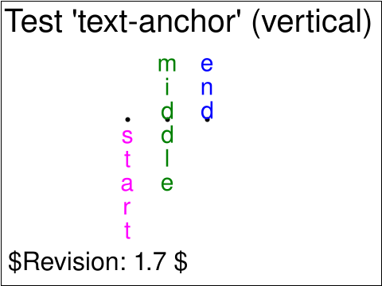 |
| [`text-align-06-b`](../../Tests/SVGConformanceTests/Resources/W3C-SVG-1.1/svg/text-align-06-b.svg) | `skipped` feature family not yet supported by SVGeeKit | — | 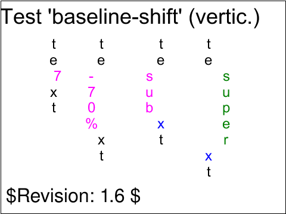 |
| [`text-align-07-t`](../../Tests/SVGConformanceTests/Resources/W3C-SVG-1.1/svg/text-align-07-t.svg) | `skipped` feature family not yet supported by SVGeeKit | — | 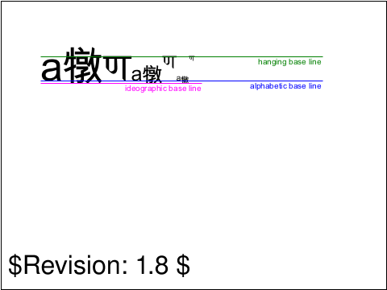 |
| [`text-align-08-b`](../../Tests/SVGConformanceTests/Resources/W3C-SVG-1.1/svg/text-align-08-b.svg) | `skipped` feature family not yet supported by SVGeeKit | — | 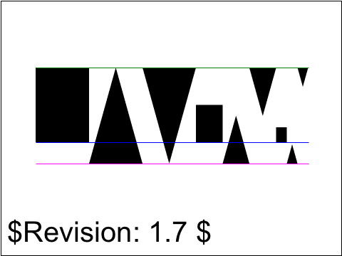 |
| [`text-altglyph-01-b`](../../Tests/SVGConformanceTests/Resources/W3C-SVG-1.1/svg/text-altglyph-01-b.svg) | `skipped` feature family not yet supported by SVGeeKit | — |  |
| [`text-altglyph-02-b`](../../Tests/SVGConformanceTests/Resources/W3C-SVG-1.1/svg/text-altglyph-02-b.svg) | `skipped` feature family not yet supported by SVGeeKit | — | 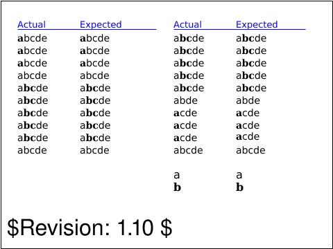 |
| [`text-altglyph-03-b`](../../Tests/SVGConformanceTests/Resources/W3C-SVG-1.1/svg/text-altglyph-03-b.svg) | `skipped` feature family not yet supported by SVGeeKit | — | 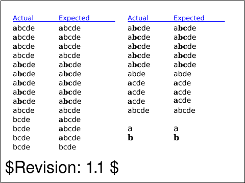 |
| [`text-bidi-01-t`](../../Tests/SVGConformanceTests/Resources/W3C-SVG-1.1/svg/text-bidi-01-t.svg) | `skipped` feature family not yet supported by SVGeeKit | — | 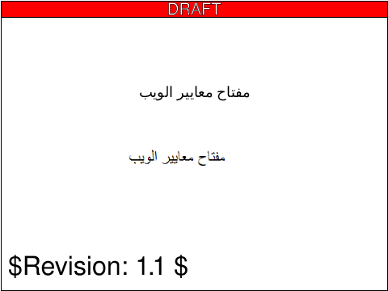 |
| [`text-deco-01-b`](../../Tests/SVGConformanceTests/Resources/W3C-SVG-1.1/svg/text-deco-01-b.svg) | `skipped` feature family not yet supported by SVGeeKit | — | 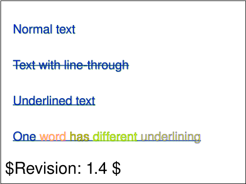 |
| [`text-dom-01-f`](../../Tests/SVGConformanceTests/Resources/W3C-SVG-1.1/svg/text-dom-01-f.svg) | `skipped` DOM API mutation; out of scope | — | 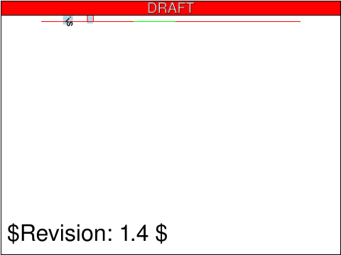 |
| [`text-dom-02-f`](../../Tests/SVGConformanceTests/Resources/W3C-SVG-1.1/svg/text-dom-02-f.svg) | `skipped` DOM API mutation; out of scope | — |  |
| [`text-dom-03-f`](../../Tests/SVGConformanceTests/Resources/W3C-SVG-1.1/svg/text-dom-03-f.svg) | `skipped` DOM API mutation; out of scope | — |  |
| [`text-dom-04-f`](../../Tests/SVGConformanceTests/Resources/W3C-SVG-1.1/svg/text-dom-04-f.svg) | `skipped` DOM API mutation; out of scope | — |  |
| [`text-dom-05-f`](../../Tests/SVGConformanceTests/Resources/W3C-SVG-1.1/svg/text-dom-05-f.svg) | `skipped` DOM API mutation; out of scope | — |  |
| [`text-font-mini-01`](../../Tests/SVGConformanceTests/Resources/W3C-SVG-1.1/svg/text-font-mini-01.svg) | `passed` |  | — |
| [`text-fonts-01-t`](../../Tests/SVGConformanceTests/Resources/W3C-SVG-1.1/svg/text-fonts-01-t.svg) | `skipped` feature family not yet supported by SVGeeKit | — | 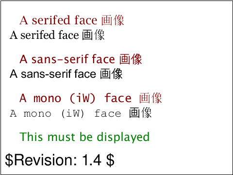 |
| [`text-fonts-02-t`](../../Tests/SVGConformanceTests/Resources/W3C-SVG-1.1/svg/text-fonts-02-t.svg) | `skipped` feature family not yet supported by SVGeeKit | — | 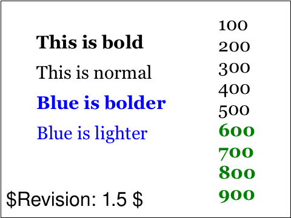 |
| [`text-fonts-03-t`](../../Tests/SVGConformanceTests/Resources/W3C-SVG-1.1/svg/text-fonts-03-t.svg) | `skipped` feature family not yet supported by SVGeeKit | — |  |
| [`text-fonts-04-t`](../../Tests/SVGConformanceTests/Resources/W3C-SVG-1.1/svg/text-fonts-04-t.svg) | `skipped` feature family not yet supported by SVGeeKit | — |  |
| [`text-fonts-05-f`](../../Tests/SVGConformanceTests/Resources/W3C-SVG-1.1/svg/text-fonts-05-f.svg) | `skipped` feature family not yet supported by SVGeeKit | — | 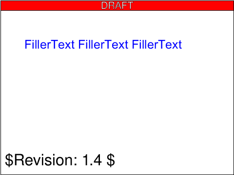 |
| [`text-fonts-202-t`](../../Tests/SVGConformanceTests/Resources/W3C-SVG-1.1/svg/text-fonts-202-t.svg) | `skipped` feature family not yet supported by SVGeeKit | — | 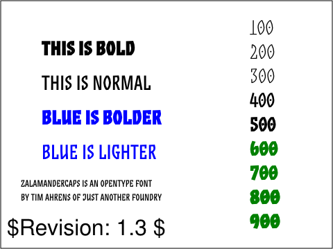 |
| [`text-fonts-203-t`](../../Tests/SVGConformanceTests/Resources/W3C-SVG-1.1/svg/text-fonts-203-t.svg) | `skipped` feature family not yet supported by SVGeeKit | — | 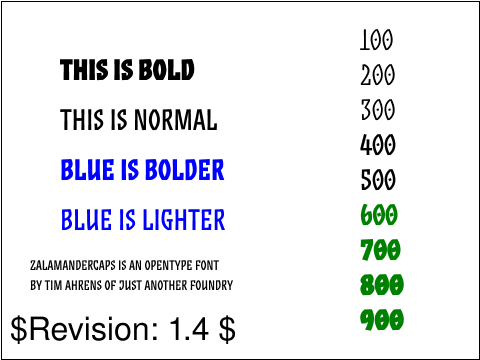 |
| [`text-fonts-204-t`](../../Tests/SVGConformanceTests/Resources/W3C-SVG-1.1/svg/text-fonts-204-t.svg) | `skipped` feature family not yet supported by SVGeeKit | — | 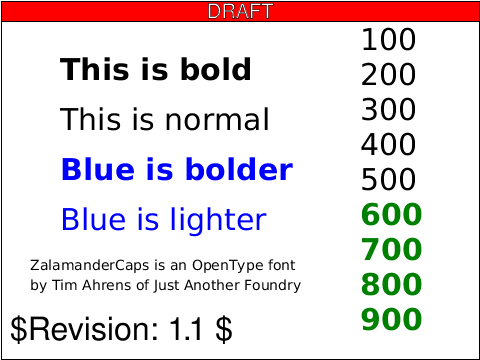 |
| [`text-intro-01-t`](../../Tests/SVGConformanceTests/Resources/W3C-SVG-1.1/svg/text-intro-01-t.svg) | `skipped` feature family not yet supported by SVGeeKit | — |  |
| [`text-intro-02-b`](../../Tests/SVGConformanceTests/Resources/W3C-SVG-1.1/svg/text-intro-02-b.svg) | `skipped` feature family not yet supported by SVGeeKit | — |  |
| [`text-intro-03-b`](../../Tests/SVGConformanceTests/Resources/W3C-SVG-1.1/svg/text-intro-03-b.svg) | `skipped` feature family not yet supported by SVGeeKit | — | 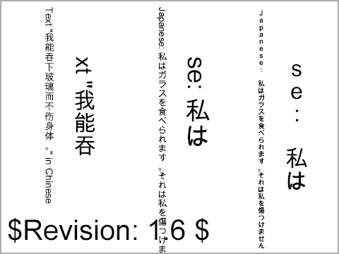 |
| [`text-intro-04-t`](../../Tests/SVGConformanceTests/Resources/W3C-SVG-1.1/svg/text-intro-04-t.svg) | `skipped` feature family not yet supported by SVGeeKit | — |  |
| [`text-intro-05-t`](../../Tests/SVGConformanceTests/Resources/W3C-SVG-1.1/svg/text-intro-05-t.svg) | `skipped` feature family not yet supported by SVGeeKit | — |  |
| [`text-intro-06-t`](../../Tests/SVGConformanceTests/Resources/W3C-SVG-1.1/svg/text-intro-06-t.svg) | `skipped` feature family not yet supported by SVGeeKit | — | 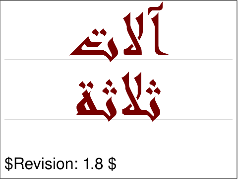 |
| [`text-intro-07-t`](../../Tests/SVGConformanceTests/Resources/W3C-SVG-1.1/svg/text-intro-07-t.svg) | `skipped` feature family not yet supported by SVGeeKit | — | 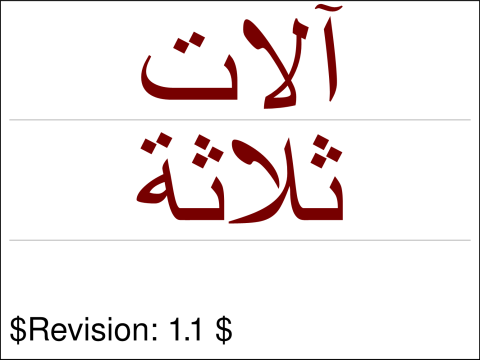 |
| [`text-intro-09-b`](../../Tests/SVGConformanceTests/Resources/W3C-SVG-1.1/svg/text-intro-09-b.svg) | `skipped` feature family not yet supported by SVGeeKit | — |  |
| [`text-intro-10-f`](../../Tests/SVGConformanceTests/Resources/W3C-SVG-1.1/svg/text-intro-10-f.svg) | `skipped` feature family not yet supported by SVGeeKit | — |  |
| [`text-intro-11-t`](../../Tests/SVGConformanceTests/Resources/W3C-SVG-1.1/svg/text-intro-11-t.svg) | `skipped` feature family not yet supported by SVGeeKit | — | 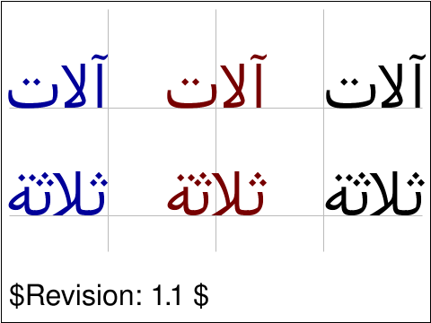 |
| [`text-intro-12-t`](../../Tests/SVGConformanceTests/Resources/W3C-SVG-1.1/svg/text-intro-12-t.svg) | `skipped` feature family not yet supported by SVGeeKit | — |  |
| [`text-path-01-b`](../../Tests/SVGConformanceTests/Resources/W3C-SVG-1.1/svg/text-path-01-b.svg) | `skipped` feature family not yet supported by SVGeeKit | — | 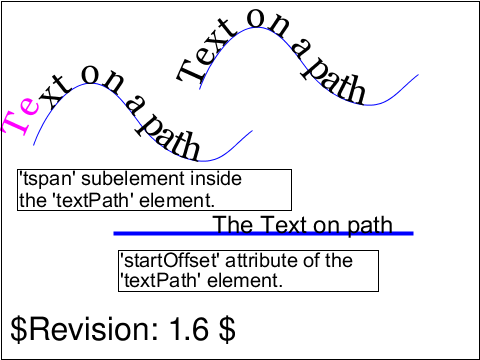 |
| [`text-path-02-b`](../../Tests/SVGConformanceTests/Resources/W3C-SVG-1.1/svg/text-path-02-b.svg) | `skipped` feature family not yet supported by SVGeeKit | — | 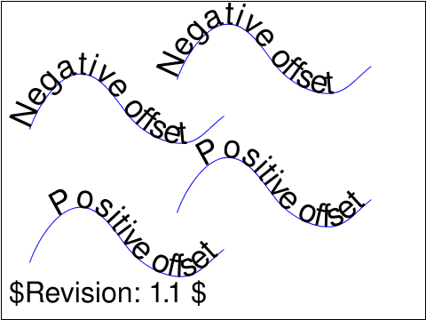 |
| [`text-path-basic-01`](../../Tests/SVGConformanceTests/Resources/W3C-SVG-1.1/svg/text-path-basic-01.svg) | `passed` | 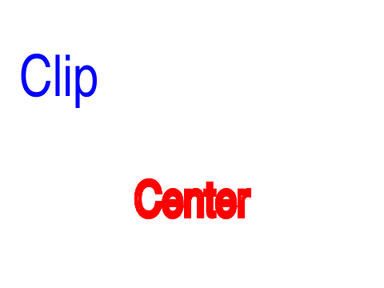 | — |
| [`text-spacing-01-b`](../../Tests/SVGConformanceTests/Resources/W3C-SVG-1.1/svg/text-spacing-01-b.svg) | `skipped` feature family not yet supported by SVGeeKit | — |  |
| [`text-text-01-b`](../../Tests/SVGConformanceTests/Resources/W3C-SVG-1.1/svg/text-text-01-b.svg) | `skipped` feature family not yet supported by SVGeeKit | — | 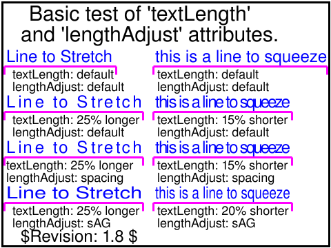 |
| [`text-text-03-b`](../../Tests/SVGConformanceTests/Resources/W3C-SVG-1.1/svg/text-text-03-b.svg) | `skipped` feature family not yet supported by SVGeeKit | — | 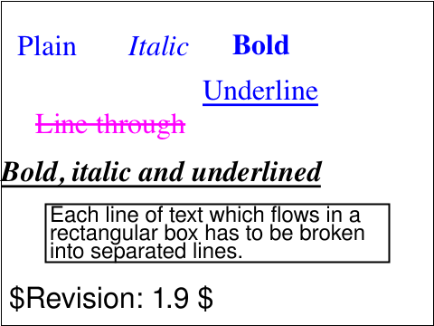 |
| [`text-text-04-t`](../../Tests/SVGConformanceTests/Resources/W3C-SVG-1.1/svg/text-text-04-t.svg) | `skipped` feature family not yet supported by SVGeeKit | — | 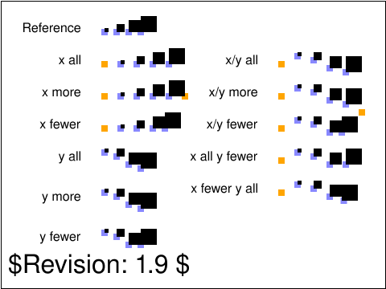 |
| [`text-text-05-t`](../../Tests/SVGConformanceTests/Resources/W3C-SVG-1.1/svg/text-text-05-t.svg) | `skipped` feature family not yet supported by SVGeeKit | — | 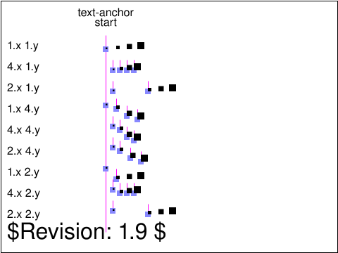 |
| [`text-text-06-t`](../../Tests/SVGConformanceTests/Resources/W3C-SVG-1.1/svg/text-text-06-t.svg) | `skipped` feature family not yet supported by SVGeeKit | — | 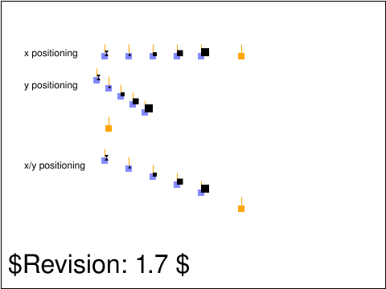 |
| [`text-text-07-t`](../../Tests/SVGConformanceTests/Resources/W3C-SVG-1.1/svg/text-text-07-t.svg) | `skipped` feature family not yet supported by SVGeeKit | — |  |
| [`text-text-08-b`](../../Tests/SVGConformanceTests/Resources/W3C-SVG-1.1/svg/text-text-08-b.svg) | `skipped` feature family not yet supported by SVGeeKit | — |  |
| [`text-text-09-t`](../../Tests/SVGConformanceTests/Resources/W3C-SVG-1.1/svg/text-text-09-t.svg) | `skipped` feature family not yet supported by SVGeeKit | — |  |
| [`text-text-10-t`](../../Tests/SVGConformanceTests/Resources/W3C-SVG-1.1/svg/text-text-10-t.svg) | `skipped` feature family not yet supported by SVGeeKit | — |  |
| [`text-text-11-t`](../../Tests/SVGConformanceTests/Resources/W3C-SVG-1.1/svg/text-text-11-t.svg) | `skipped` feature family not yet supported by SVGeeKit | — |  |
| [`text-text-12-t`](../../Tests/SVGConformanceTests/Resources/W3C-SVG-1.1/svg/text-text-12-t.svg) | `skipped` feature family not yet supported by SVGeeKit | — | 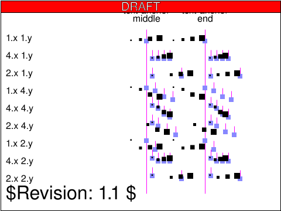 |
| [`text-tref-01-b`](../../Tests/SVGConformanceTests/Resources/W3C-SVG-1.1/svg/text-tref-01-b.svg) | `skipped` feature family not yet supported by SVGeeKit | — | 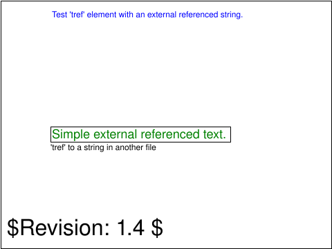 |
| [`text-tref-02-b`](../../Tests/SVGConformanceTests/Resources/W3C-SVG-1.1/svg/text-tref-02-b.svg) | `skipped` feature family not yet supported by SVGeeKit | — |  |
| [`text-tref-03-b`](../../Tests/SVGConformanceTests/Resources/W3C-SVG-1.1/svg/text-tref-03-b.svg) | `skipped` feature family not yet supported by SVGeeKit | — | 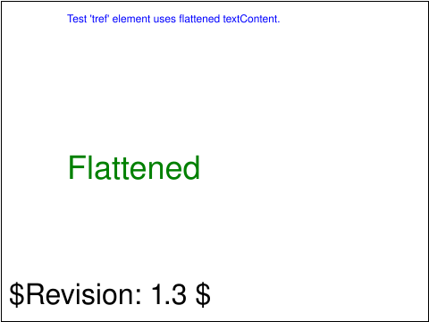 |
| [`text-tselect-01-b`](../../Tests/SVGConformanceTests/Resources/W3C-SVG-1.1/svg/text-tselect-01-b.svg) | `skipped` feature family not yet supported by SVGeeKit | — |  |
| [`text-tselect-02-f`](../../Tests/SVGConformanceTests/Resources/W3C-SVG-1.1/svg/text-tselect-02-f.svg) | `skipped` feature family not yet supported by SVGeeKit | — | 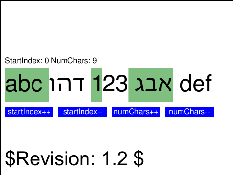 |
| [`text-tselect-03-f`](../../Tests/SVGConformanceTests/Resources/W3C-SVG-1.1/svg/text-tselect-03-f.svg) | `skipped` feature family not yet supported by SVGeeKit | — | 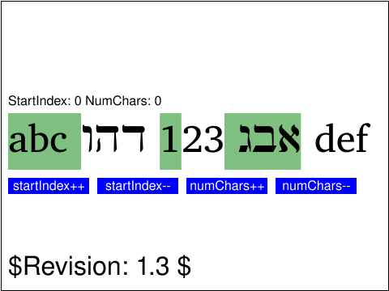 |
| [`text-tspan-01-b`](../../Tests/SVGConformanceTests/Resources/W3C-SVG-1.1/svg/text-tspan-01-b.svg) | `passed` | 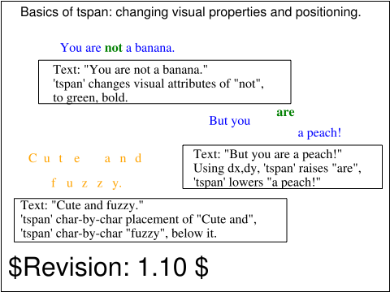 | 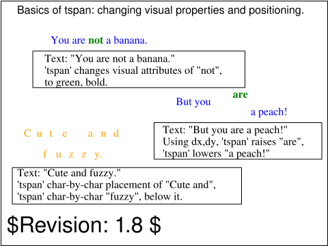 |
| [`text-tspan-02-b`](../../Tests/SVGConformanceTests/Resources/W3C-SVG-1.1/svg/text-tspan-02-b.svg) | `skipped` feature family not yet supported by SVGeeKit |  |  |
| [`text-ws-01-t`](../../Tests/SVGConformanceTests/Resources/W3C-SVG-1.1/svg/text-ws-01-t.svg) | `skipped` feature family not yet supported by SVGeeKit | — |  |
| [`text-ws-02-t`](../../Tests/SVGConformanceTests/Resources/W3C-SVG-1.1/svg/text-ws-02-t.svg) | `skipped` feature family not yet supported by SVGeeKit | — |  |
| [`text-ws-03-t`](../../Tests/SVGConformanceTests/Resources/W3C-SVG-1.1/svg/text-ws-03-t.svg) | `skipped` feature family not yet supported by SVGeeKit | — | 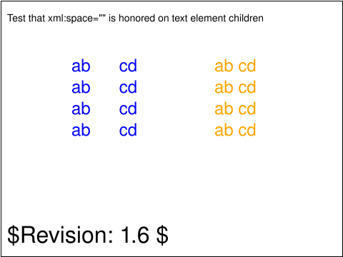 |

